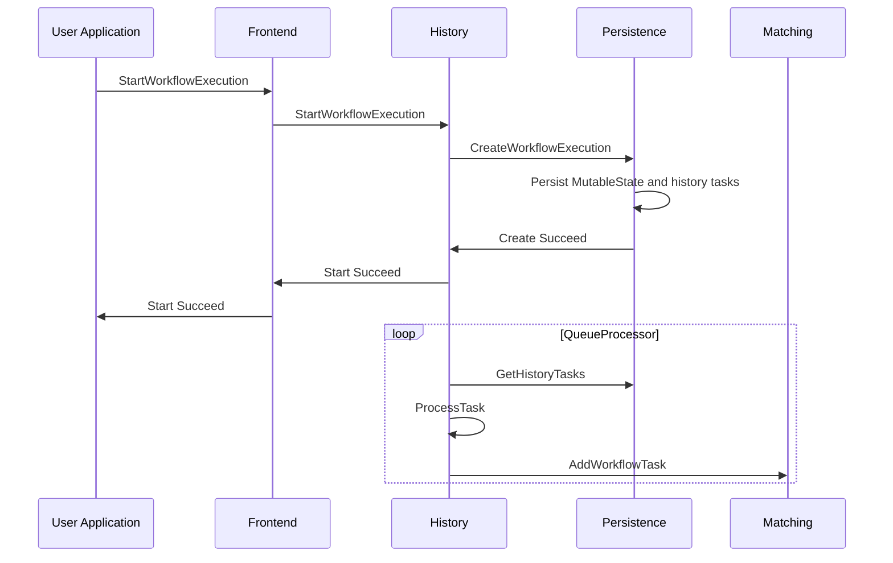
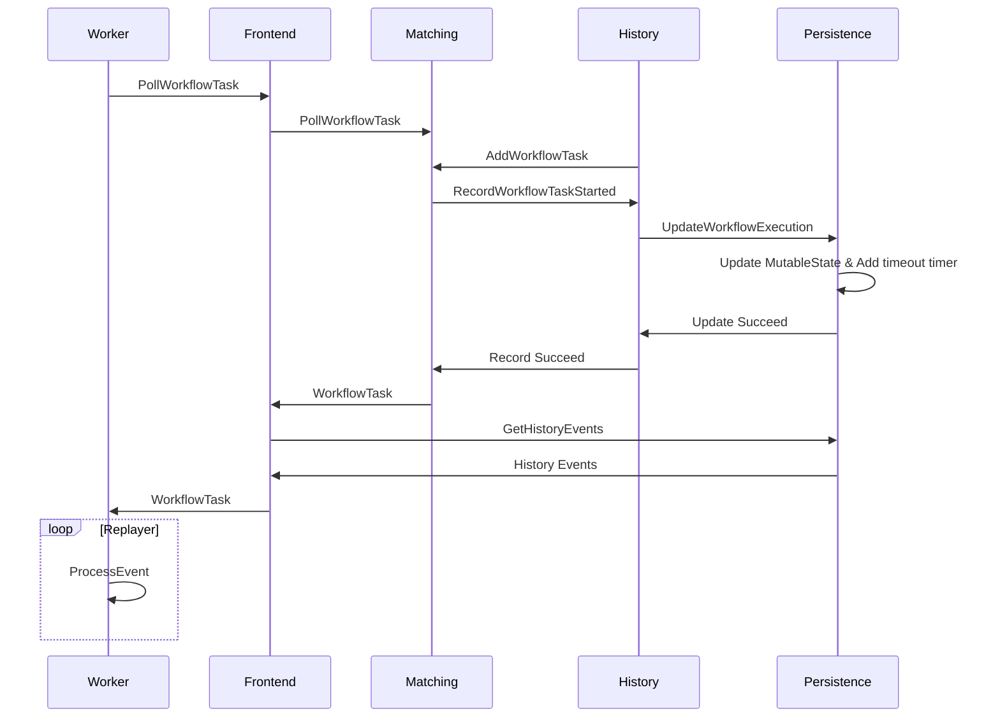
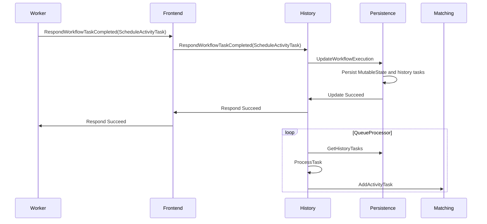
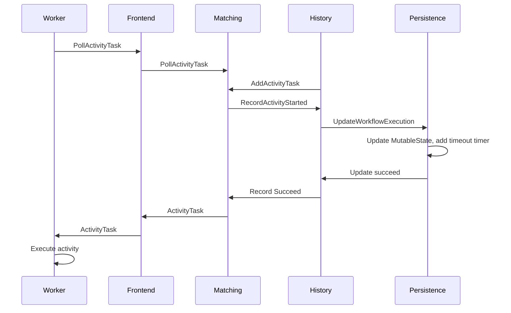
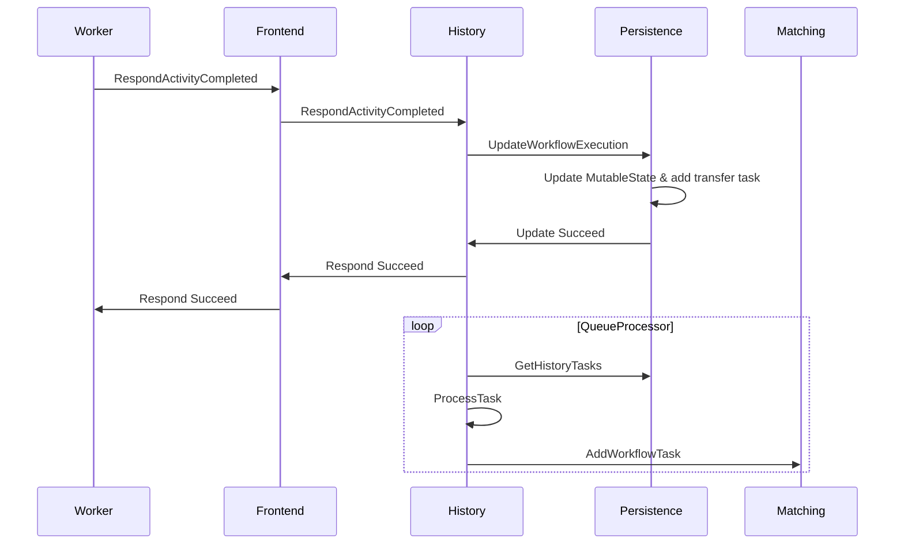
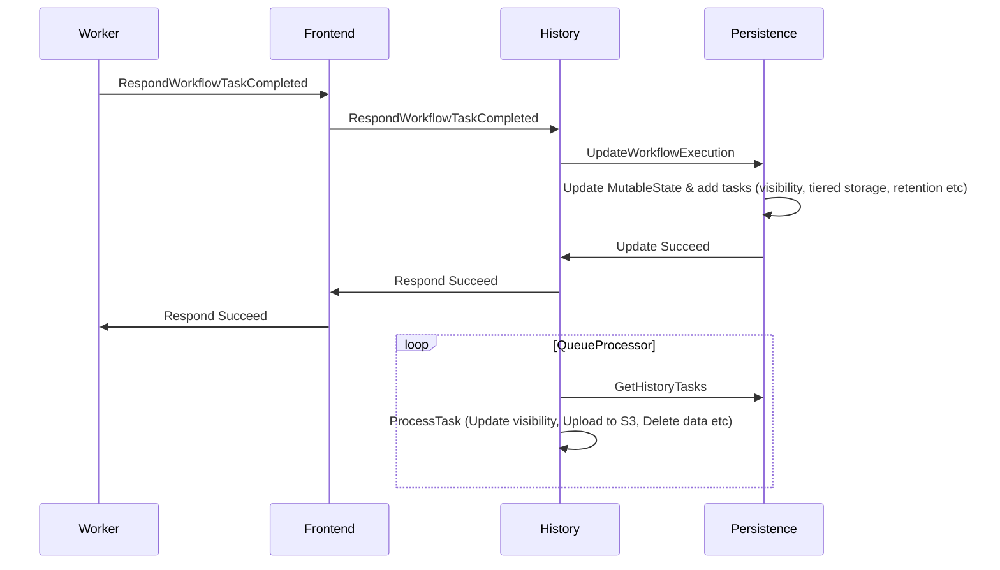
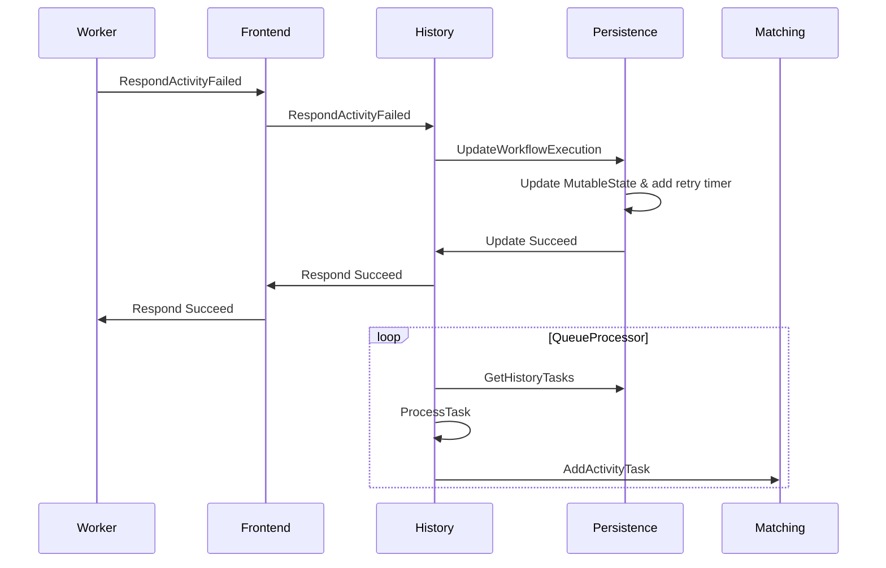

# Premises

The following are some fundamental premises of Temporal workflows:

**Requirements**

- Workflows are defined as code, in one of the supported [SDK languages](https://docs.temporal.io/dev-guide).

- _Durable execution_ of workflows must be guaranteed: workflows must still execute correctly in the face of transient failures in user-hosted processes.

- The system can be scaled to handle arbitrarily many concurrent workflow executions.

- User code is not transmitted outside user systems.

**Design decisions**

- The system functions via event sourcing: an append-only history of events is stored for each workflow execution, and all required workflow state can be recreated at any time by replaying this history.

- User code defining workflows is segregated into [Workflow](https://docs.temporal.io/workflows) definitions and [Activity](https://docs.temporal.io/activities) definitions. Workflow code is highly constrained: side-effects are permitted only in Activity code.

# High-level architecture

These premises have led to a system architecture which is divided into user-hosted processes, versus the Temporal server processes (which may be hosted outside the user's systems):

<!-- https://lucid.app/lucidchart/0202e4b8-5258-4cd6-a6a0-67159300532b/edit -->


#### User-hosted processes

- The user's application uses one of the [Temporal SDKs](https://docs.temporal.io/dev-guide) to communicate with the Temporal server to start/cancel workflows, and interact with running workflows.

- In addition, the user segregates some of their application code into Temporal Workflow and Activity definitions, and hosts [Worker](https://docs.temporal.io/workers) processes, which execute their Workflow and Activity code. Workflow and Activity code uses the SDK as a library, and the Worker runtime is implemented by the SDK.

- The worker processes communicate with the Temporal server in two ways: they continuously poll the server for tasks, and on completion of each task they send commands to the server specifying what must be done to further advance the workflow execution. See [Tasks](./#Tasks) below.

#### Temporal Server processes

- History service shards manage individual [Workflow Executions](https://docs.temporal.io/workflows#workflow-execution). They handle RPCs originating from the User Application and the Temporal Worker, drive the Workflow Execution to completion by enqueuing Workflow and Activity Tasks in the Matching Service, and store all state required for durable execution of the workflow.
- Matching service shards manage the [Task Queues](https://docs.temporal.io/workers#task-queue) being polled by Temporal Worker processes. A single task queue holds tasks for multiple Workflow Executions.
- Users can host and operate the Temporal server and its database themselves, or use [Temporal Cloud](https://temporal.io/cloud).

## Tasks

Temporal Workers poll the Task Queues in the Matching service for tasks. There are two types of task:

- A **Workflow Task** is processed by resuming execution of the user's workflow code until it becomes blocked (e.g. on a timer or an Activity call), or is complete. On completion of a Workflow Task the worker sends a sequence of commands specifying what is required to advance the workflow (e.g. set a timer, schedule an Activity task).

- An **Activity Task** is processed by attempting to execute an Activity. On completion of an Activity Task (whether success or failure), the worker sends information about the activity outcome to the server.

# Workflow lifecycle

Below we follow a typical sequence of events in the execution of the following very simple workflow:

```
myWorkflow() {
   result = callActivity(myActivity)
   return result
}
```

<br>

---

<br>

**1. The User Application uses a Temporal SDK to send a `StartWorkflowExecution` request; a Workflow Task is added in the Matching service**



**Code entrypoints:**

- History service [`StartWorkflow` handler](https://github.com/temporalio/temporal/blob/ef49189005b5323c532264287af6c08a447aab8a/service/history/api/startworkflow/api.go#L157).
- History service [queue processors](https://github.com/temporalio/temporal/blob/ef49189005b5323c532264287af6c08a447aab8a/service/history/history_engine.go#L303) and [transfer task queue processor](https://github.com/temporalio/temporal/blob/ef49189005b5323c532264287af6c08a447aab8a/service/history/queues/queue_immediate.go#L150).

<br>

---

<br>

**2. The Worker dequeues the Workflow Task, advances the workflow execution, and becomes blocked on the Activity call.**



**Code entrypoints:**

- History service [`RecordWorkflowTaskStarted` handler](https://github.com/temporalio/temporal/blob/ef49189005b5323c532264287af6c08a447aab8a/service/history/handler.go#L319)

<br>

---

<br>

**3. The Worker sends a `ScheduleActivityTask` command; an Activity task is added in the Matching service.**



**Code entrypoints:**

- History service [`ScheduleActivityTask` command handler](https://github.com/temporalio/temporal/blob/ef49189005b5323c532264287af6c08a447aab8a/service/history/workflow_task_handler.go#L338)

<br>

---

<br>

**4. The Worker dequeues the Activity task and executes the activity**



**Code entrypoints:**

- History service [`RecordActivityTaskStarted` handler](https://github.com/temporalio/temporal/blob/ef49189005b5323c532264287af6c08a447aab8a/service/history/handler.go#L287)

<br>

---

<br>

**4. The Worker sends `RespondActivityCompleted`; a Workflow Task is added in the Matching service**



**Code entrypoints:**

- History service [`RespondActivityTaskCompleted` handler](https://github.com/temporalio/temporal/blob/ef49189005b5323c532264287af6c08a447aab8a/service/history/handler.go#L361)

<br>

---

<br>

**5. The Worker dequeues the Workflow Task, advances the workflow, and finds that it has reached its end**

\<Same sequence diagram as step 2 above\>

<br>

---

<br>

**6. The Worker sends `RespondWorkflowTaskCompleted`**



**Code entrypoints:**

- History service [`RespondWorkflowTaskCompleted` handler](https://github.com/temporalio/temporal/blob/ef49189005b5323c532264287af6c08a447aab8a/service/history/handler.go#L478)

<br>

---

<br>

**Alternatively, the Activity may fail and be retried:**



**Code entrypoints:**

- History service [`RespondActivityTaskFailed` handler](https://github.com/temporalio/temporal/blob/ef49189005b5323c532264287af6c08a447aab8a/service/history/handler.go#L400)
