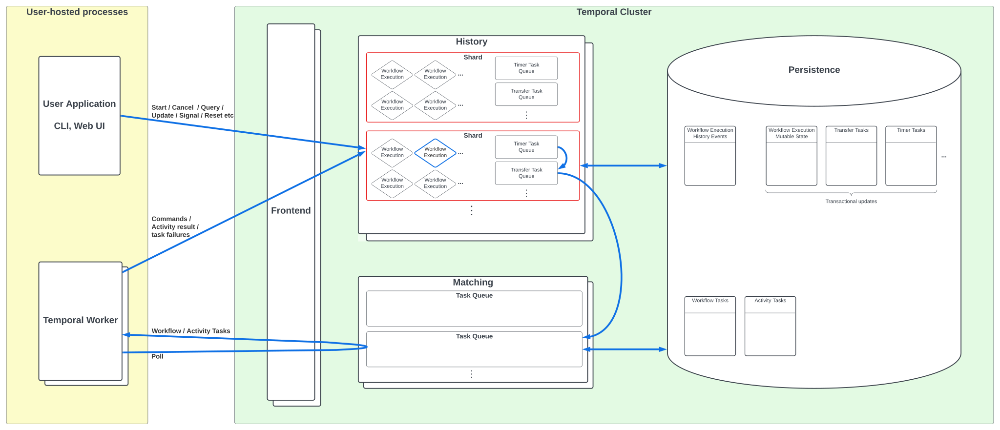

These pages contain an introduction to Temporal's system architecture and internal implementation.

Below we give a high-level overview of how Temporal works; other pages provide more detailed descriptions of the services and of the lifecycle of a Workflow Execution:

**Internal services**

- Frontend Service
- [History Service](./history-service.md)
- [Matching Service](./matching-service.md)
- Internal Workers Service

**Workflow lifecycle**

- [Sequence diagrams](./workflow-lifecycle.md)
- [SDK Workers](https://github.com/temporalio/sdk-core/blob/master/ARCHITECTURE.md)

A Temporal cluster executes units of application logic called Workflows in a durable manner that automatically handles intermittent failures, and retries failed operations.
The following are some fundamental premises:

**Requirements**

- Workflows are defined as code, in one of the supported [SDK languages](https://docs.temporal.io/dev-guide).

- _Durable execution_ of workflows must be guaranteed: workflows must still execute correctly in the face of transient failures in server processes and user-hosted processes.

- The system can be scaled to handle arbitrarily many concurrent workflow executions.

- User code is executed in environments owned by the user.

**Design decisions**

- The system functions via event sourcing: an append-only history of events is stored for each workflow execution, and all required workflow state can be recreated at any time by replaying this history.

- User code defining workflows is segregated into [Workflow](https://docs.temporal.io/workflows) definitions and [Activity](https://docs.temporal.io/activities) definitions.
  Workflow code must be deterministic and have no side effects (with specific exceptions), and activity code must either be idempotent or non-retryable (i.e. at least once or at most once).

## High-level architecture

These premises have led to a system architecture which is divided into user-hosted processes, versus the Temporal cluster processes (which may be hosted outside the user's systems):

<!-- https://lucid.app/lucidchart/0202e4b8-5258-4cd6-a6a0-67159300532b/edit -->

### User-hosted processes

- The User Application uses one of the [Temporal SDKs](https://docs.temporal.io/dev-guide) as a gRPC client to communicate with the Temporal server to start/cancel workflows, and interact with running workflows.

- In addition, the user segregates some of their application code into Temporal Workflow and Activity definitions, and hosts [Worker](https://docs.temporal.io/workers) processes, which execute their Workflow and Activity code.
  Workflow and Activity code uses the SDK as a library, and the Worker runtime is implemented by the SDK.

- The worker processes communicate with the Temporal server in two ways: they continuously poll the server for Workflow and Activity tasks, and on completion of each task they send information to the server.
  (For a Workflow task they send commands to the server specifying what must be done to further advance the Workflow execution, and for an Activity task they send the task result or failure information.)
  See [Tasks](#Tasks) below.

### Temporal Cluster

- History Service shards manage individual [Workflow Executions](https://docs.temporal.io/workflows#workflow-execution).
  They handle RPCs originating from the User Application and the Temporal Worker, drive the Workflow Execution to completion by enqueuing Workflow and Activity Tasks in the Matching Service, and store all state required for durable execution of the workflow.
- The Matching Service manages the [Task Queues](https://docs.temporal.io/workers#task-queue) being polled by Temporal Worker processes.
  A single task queue holds tasks for multiple Workflow Executions.
- Users can host and operate the Temporal server and its database themselves, or use [Temporal Cloud](https://temporal.io/cloud).

### Tasks

Temporal Workers poll the Task Queues in the Matching service for tasks. There are two main types of task:

- A **Workflow Task** is processed by resuming execution of the user's workflow code until it becomes blocked (e.g. on a timer or an Activity call), or is complete.
  On completion of a Workflow Task the worker sends a sequence of commands specifying what is required to advance the workflow (e.g. set a timer, schedule an Activity task).

- An **Activity Task** is processed by attempting to execute an Activity.
  On completion of an Activity Task (whether success or failure), the worker sends information about the activity outcome to the server.

In addition, Queries are implemented via Query Tasks, which are similar to Workflow Tasks but result only in Query results being sent to the server (do not cause the Workflow to advance).

## Further reading

- Frontend Service
- [History Service](./history-service.md)
- [Matching Service](./matching-service.md)
- Internal Workers Service
- [Workflow lifecycle sequence diagrams](./workflow-lifecycle.md)
- [SDK Workers](https://github.com/temporalio/sdk-core/blob/master/ARCHITECTURE.md)
