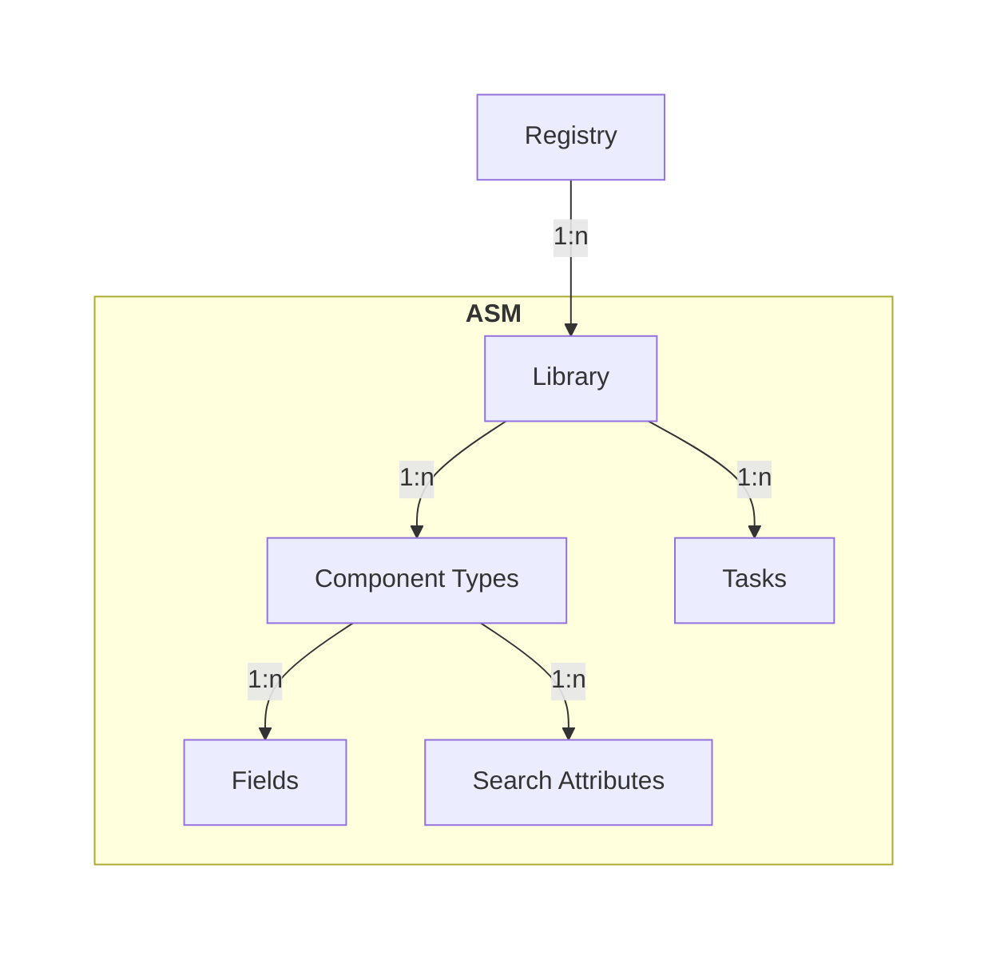
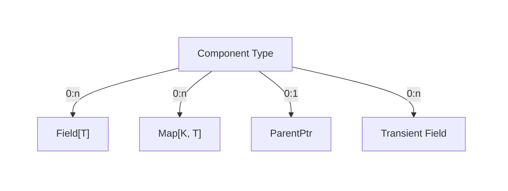
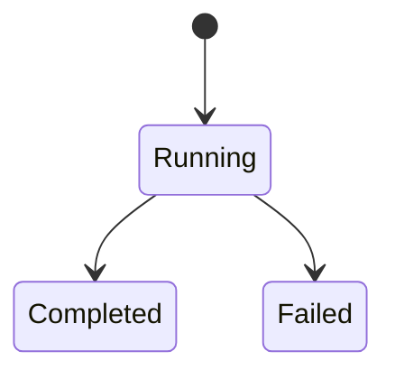
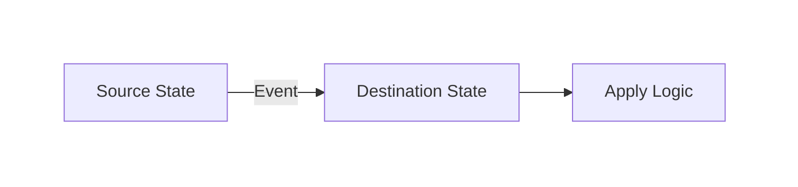
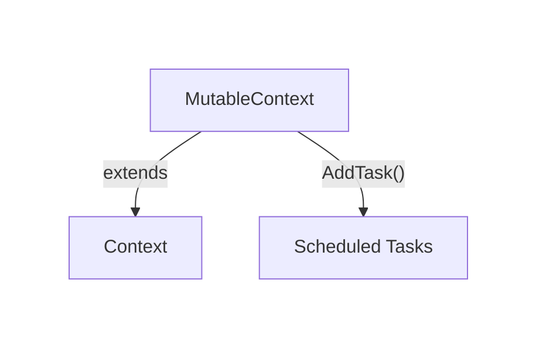
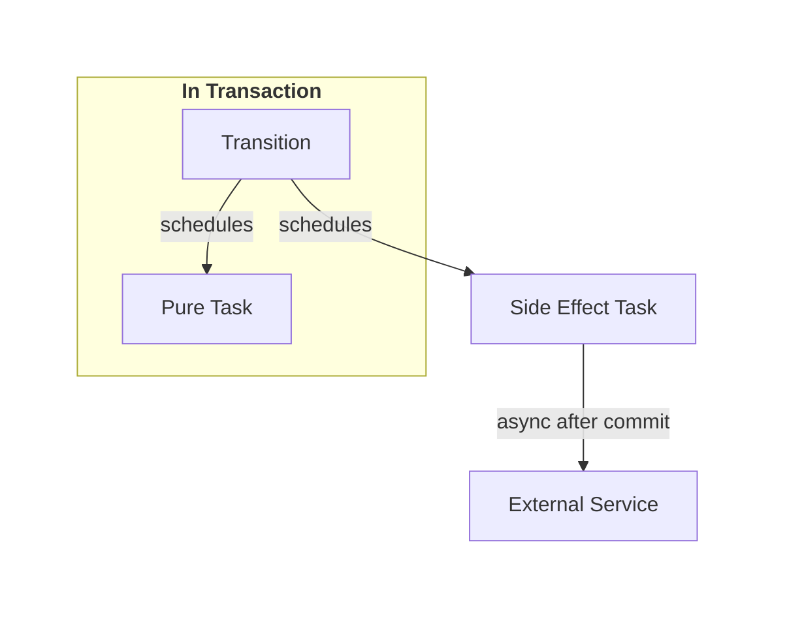
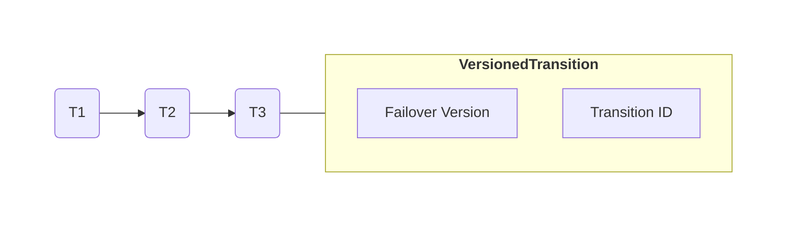
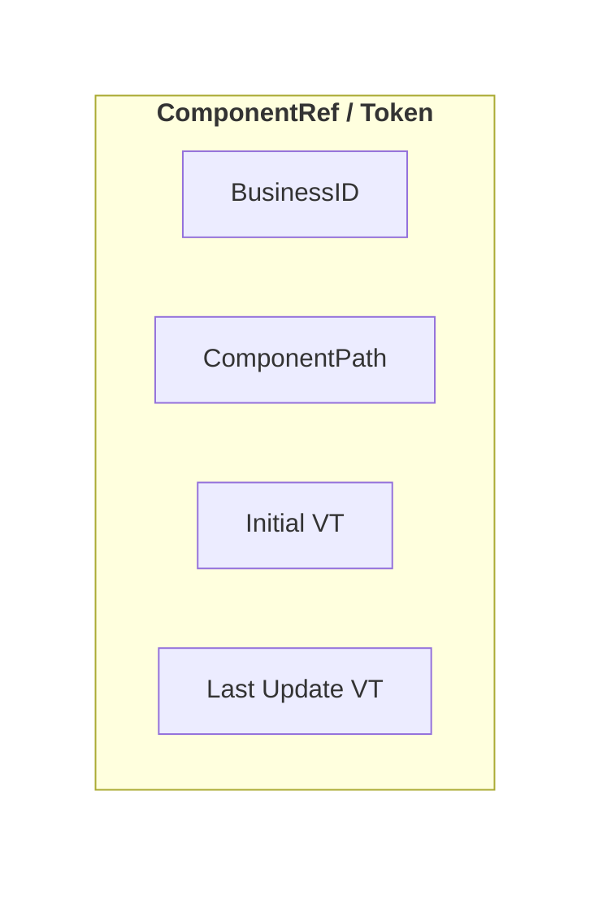
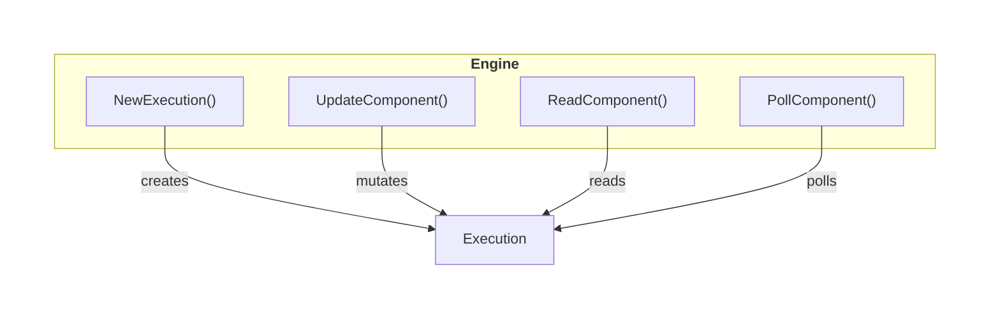
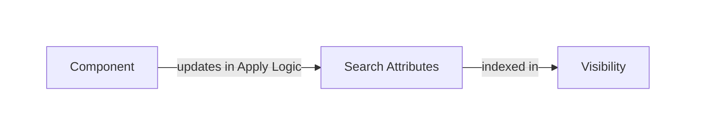

# CHASM: Coordinated Heterogeneous Application State Machines

This document is a step-by-step introduction to the core architecture and domain entities of the CHASM framework.

---

## Why CHASM?

Temporal Workflows are powerful, but they have real limits: too slow or heavyweight for some problems, unable to scale in every dimension (e.g. millions of signals, large payloads), and overly complex when a purpose-built solution would be simpler.

CHASM addresses this by treating Workflow as just one **Application State Machine (ASM)** among many. An ASM is a specialized state machine that leverages Temporal infrastructure like sharding, routing, atomic storage, failure recovery without the full cost of a Workflow.

---

## Application State Machine (ASM)

An **ASM** is a registered state machine type, composed of a Library, Component types, and Tasks.

<table>
  <tr>
    <td width="40%">



   </td>
   <td width="60%">

### Registry
The global catalog of all registered Libraries.

### Library
A Library groups components, tasks, and service handlers into a namespace.

Examples: [**`workflow`**](../../chasm/lib/workflow/library.go), [**`scheduler`**](../../chasm/lib/scheduler/library.go) and [**`nexusoperation`**](../../chasm/lib/nexusoperation/library.go)

### Component type
A registered type that defines **state** (Fields and Search Attributes) and **behavior** (Transitions).
Each Component type is identified by a name (aka **Archetype**), which CHASM converts to a stable ID (aka **Archetype ID**) for storage.

> [!NOTE]
> At runtime, a Component type is instantiated as a **Component** living inside a Node — see [Executions](#executions).

### Tasks
Asynchronous work units (e.g. network calls, timers) that a Component type can schedule. Registered in Library alongside Component types.

### Fields
The framework-managed containers for a component's persisted state.

### Search Attributes
Key-value metadata declared per Component type, indexed into Temporal Visibility for querying.

   </td>
  </tr>
</table>

---

## Component State

A Component's state is made up of typed Fields. CHASM uses these to persist and replicate data.

<table>
  <tr>
    <td width="40%">



   </td>
   <td width="60%">

### Fields
- **`Field[T]`** — stores a single value.
- **`Map[K, T]`** — stores a keyed collection.
- **`ParentPtr`** — a typed reference to the parent Component. Allows a child to read its parent's state and call its methods.
- **Transient fields** — plain Go fields (not wrapped in a `Field`) that hold in-memory derived state. Not persisted; invalidated and recomputed as needed.

`T` can be either a Protobuf message or a child Component (e.g. `Field[*Generator]`, `Map[string, *Backfiller]`).

A special built-in field type is **`Field[*chasm.Visibility]`**, which exposes Search Attributes for querying via Temporal Visibility — see [Search Attributes](#search-attributes).

> [!NOTE]
> Each `Field` is persisted independently, so updates only write what changed. Use a separate field for data that changes at a different frequency, is large, or is only read in certain operations.

   </td>
  </tr>
</table>

---

## Component Lifecycle

Every Component implements a lifecycle method that CHASM uses to determine whether it has reached a terminal state.

<table>
  <tr>
    <td width="40%">



   </td>
   <td width="60%">

### Running
The component is active and accepting transitions.

### Completed
The component finished successfully. CHASM treats this as terminal.

### Failed
The component finished with an error. CHASM treats this as terminal.

   </td>
  </tr>
</table>

---

## Executions

An **Execution** is a live instance of an ASM.

<table>
  <tr>
    <td width="40%">

```
Execution
├─ Namespace
├─ BusinessID
├─ RunID
└─ Node (0..n)
   ├─ ComponentPath
   └─ Component
```

   </td>
   <td width="60%">

### Namespace
Top-level isolation boundary.

### BusinessID
Stable, human-meaningful name (e.g., a Workflow ID or Order ID). Persists across resets.

### RunID
A single incarnation. If reset or restarted, the Execution gets a new RunID while the BusinessID stays the same.

### Node
The framework's storage bucket. Every Execution starts with a Root Node, which can own 0 or more Child Nodes.

### Component
The runtime instance of a Component type, living inside a Node. The Node handles storage; the Component handles behavior.

### ComponentPath
A sequence of names that uniquely identifies a Node's position in the tree — like a file path (e.g., `["nexus", "operations", "op-123"]`).

   </td>
  </tr>
</table>

---

## Behavior: State Machines and Transitions

Component behavior is modeled as a state machine. Developers declare valid transitions between states.

<table>
  <tr>
    <td width="40%">



   </td>
   <td width="60%">

### StateMachine
The `StateMachine[S comparable]` interface. Implemented by declaring `Transition` structs — each specifying a source state, an event type, and a destination state.

### Event
The trigger for a state change: a network callback, timer firing, or incoming signal.

### Apply Logic
The business code that runs when a transition fires. Receives a `MutableContext` (§4) and may update Fields, schedule Tasks, or modify child Nodes.

   </td>
  </tr>
</table>

---

## Context

Apply Logic and task executors receive a Context that controls what they are allowed to do.

<table>
  <tr>
    <td width="40%">



   </td>
   <td width="60%">

### Context
Read-only access to the execution. Passed to `ReadComponent` and query handlers.

### MutableContext
Extends `Context` with:
- **`AddTask()`** — schedules a task as part of the current transition.

Only code inside a transition receives a `MutableContext`. This enforces that all state mutations and side effects originate from transitions.

   </td>
  </tr>
</table>

---

## Tasks

Transitions can schedule tasks to interact with the outside world. There are two kinds with different execution timing and capabilities.

<table>
  <tr>
    <td width="40%">



   </td>
   <td width="60%">

### Pure Tasks
Execute *within* the transaction. Receive a `MutableContext` and can directly read and mutate component state. Use for fast, in-process work: computing derived state, triggering child transitions.

### Side Effect Tasks
Execute *asynchronously* after the transaction commits. Can call external services (gRPC, queues) via context, but **cannot directly mutate state** — any resulting state change must come back as a new event on a new transition.
- Only dispatched if the state update committed successfully.
- Slow external calls never block the state machine.

   </td>
  </tr>
</table>

---

## Consistency: VersionedTransition

Every transition is stamped with a **VersionedTransition (VT)** — the logical clock of CHASM.

<table>
  <tr>
    <td width="40%">



   </td>
   <td width="60%">

### VersionedTransition
Two components:
- **Failover Version** — increments when the owning cluster changes (cross-DC failover).
- **Transition ID** — increments with every state update.

Together they provide a total ordering of all state changes, even across data centers.

### Atomicity
A transition either fully commits to the database (state + scheduled tasks) or rolls back entirely. There is no partial write.

   </td>
  </tr>
</table>

---

## Callbacks: ComponentRef

When a component starts an external task and needs the result routed back, it creates a **ComponentRef** — a serialized token that acts as a return address.

<table>
  <tr>
    <td width="40%">



   </td>
   <td width="60%">

### ComponentRef
Contains the **BusinessID** and **ComponentPath** so the callback can find the right node. Also carries two VT values:

- **Initial VT** — the VT when this node was *created*. Guards against a callback for a deleted-and-recreated node hitting the wrong instance at the same path.
- **Last Update VT** — the VT when the token was *issued*. Guards against a stale callback updating a node that has already moved past the expected state.

   </td>
  </tr>
</table>

---

## The Engine

The Engine is the external API for creating and driving CHASM executions.

<table>
  <tr>
    <td width="40%">



   </td>
   <td width="60%">

### NewExecution
Creates an execution with a root component. Produces the first transition and persists the initial state.

### UpdateComponent
Delivers an event to a component and runs the corresponding Apply Logic inside a transaction. The primary way to drive state changes.

### ReadComponent
Returns a component's current state without producing a transition. Caller receives a `Context`.

### PollComponent
Blocks until a component satisfies a condition. Avoids busy-polling for long-running state changes.

   </td>
  </tr>
</table>

---

## Search Attributes

Components can declare **Search Attributes** to make executions queryable through Temporal Visibility.

<table>
  <tr>
    <td width="40%">



   </td>
   <td width="60%">

### Registration
Declared per component type in the Library definition, alongside Fields.

### Updates
Apply Logic is responsible for keeping Search Attributes up to date during transitions, alongside Field writes.

### Querying
Once indexed, Search Attributes allow querying executions by business-relevant criteria (e.g., "all executions in state `Scheduled` for customer `X`").

   </td>
  </tr>
</table>

---

## Typical Package Layout

Each ASM is a **self-contained package**.

```
my_asm/
├── proto/
│   └── my_asm.proto       # Service API (gRPC) and state/field message types
├── <component>.go         # Component struct, Field declarations, lifecycle method etc.
├── config.go              # Dynamic config settings for the ASM
├── frontend.go            # Frontend gRPC handler to map API calls to Engine operations
├── fx.go                  # fx module to wire the Library into the application
├── library.go             # Registers component and task types with the Library
└── statemachine.go        # Transition declarations
```
