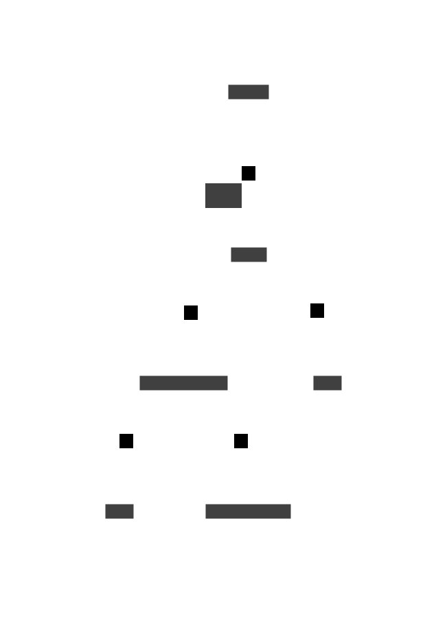
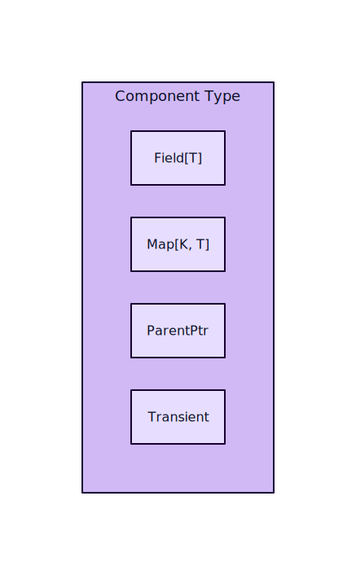
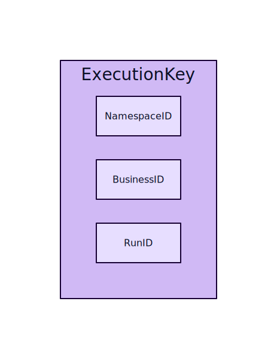
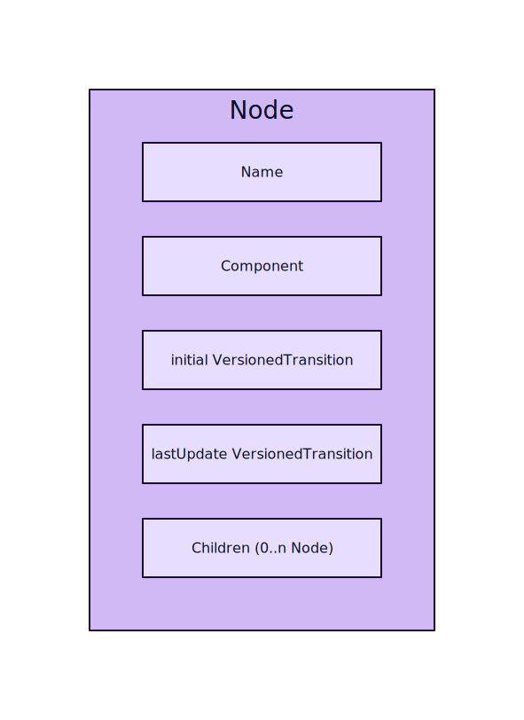
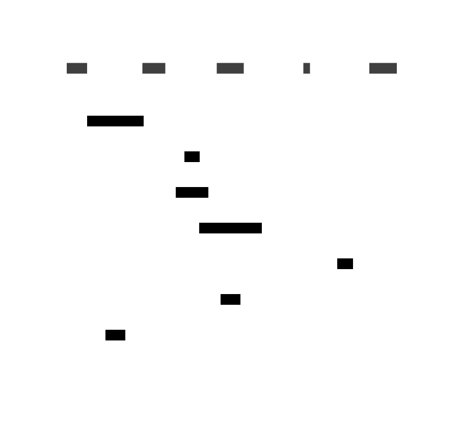
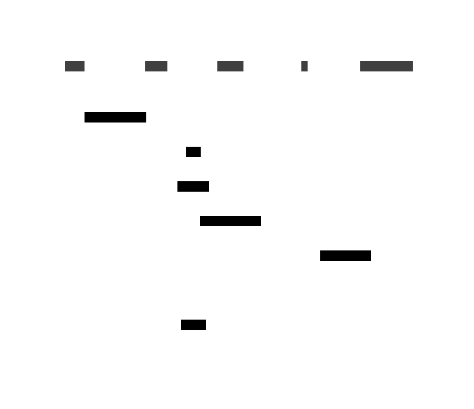
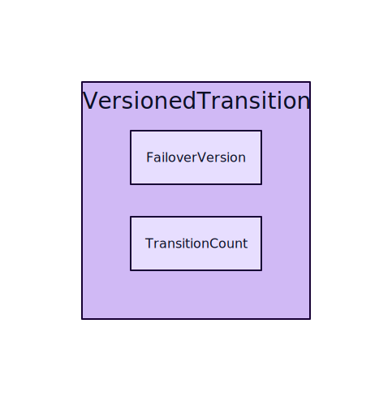
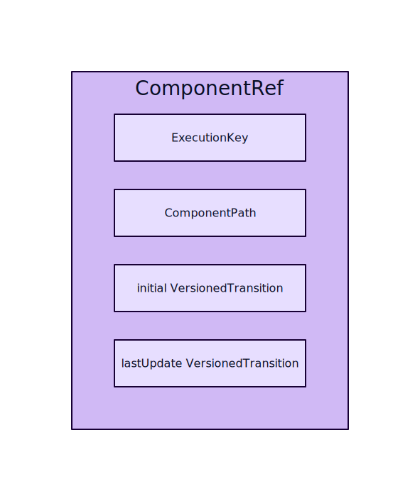
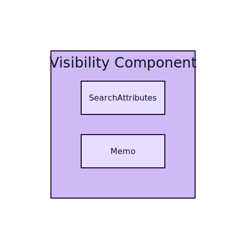

# CHASM: Coordinated Heterogeneous Application State Machines

This document is a step-by-step introduction to the core architecture and domain entities of the CHASM framework.

---

## Why CHASM?

Temporal Workflows are powerful, but they have real limits: too slow or heavyweight for some problems, unable to scale in every dimension (e.g. millions of signals, large payloads), and overly complex when a purpose-built solution would be simpler.

CHASM addresses this by treating Workflow as just one **Application State Machine (ASM)** among many. An ASM is a specialized state machine that leverages Temporal infrastructure like sharding, routing, atomic storage, failure recovery without the full cost of a Workflow — and hides those distributed systems details behind a clean, typed API so developers can focus on business logic.

---

## Application State Machine (ASM)

An **ASM** is a registered state machine type, composed of a Library, Component types, and Tasks.

<table>
  <tr style="background-color: transparent">
    <td width="500">



   </td>
   <td width="500">

### Registry
The global catalog of all registered Libraries.

### Library
A Library groups components, tasks, and service handlers into a namespace.

Examples: [**`workflow`**](../../chasm/lib/workflow/library.go), [**`scheduler`**](../../chasm/lib/scheduler/library.go) and [**`nexusoperation`**](../../chasm/lib/nexusoperation/library.go)

### Component type
A registered type that defines **state** (Fields) and **behavior**.
Each Component type is identified by a name (aka **Archetype**), which CHASM converts to a stable ID (aka **Archetype ID**) for storage.

> [!NOTE]
> At runtime, a Component type is instantiated as a **Component** living inside a Node — see [Execution](#execution).

### Tasks
Asynchronous work units (e.g. network calls, timers) that a Component type can schedule. Registered in Library alongside Component types.

### Fields
The framework-managed containers for a component's persisted state.

   </td>
  </tr>
</table>

---

## Component State

A Component's state is made up of typed Fields. CHASM uses these to persist and replicate data.

<table>
  <tr style="background-color: transparent">
    <td width="500">



   </td>
   <td width="500">

### Field types
- **`Field[T]`** — stores a single value.
- **`Map[K, T]`** — stores a keyed collection.
- **`ParentPtr`** — a typed reference to the parent Component. Allows a child to read its parent's state and call its methods.
- Transient fields — plain Go fields (not wrapped in a `Field`) that hold in-memory derived state. Not persisted; invalidated and recomputed as needed.

`T` determines the field kind:
- **Data Field** — `T` is a Protobuf message; stores serialized data.
- **Component Field** — `T` is a child Component; stores a nested component subtree.

> [!NOTE]
> `Field` and `Map` children are each persisted as separate nodes. Use a separate field for data that changes at a different frequency, is large, or is only read in certain operations.

   </td>
  </tr>
</table>

---

## Execution

An **Execution** is a runtime instance of an ASM. Namespace retention, visibility records, and ID reuse policies all apply at the Execution level.

<table>
  <tr style="background-color: transparent">
    <td width="500">



   </td>
   <td width="500">

### ExecutionKey (*identity*)
The unique identifier of an Execution, composed of:
- **NamespaceID**
- **BusinessID** — user-defined name (e.g., a Workflow ID). Persists across resets.
- **RunID** — a single instance. Changes on reset or when a follow-up run is started under the same BusinessID; the BusinessID stays the same.

   </td>
  </tr>
</table>

<table>
  <tr style="background-color: transparent">
    <td width="500">



   </td>
   <td width="500">

### Node (*state*)
The state of the Execution where [`ExecutionKey`](#executionkey-identity) identifies the **Root Component**.
- **Name** — the child's key in its parent: a sub-component field name or a `Map` key.
- **Component** — the runtime instance of a Component type. The Node handles storage; the Component handles behavior.
- **Children** — 0 or more child Nodes, each keyed by name.
- **initialVT / lastUpdateVT** — [VersionedTransition](#versionedtransition) stamps.

The root Node and its descendants form the **CHASM Tree** of the Execution.

### ComponentPath
The sequence of Names from the root to a child Node within an Execution (e.g. `["callbacks", "cb-1"]`).

   </td>
  </tr>
</table>

---

## Component Lifecycle

Every Component implements a lifecycle method that CHASM uses to determine whether it has reached a terminal state.

<table>
  <tr style="background-color: transparent">
    <td width="500">


   </td>
   <td width="500">

### States
- **Running** — the component is active and accepting transitions.
- **Completed** — the component finished successfully; a terminal state.
- **Failed** — the component finished with an error; a terminal state.

### Terminal State

When the **Root Component** reaches a terminal state, the Execution closes: its BusinessID becomes available for reuse and it is eventually deleted according to the namespace's retention policy.

   </td>
  </tr>
</table>

---

## Engine

The **Engine** is the entry point for interacting with Executions.

<table>
  <tr style="background-color: transparent">
    <td width="600">



   </td>
   <td width="400">

### Read
- **ReadComponent** — reads a Component's state without triggering a Transition.
- **PollComponent** — reads a Component's state and waits (long-polls) until a condition is met.
- **NotifyExecution** — notifies any `PollComponent` callers waiting on the Execution.

### Context
Read-only. Provided during reads and task validation.

   </td>
  </tr>
</table>

<table>
  <tr style="background-color: transparent">
    <td width="600">



   </td>
   <td width="400">

### Write
- **StartExecution** — creates a new Execution.
- **UpdateWithStartExecution** — creates a new Execution or updates an existing one atomically.
- **UpdateComponent** — delivers an event to a Component, triggering a [Transition](#transition).
- **DeleteExecution** — deletes an Execution.

### MutableContext
Provided during write operations. Allows writing Fields and scheduling Tasks.

   </td>
  </tr>
</table>

---

## Transition

A **Transition** is the atomic unit of state change in CHASM. It operates on the entire Execution — any Node can be read or mutated.

<table>
  <tr style="background-color: transparent">
    <td width="500">


   </td>
   <td width="500">

### Event
Any external trigger delivered to a Component — e.g. a network callback, timer firing, or incoming signal.

### Transition Fn
Developer-provided code that runs when the Event is delivered. May write Fields and schedule Tasks.

### Atomicity
All Field writes and Task schedules from a transition commit together as a single database write, or roll back entirely. On commit, every modified Node is stamped with a new [**VersionedTransition**](#versionedtransition).

   </td>
  </tr>
</table>

---

## Tasks

Transitions can schedule Tasks for deferred work. There are two kinds, differing in when they run and what they can access. Tasks are written atomically with the component state ([transactional outbox pattern](https://microservices.io/patterns/data/transactional-outbox.html)), guaranteeing no work is silently lost on crash.

<table>
  <tr style="background-color: transparent">
    <td width="500">


   </td>
   <td width="500">

### Pure Task
Runs within a transaction with full read/write access to component state. A Pure Task scheduled without a deadline runs immediately in the same transaction as the scheduling Transition. One scheduled with a deadline runs in a new transaction when the deadline fires.

### Side Effect Task
Runs asynchronously after the transaction commits. Can call external services but cannot mutate state directly — any state change must go through the same API as any external caller.

### Task Executor
Each task type is processed by a handler with two methods:
- **Validator** — runs before execution; discards the task when it is no longer relevant (e.g. a newer attempt has superseded an older timer).
- **Executor** — carries out the task's work.

### Retries
If the Validator or Executor returns an error, the framework retries the task until it succeeds or the Validator discards it.

Tasks are processed in FIFO order in general, but strict ordering is not guaranteed.

   </td>
  </tr>
</table>

---

## VersionedTransition

Every transition is stamped with a **VersionedTransition** — the logical clock of CHASM.

<table>
  <tr style="background-color: transparent">
    <td width="500">



   </td>
   <td width="500">

Provides a total ordering of all state changes, even across data centers.

- **FailoverVersion** — increments when the owning cluster changes (cross-DC failover).
- **TransitionCount** — increments with every state update within the Execution.

   </td>
  </tr>
</table>

---

## ComponentRef

When a component starts an external task and needs the result routed back as a **callback**, it creates a **ComponentRef** — a serialized token that acts as a return address.

<table>
  <tr style="background-color: transparent">
    <td width="500">



   </td>
   <td width="500">

Contains the full [**ExecutionKey**](#executionkey-identity) and [**ComponentPath**](#componentpath) so the callback can find the right node.

Also carries two [VersionedTransition](#versionedtransition) values:

- **initialVT** — the VersionedTransition when this node was *created*. Guards against a callback for a deleted-and-recreated node hitting the wrong instance at the same path.
- **lastUpdateVT** — the VersionedTransition when the token was *issued*. Guards against a stale callback updating a node that has already moved past the expected state.

### Consistency Check
When a callback arrives, the Engine loads the Node at the given ComponentPath and verifies both VT values before allowing the transition to proceed. A mismatch on either value causes the callback to be rejected.

   </td>
  </tr>
</table>

---

## Visibility

**Visibility** is a built-in child Component that manages an Execution's visibility record.

<table>
  <tr style="background-color: transparent">
    <td width="500">



   </td>
   <td width="500">

### Search Attributes
Indexed key-value pairs that make Executions queryable. There are two sources:
- **User-defined** custom Search Attributes stored by the archetype user (e.g. custom tags on a workflow execution).
- **Component-defined** Search Attributes computed dynamically from the root component's state, provided by implementing the search attributes provider interface.

### Memo
Unindexed key-value metadata attached to an Execution. There are two sources:
- **User-defined** custom Memo stored by the archetype user.
- **Component-defined** Memo computed dynamically from the root component's state, provided by implementing the memo provider interface.

   </td>
  </tr>
</table>

---

## Typical Package Layout

Each ASM is a **self-contained package**.

```
my_asm/
├── proto/
│   └── my_asm.proto       # Service API (gRPC) and state/field message types
├── <component>.go         # Component struct, Field declarations, lifecycle method etc.
├── config.go              # Dynamic config settings for the ASM
├── frontend.go            # Frontend gRPC handler to map API calls to Engine operations
├── fx.go                  # fx module to wire the Library into the application
├── library.go             # Registers component and task types with the Library
└── statemachine.go        # (optional) Transition declarations using the statemachine framework
```
