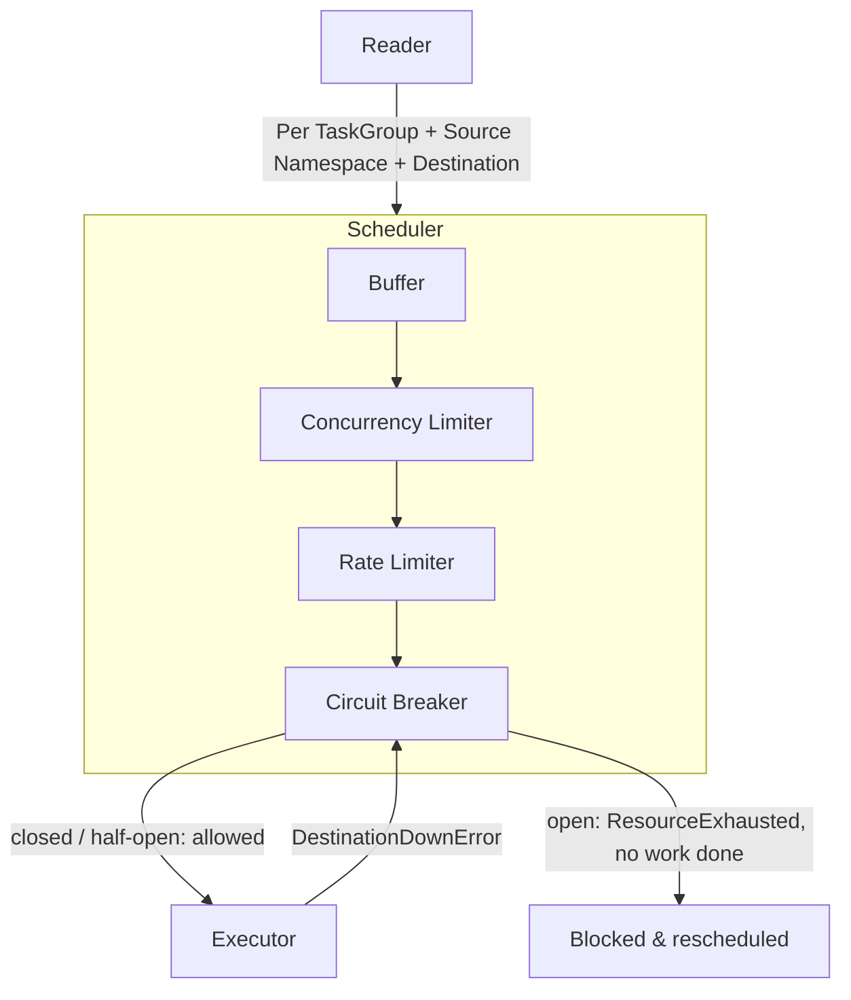

# Outbound Queue Circuit Breaker

Most work in Temporal's history service drives workflows forward internally. But some tasks make
*outbound* calls to systems outside the server. The main example is [Nexus](./nexus.md): invoking a
Nexus operation makes the server issue an HTTP request to a Nexus endpoint (which may be another
Temporal namespace or an external service). Another example is delivering a workflow-completion
[callback](../../components/callbacks) (an HTTP request the server sends when a workflow finishes).

In these cases, the server — not a user Worker — is the client making the request.

These calls are driven by the [outbound task queue](./nexus.md#outbound-task-queue), an internal,
sharded "immediate" queue in the history service. Because outbound tasks talk to systems the server does not control,
they add a failure mode internal tasks don't have: the destination can be slow or down. Retrying
every task for a dead destination is expensive — each attempt loads the workflow's *mutable state*
(the per-execution record the server reads from cache or the database), occupies a scheduler
goroutine, and then blocks on a request that is doomed to time out. Left unchecked, one unhealthy
destination can starve the queue of the capacity healthy destinations need to make progress.

The **circuit breaker** contains that blast radius. It applies the well-known [circuit breaker
design pattern](https://en.wikipedia.org/wiki/Circuit_breaker_design_pattern): after a destination
has failed enough, the breaker "trips" and fails subsequent calls fast instead of letting them pile
up against a dependency that is already struggling. Here it is the last stage of the outbound queue's
per-group processing pipeline, and it short-circuits work bound for a destination that has been
failing, so the queue stops spending effort on requests likely to fail again. (And the task will
remain in the queue, to be retried later.)

> This document focuses on the circuit breaker and its isolation properties. For the surrounding
> outbound queue machinery — multi-cursor readers, the group-by scheduler, buffers, and rate limiters — see
> [Outbound Task Queue](./nexus.md#outbound-task-queue) in the Nexus docs.

## The circuit breaker primitive

The breaker is a thin wrapper over the [gobreaker](https://pkg.go.dev/github.com/sony/gobreaker)
library, defined in [`common/circuitbreaker/circuitbreaker.go`](../../common/circuitbreaker/circuitbreaker.go).

The public interface is `TwoStepCircuitBreaker`. "Two-step" means acquiring permission and reporting
the outcome are separate calls, rather than gobreaker executing a closure for you:

```go
type TwoStepCircuitBreaker interface {
    Name() string
    State() gobreaker.State
    Counts() gobreaker.Counts
    Allow() (done func(success bool), err error)
}
```

`Allow()` either returns an error (the breaker is open — the caller must not proceed) or returns a
`done` callback the caller invokes with `true`/`false` once the work completes. This split is what
lets the outbound queue decide, *after* running a task, whether the resulting error should count as a
destination failure (see below).

The concrete implementation, `TwoStepCircuitBreakerWithDynamicSettings`, adds one Temporal-specific
capability: its `MaxRequests`, `Interval`, and `Timeout` come from [dynamic
config](../../common/dynamicconfig/shared_constants.go) and can change at runtime. When they change,
its `UpdateSettings` callback atomically swaps in a freshly constructed gobreaker (note: the swap
resets the breaker's state and counters). `Allow()` itself just delegates to the current breaker. The
trip policy is gobreaker's default: the breaker opens when **consecutive failures exceed 5**.

### Breaker states

The breaker is a standard three-state machine:

- **Closed** — the normal state. Requests pass through, and consecutive `done(false)` calls are
  counted; once the count exceeds 5, the breaker trips to Open.
- **Open** — the destination is considered down. `Allow()` returns an error immediately without doing
  any work. After `Timeout` (default 60s) the breaker moves to Half-Open.
- **Half-Open** — a probing state. Up to `MaxRequests` (default 1) requests are allowed through. If
  they succeed, the breaker closes; if any fails, it re-opens and waits another `Timeout`.

stateDiagram-v2
    [*] --> Closed

    state "Closed" as Closed
    state "Open" as Open
    state "Half Open" as HalfOpen

    Closed: Requests pass through
    Open: Requests fail fast
    HalfOpen: Limited probe requests

    Closed --> Open: done(false) > 5
    Open --> HalfOpen: Timeout elapsed
    HalfOpen --> Closed: probes succeed
    HalfOpen --> Open: any probe fails


## Wiring into the outbound queue

Rather than one global breaker, the server keeps a *pool* of breakers keyed by the identity of the
work. A single global breaker would be far too coarse: one unhealthy destination would trip the
breaker for *every* outbound task on the host, blocking healthy destinations too. Keying the pool
means a failing destination only trips its own breaker. In practice the key is **(`TaskGroup`,
`NamespaceID`, `Destination`)** — for Nexus, `Destination` is the endpoint *name* (e.g. `"my-endpoint"`),
not a full URL nor hostname. (The endpoint name is resolved to an actual target — a task queue
or an external URL — separately; see [below](#what-actually-gets-isolated).) Two generic pieces make
this up:

- [`CircuitBreakerPool[K]`](../../service/history/circuitbreakerpool/circuit_breaker_factory.go) — a
  lazily-populated map from key `K` to a breaker, backed by a `collection.OnceMap` (entries are
  created on first access and never deleted for the life of the process).
- [`OutboundQueueCircuitBreakerPool`](../../service/history/circuitbreakerpool/fx.go) — the concrete
  pool used by the outbound queue, keyed by
  [`tasks.TaskGroupNamespaceIDAndDestination`](../../service/history/tasks/predicates.go):

```go
type TaskGroupNamespaceIDAndDestination struct {
    TaskGroup   string // the state-machine task type, e.g. "nexusoperations.Invocation"
    NamespaceID string // the source (caller) namespace
    Destination string // the Nexus endpoint name (or callback destination)
}
```

**This key is the crux of the isolation story.** When a breaker is first requested for a key, the pool
reads that (namespace, destination) pair's initial `OutboundQueueCircuitBreakerSettings` and subscribes
to future changes, so operators can tune or disable the breaker per destination via dynamic config.

The pool is a per-host singleton (provided once via
[fx](../../service/history/circuitbreakerpool/fx.go) and injected into the [outbound queue
factory](../../service/history/outbound_queue_factory.go)). A history host owns many *shards*, and
each workflow execution lives on exactly one shard at a time; all shards on a host share the same
breaker for a given key.

> **Circuit Breaking for Nexus**
>
> `Destination` is set to the Nexus *endpoint* — a cluster-global, named routing target that resolves to
> *either* a **Worker** target (one namespace ID + one Nexus task queue) *or* an **External** target
> (one URL). The endpoint has no notion of "service": *service* and *operation* names travel on each
> request, so one endpoint can route to many services and operations, and they all share one breaker
> (for a given task group and caller).
>
> `nexusoperations.Invocation` and `nexusoperations.Cancelation` are distinct task groups and therefore
> get distinct breakers.

### The `CircuitBreakerExecutable`

The breaker is spliced into task processing by wrapping each task's `Executable` in a
[`CircuitBreakerExecutable`](../../service/history/queues/executable.go), constructed in the outbound
queue factory where `CircuitBreakerPool.Get(key)` looks up the breaker for the task's
group/namespace/destination. Its `Execute()` ties the pieces together:

```go
func (e *CircuitBreakerExecutable) Execute() error {
    doneCb, err := e.cb.Allow()
    if err != nil {
        metrics.CircuitBreakerExecutableBlocked.With(e.metricsHandler).Record(1)
        // Returned as a ResourceExhausted so the task is retried gently and is NOT sent to the DLQ.
        return fmt.Errorf("%w: %w",
            serviceerror.NewResourceExhausted(
                enumspb.RESOURCE_EXHAUSTED_CAUSE_CIRCUIT_BREAKER_OPEN, "circuit breaker rejection"),
            err)
    }
    // ... (panics report failure via doneCb(false) and re-panic)
    err = e.Executable.Execute()
    var destinationDownErr *queueserrors.DestinationDownError
    if errors.As(err, &destinationDownErr) {
        err = destinationDownErr.Unwrap()
    }
    doneCb(destinationDownErr == nil)
    return err
}
```

Two behaviors are worth calling out:

1. **When the breaker is open**, the task never reaches the underlying executor. It short-circuits
   with a `ResourceExhausted` / `CIRCUIT_BREAKER_OPEN` error. This is deliberate: `ResourceExhausted`
   makes the task retry gently and keeps it out of the dead-letter queue
   ([DLQ](./history-service.md)), where a poison task would otherwise land and stop being retried —
   so no work, not even loading mutable state, is spent on a destination that is down. Each rejection
   emits the `circuit_breaker_executable_blocked` metric.

2. **What counts as a failure is narrow.** The breaker records `done(false)` only when the executor
   returns a `DestinationDownError`
   ([`service/history/queues/errors/errors.go`](../../service/history/queues/errors/errors.go)). Any
   other error — including a Nexus operation that fails for application-level reasons — is reported as
   a *success* (`done(true)`), because it says nothing about whether the destination is healthy. The
   breaker tracks destination *health*, not task *outcomes*.

### Pipeline position



## Configuration and observability

- **Dynamic config:** [`history.outboundQueue.circuitBreakerSettings`](../../common/dynamicconfig/constants.go)
  (`OutboundQueueCircuitBreakerSettings`) tunes `MaxRequests`, `Interval`, and `Timeout` per
  destination. Changes take effect without a restart via the settings subscription.
- **Metrics:** `circuit_breaker_executable_blocked` counts tasks rejected while a breaker is open. The
  surrounding scheduler stages emit their own metrics tagged with the group key — see [Outbound Task
  Queue](./nexus.md#outbound-task-queue).
- **Disabling the queue entirely:** set `history.outboundTaskBatchSize` to `0`.

## Related reading

- [Nexus](./nexus.md) — the primary producer of outbound tasks, and the Nexus endpoint registry.
- [History Service](./history-service.md) — queues, task executors, and the DLQ.
- [Retry](./retry.md) — how errors like `ResourceExhausted` influence retry behavior.
