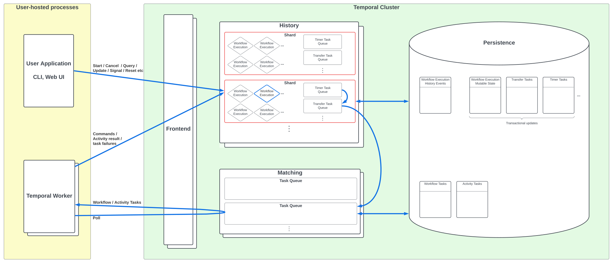
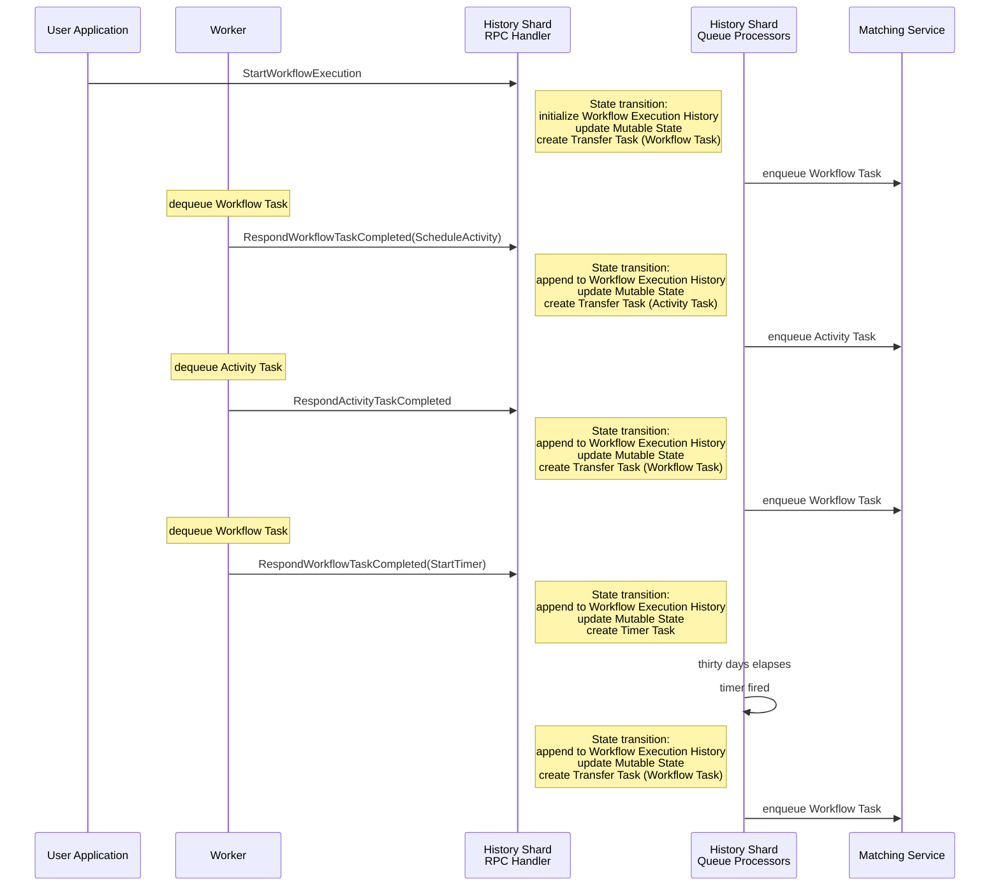
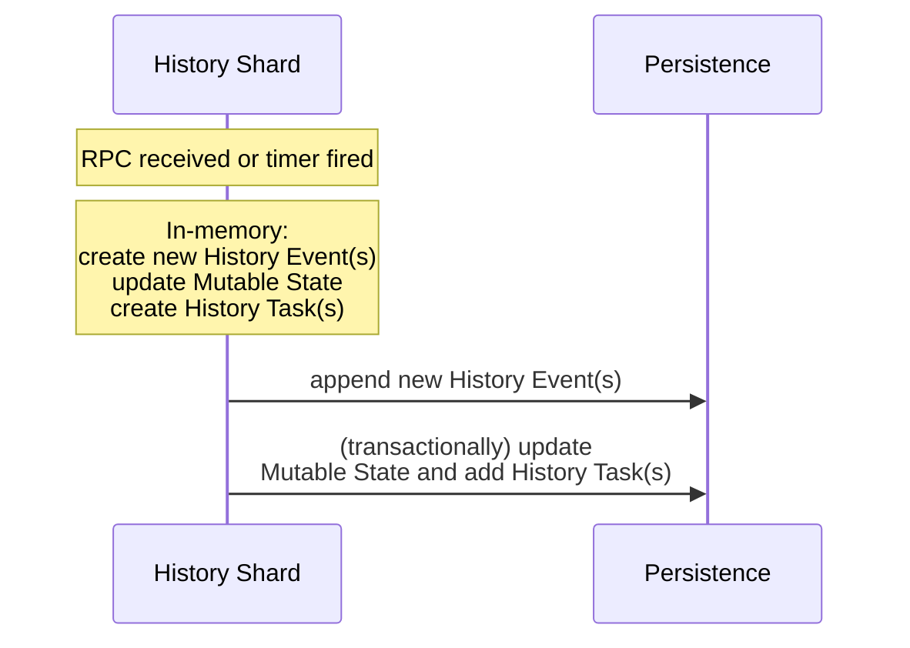

# History Service

This page is an introduction to the History Service architecture and internal implementation.
See [Temporal overview](./README.md) for a system architecture overview placing this in context.

<!-- https://lucid.app/lucidchart/0202e4b8-5258-4cd6-a6a0-67159300532b/edit -->


The History Service handles two main types of request (gRPC) relating to an individual Workflow Execution:

1. **Requests originating from the User Application** (Start / Cancel / Query / Update / Signal / Reset etc).

2. **Requests originating from Temporal Workers**, on completion of a Workflow Task or Activity Task.

A simplistic description of what the History Service does when handling these requests is:

1. _Determine the new History Events that the request implies, and append these to Workflow History._

2. _If the request implies that a Workflow or Activity Task should be created for the workflow, then add a Transfer Task in a History Service task queue, representing the task that must be added to Matching Service._

3. _Alternatively, if the request is a Worker reporting that the user workflow is blocked on a timer, then add a Timer Task in a History Service task queue; when that timer expires, create a Transfer Task representing the Workflow Task in Matching that is required to continue advancing the workflow._

This is illustrated in the diagram below, which contains a typical sequence of events in the execution of the following workflow pseudocode (see [Workflow Lifecycle](./workflow-lifecycle.md) for more detailed scenarios):

```javascript
function myWorkflow() {
  result = callActivity(myActivity);
  workflowSleep(THIRTY_DAYS);
  return result;
}
```



However, there are several requirements that make the above challenging to implement. In particular:

- **Scaling**: the History service must be able to support arbitrarily many concurrent workflow executions. See [History shards](#history-shards).
- **Consistency**: the Workflow and Activity tasks in Matching Service must be consistent with the workflow execution data in History Service. See [Consistency guarantees](#consistency-guarantees).
- **Latency** of request handling and server-side workflow advance must be minimized.

The rest of this document describes the implementation, which addresses these requirements.

The History Service has many other responsibilities which are not covered here, for example: Shard Membership and Ownership, Replication and conflict resolution, Visibility, Archival, Workflow Reset.

## Concepts

### History shards

A single Temporal Cluster manages many (e.g. millions of) Workflow Executions.
These are logically partitioned into subsets that we call History Shards.
The Temporal Cluster typically has multiple instances of the History service application process (each typically running on a separate machine/VM), and each History service instance owns some set of History Shards.
"Owning" a History Shard means being responsible for the lifecycle of every workflow execution in the shard by [handling incoming requests](#rpc-handling) relating to that workflow execution, managing timers, and causing Workflow and Activity Tasks to be enqueued in Matching Service. To achieve this, each shard manages its own [task queues](#queue-processing).

Therefore, objects corresponding to History Shards exist in the memory of a History service instance.
Persistence details are abstracted away via a Go interface but in practice, when the persistence layer is backed by Cassandra, History Shards map 1-1 with partitions of the [`executions` table](https://github.com/temporalio/temporal/blob/ef49189005b5323c532264287af6c08a447aab8a/schema/cassandra/temporal/schema.cql#L52). Persistence layer implementations also exist for MySQL, Postgres, and SQLite.

<details>
<summary><i>Code entrypoints</i></summary>

- [`schema/`](https://github.com/temporalio/temporal/blob/ef49189005b5323c532264287af6c08a447aab8a/schema) directory
- When the History service starts on a host, [`Start()`](https://github.com/temporalio/temporal/blob/ef49189005b5323c532264287af6c08a447aab8a/service/history/history_engine.go#L288) is called for each shard owned by that host.

</details>

### Workflow Execution "Mutable State"

For every workflow execution, we maintain a collection of data structures summarizing various aspects of its current state, for example, the identities of in-progress activities, timers, and child workflows.
Although most of this data could in principle be recomputed from Workflow History Events when handling an incoming request, this would be slow, and hence the summaries themselves are persisted.
Mutable State for recently accessed workflow executions are cached in memory.
While it would be natural to arrange the persisted data following a relational schema, Cassandra is our most important persistence backend and has very limited support for RDBMS features, so in practice the data is persisted in a single row, similar to its layout in the in-memory cache.

<details>
<summary><i>Code entrypoints</i></summary>

- [`executions` table schema in Cassandra](https://github.com/temporalio/temporal/blob/ef49189005b5323c532264287af6c08a447aab8a/schema/cassandra/temporal/schema.cql#L7)
- Mutable State for a workflow is [loaded](https://github.com/temporalio/temporal/blob/ef49189005b5323c532264287af6c08a447aab8a/service/history/workflow/context.go#L248) ([cassandra](https://github.com/temporalio/temporal/blob/ef49189005b5323c532264287af6c08a447aab8a/common/persistence/cassandra/mutable_state_store.go#L485), [sql](https://github.com/temporalio/temporal/blob/ef49189005b5323c532264287af6c08a447aab8a/common/persistence/sql/execution.go#L226)) into the in-memory data type [`MutableStateImpl`](https://github.com/temporalio/temporal/blob/ef49189005b5323c532264287af6c08a447aab8a/service/history/workflow/mutable_state_impl.go#L112), which implements the [`MutableState`](https://github.com/temporalio/temporal/blob/ef49189005b5323c532264287af6c08a447aab8a/service/history/workflow/mutable_state.go#L108) interface.

</details>

### Workflow Execution History

Workflow Execution History is a linear sequence of History Events (unless the workflow has been `Reset` or subject to conflict resolution, in which case it has a branching topology).
Some events have associated data, for example containing the payload that was submitted in the request that generated the event.

History Events are a publicly-exposed part of Temporal's internal event-sourcing implementation, and have the property that the sequence of History Events alone, for some Workflow Execution, is sufficient to recover all other relevant information about the workflow execution's state (i.e. the Mutable State and the tasks relating to that workflow execution).
The set of event types are defined here, with some explanation of each: [`enum EventType`](https://github.com/temporalio/api/blob/66df148533a971f58fc0fec79bf25ab175ec1b78/temporal/api/enums/v1/event_type.proto#L35).

In general, Temporal uses the term "event" to mean Workflow History Event.
Note that this does not have the same meaning as in "event-driven architecture".
(Event-driven architecture refers to a system that is implemented as a collection of handlers responding to external events.
In contrast, a Workflow History Event is something that the Temporal Server computes internally to define the precise state of the Workflow Execution _after_ receiving an external event from the User Application or a request from the Worker on completion of a task, or when a timer fires.)

<details>
<summary><i>Code entrypoints</i></summary>

- [`enum EventType`](https://github.com/temporalio/api/blob/66df148533a971f58fc0fec79bf25ab175ec1b78/temporal/api/enums/v1/event_type.proto#L35)
- [`history_node`](https://github.com/temporalio/temporal/blob/ef49189005b5323c532264287af6c08a447aab8a/schema/cassandra/temporal/schema.cql#L56) and [`history_tree`](https://github.com/temporalio/temporal/blob/ef49189005b5323c532264287af6c08a447aab8a/schema/cassandra/temporal/schema.cql#L70) table schemas in Cassandra.

</details>

## Implementation Overview

### RPC handling

The History Service handles two types of gRPC requests relating to an individual Workflow Execution:

1.  **Requests originating from the User Application**<br>
    (Start / Cancel / Query / Update / Signal / Reset etc)

    The handlers for these requests are defined in [`history/api/`](https://github.com/temporalio/temporal/blob/main/service/history/api)

       <details>
       <summary><i>Code entrypoints</i></summary>

    - In the case of, for example, `StartWorkflow`, `UpdateWorkflow`, and `SignalWorkflow`, the RPC results in a [state transition](#state-transitions) which is implemented using a [shared code path](https://github.com/temporalio/temporal/blob/ef49189005b5323c532264287af6c08a447aab8a/service/history/api/update_workflow_util.go#L37).

    - For example, the handling of a `SignalWorkflow` request can be traced from the corresponding [`Invoke`](https://github.com/temporalio/temporal/blob/ef49189005b5323c532264287af6c08a447aab8a/service/history/api/signalworkflow/api.go#L38) function.

    </details>
    <br>

2.  **Requests originating from Temporal Workers**, on completion of a Workflow Task or Activity Task.

    For example:

    - `RespondWorkflowTaskCompleted`<br>
      These requests contain a sequence of [Commands](https://docs.temporal.io/references/commands), for example [`StartTimer`](https://docs.temporal.io/references/commands#starttimer), [`ScheduleActivityTask`](https://docs.temporal.io/references/commands#scheduleactivitytask), [`StartChildWorkflowExecution`](https://docs.temporal.io/references/commands#startchildworkflowexecution).<br>
      See [`enum CommandType`](https://github.com/temporalio/api/blob/66df148533a971f58fc0fec79bf25ab175ec1b78/temporal/api/enums/v1/command_type.proto#L35) for the complete list of commands.

    - `RespondActivityTaskCompleted`<br>
      These requests contain the result of the activity.

    - `RespondWorkflowTaskFailed`, `RespondActivityTaskFailed`, etc.

    <details>
    <summary><i>Code entrypoints</i></summary>

    - The [handler](https://github.com/temporalio/temporal/blob/ef49189005b5323c532264287af6c08a447aab8a/service/history/workflow_task_handler_callbacks.go#L371) for `WorkflowTaskCompleted` [accumulates updates](https://github.com/temporalio/temporal/blob/ef49189005b5323c532264287af6c08a447aab8a/service/history/workflow_task_handler_callbacks.go#L562) to MutableState from each of the contained commands, and then [calls](https://github.com/temporalio/temporal/blob/ef49189005b5323c532264287af6c08a447aab8a/service/history/workflow_task_handler_callbacks.go#L690) the same [state transition](#state-transitions) machinery that is used elsewhere.

    </details>
    <br>

### Queue processing

_It's important to understand that elsewhere in Temporal documentation, "task queue" refers to the [Task Queues](https://docs.temporal.io/workers#task-queue) of the Matching Service, which are a concept exposed to Temporal users; the task queues we are discussing here are an internal implementation detail of the History Service._

Each History Shard manages a collection of task queues.
These queues include replication, visibility, and archival task queues, but here we focus on the Timer Task queue and the Transfer Task queue.

When the History Service starts on a host, for every shard owned by that host, a per-shard `QueueProcessor` is started for each of the queue types (transfer, timer, replication, visibility, archival).
The `QueueProcessor` starts a variety of goroutines that are responsible for:

- Reading tasks from persistence that are ready to be executed.
- Submitting tasks for execution to the task execution framework.
- Periodically persisting queue "ack levels" (this periodic checkpointing represents a compromise between the desire to minimize the number of already-processed tasks processed on shard reload, and the desire to minimize write load).

<details>
<summary><i>Code entrypoints</i></summary>

- When the History service starts on a host, [`Start()`](https://github.com/temporalio/temporal/blob/ef49189005b5323c532264287af6c08a447aab8a/service/history/history_engine.go#L288) is called for each shard owned by that host, which starts the per-shard queue processor for each of the queue types.
- Each queue processor [starts](https://github.com/temporalio/temporal/blob/ef49189005b5323c532264287af6c08a447aab8a/service/history/queues/queue_base.go#L281) multiple [`Readers`](https://github.com/temporalio/temporal/blob/ef49189005b5323c532264287af6c08a447aab8a/service/history/queues/reader.go#L51) which, in response to messages on a certain channel, submit tasks to be processed.
- The per-shards QueueProcessor goroutines submit tasks for execution to the task execution framework implemented in [`common/tasks/`](https://github.com/temporalio/temporal/blob/ef49189005b5323c532264287af6c08a447aab8a/common/tasks).
- The task-execution framework itself uses a goroutine pool that is shared across shards. Ultimately, it [calls](https://github.com/temporalio/temporal/blob/ef49189005b5323c532264287af6c08a447aab8a/common/tasks/fifo_scheduler.go#L219) `Execute` and then either `Ack` or `Nack` on each task.

- Each queue processor also starts a goroutine running `processEventLoop`.
  There are two variants of `processEventLoop`: [one for immediate queues](https://github.com/temporalio/temporal/blob/ef49189005b5323c532264287af6c08a447aab8a/service/history/queues/queue_immediate.go#L150) such as the Transfer queue, and [one for scheduled queues](https://github.com/temporalio/temporal/blob/ef49189005b5323c532264287af6c08a447aab8a/service/history/queues/queue_scheduled.go#L199) such as the Timer queue. For both queue types, [`checkpoint()`](https://github.com/temporalio/temporal/blob/ef49189005b5323c532264287af6c08a447aab8a/service/history/queues/queue_base.go#L349) is called periodically, which persists queue ack levels.

- [`executions` table schema in Cassandra](https://github.com/temporalio/temporal/blob/ef49189005b5323c532264287af6c08a447aab8a/schema/cassandra/temporal/schema.cql#L7)
- [handling](https://github.com/temporalio/temporal/blob/ef49189005b5323c532264287af6c08a447aab8a/service/history/timer_queue_active_task_executor.go#L114) of the various types of timers in the Timer Task queue.

   </details>
   <br>

#### Transfer Task queue

A Transfer Task is available to be executed immediately.
When a Transfer Task is executed, an RPC is made to the Matching Service, for example to enqueue a Workflow Task or Activity Task specified by the Transfer Task.
(In addition to enqueuing Workflow and Activity tasks, there are several other types of Transfer Task.)

<details>
<summary><i>Code entrypoints</i></summary>

- The [`Execute`](https://github.com/temporalio/temporal/blob/ef49189005b5323c532264287af6c08a447aab8a/service/history/transfer_queue_active_task_executor.go#L114) method on a task dispatches according to task type.

- For an Activity, [`processActivityTask`](https://github.com/temporalio/temporal/blob/ef49189005b5323c532264287af6c08a447aab8a/service/history/transfer_queue_active_task_executor.go#L169) is called, resulting in [an RPC to Matching service](https://github.com/temporalio/temporal/blob/ef49189005b5323c532264287af6c08a447aab8a/service/history/transfer_queue_task_executor_base.go#L121) to create the Activity Task.

- Similarly, for a workflow task: [`processWorkflowTask`](https://github.com/temporalio/temporal/blob/ef49189005b5323c532264287af6c08a447aab8a/service/history/transfer_queue_active_task_executor.go#L217) results in an [RPC to Matching Service](https://github.com/temporalio/temporal/blob/ef49189005b5323c532264287af6c08a447aab8a/service/history/transfer_queue_task_executor_base.go#L152) to create the Workflow Task.
</details><br>

#### Timer Task queue

There are several scenarios in which it's necessary to set a timer associated with a workflow execution and do something when the timer expires. For example:

- A Timer Task representing a `workflow.sleep()` call in user workflow code is processed, when the timer expires, by creating a Transfer Task specifying that a Workflow Task should be enqueued in Matching to advance the workflow.
- A Timer Task is created on receiving a `ScheduleActivity` command, representing the [schedule-to-start](https://docs.temporal.io/activities#schedule-to-start-timeout) timeout.

These are implemented as tasks in the Timer Task queue.
A Timer Task becomes available to be executed at the trigger time that is stored with the task.

<details>
<summary><i>Code entrypoints</i></summary>

- For the Timer Task queue, [`Execute`](https://github.com/temporalio/temporal/blob/ef49189005b5323c532264287af6c08a447aab8a/service/history/timer_queue_active_task_executor.go#L90) handles the task differently according to the type of timer.

- For example, [`executeUserTimerTimeoutTask`](https://github.com/temporalio/temporal/blob/ef49189005b5323c532264287af6c08a447aab8a/service/history/timer_queue_active_task_executor.go#L136) handles a `workflow.sleep()` timer set in user code by appending `TimerFired`, and `WorkflowTaskScheduled` events to Workflow History, and creating a Transfer Task for the Workflow Task, using the same [state transition machinery](https://github.com/temporalio/temporal/blob/ef49189005b5323c532264287af6c08a447aab8a/service/history/workflow/context.go#L565) as we have seen elsewhere.

- Other types of timer task are handled similarly (e.g. `ActivityTimeout`, `WorkflowTaskTimeout`). In contrast, [`executeActivityRetryTimerTask`](https://github.com/temporalio/temporal/blob/ef49189005b5323c532264287af6c08a447aab8a/service/history/timer_queue_active_task_executor.go#L426) calls Matching directly, since activity retries do not contribute events to Workflow History.

</details><br>

### State transitions

Notice that a workflow execution "state transition" can occur in response to four different types of inputs:

- RPC from User Application
- RPC from Worker
- Timer fired
- A different Workflow Execution performing start-child-workflow / signal-external-workflow

In general, the History Service implements these state transitions in the same way, in many cases using the [same code path](https://github.com/temporalio/temporal/blob/ef49189005b5323c532264287af6c08a447aab8a/service/history/api/update_workflow_util.go#L37):



<details>
<summary><i>Code entrypoints</i></summary>

These state transitions are performed using the generic utility function [GetAndUpdateWorkflowWithNew](https://github.com/temporalio/temporal/blob/ef49189005b5323c532264287af6c08a447aab8a/service/history/api/update_workflow_util.go#L37). The utility function receives a function that performs the updates to mutable state specific to the particular state transition, and then performs the two commits to persistence via
[`UpdateWorkflowExecutionAsActive`](https://github.com/temporalio/temporal/blob/ef49189005b5323c532264287af6c08a447aab8a/service/history/workflow/context.go#L459), ultimately calling the persistence backends, e.g.
[sql](https://github.com/temporalio/temporal/blob/ef49189005b5323c532264287af6c08a447aab8a/common/persistence/sql/execution.go#L339) and [cassandra](https://github.com/temporalio/temporal/blob/ef49189005b5323c532264287af6c08a447aab8a/common/persistence/cassandra/execution_store.go#L142).

- When handling a `ScheduleActivityTask` command from a Worker, a task is [added to in-memory mutable state](https://github.com/temporalio/temporal/blob/ef49189005b5323c532264287af6c08a447aab8a/service/history/workflow/task_generator.go#L419) representing the Transfer Task that must be persisted.

Call sites:

- Handling an RPC from the User Application, for example [`SignalWorkflow`](https://github.com/temporalio/temporal/blob/ef49189005b5323c532264287af6c08a447aab8a/service/history/api/signalworkflow/api.go#L54).

- Handling a `WorkflowTaskCompleted` RPC from the Worker in [`handleWorkflowTaskCompleted`](https://github.com/temporalio/temporal/blob/ef49189005b5323c532264287af6c08a447aab8a/service/history/workflow_task_handler_callbacks.go#L690)

- Timer task processor: [`executeUserTimerTimeoutTask`](https://github.com/temporalio/temporal/blob/ef49189005b5323c532264287af6c08a447aab8a/service/history/timer_queue_active_task_executor.go#L136) handles a `workflow.sleep()` timer set in user code by appending `TimerFired`, and `WorkflowTaskScheduled` events to Workflow History, and creating a Transfer Task for the Workflow Task.

</details>
<br>
<br>

#### Consistency guarantees

- Consistency of Mutable State and History Tasks is achieved via use of database transactions.
- Consistency of these with History Events is achieved by storing in Mutable State the identity of the latest History Event reflected in Mutable State; a History Event is only "valid" if it is in Mutable State and, on failure to persist dirty Mutable State and associated History Tasks, we reload from persistence.
- Consistency with Matching Service is achieved by the combination of the above within-History Service consistency guarantees, and the Transfer Task queue processor which ensures that Transfer Tasks written by a History Shard will eventually result in the required Workflow or Activity Task being created in the Matching Service (this is known as the [Transactional Outbox](https://microservices.io/patterns/data/transactional-outbox.html) Pattern).
