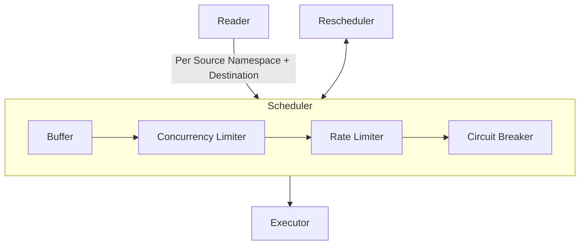
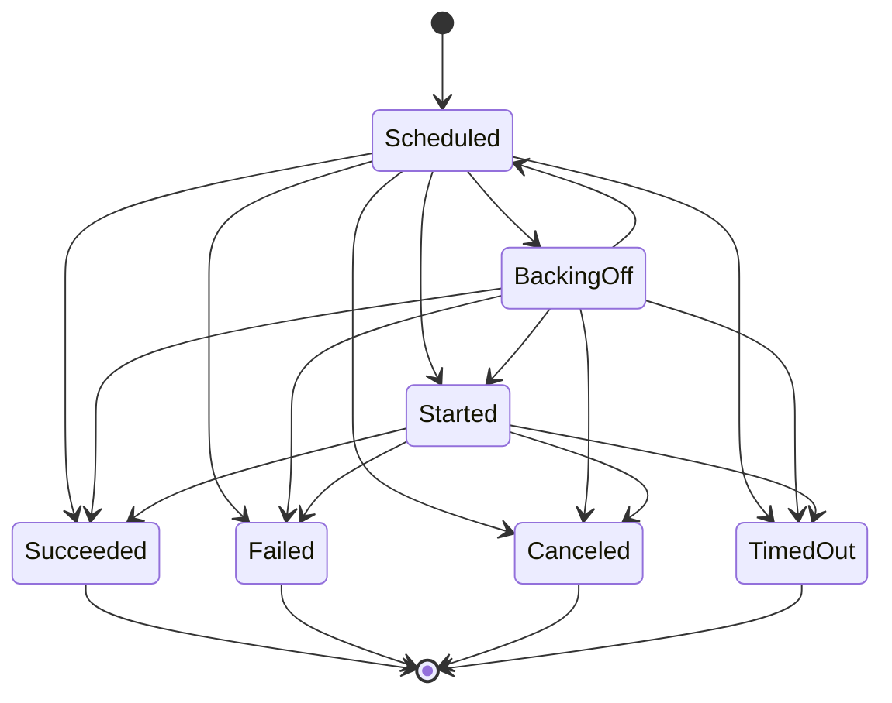
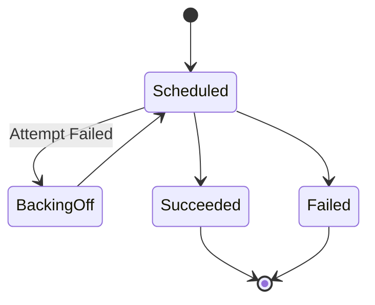
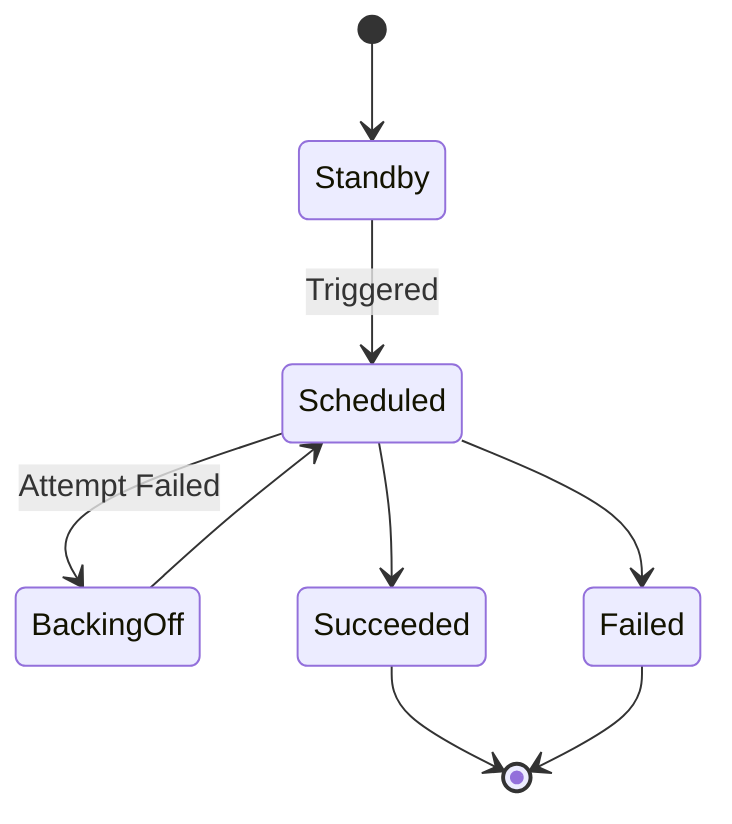
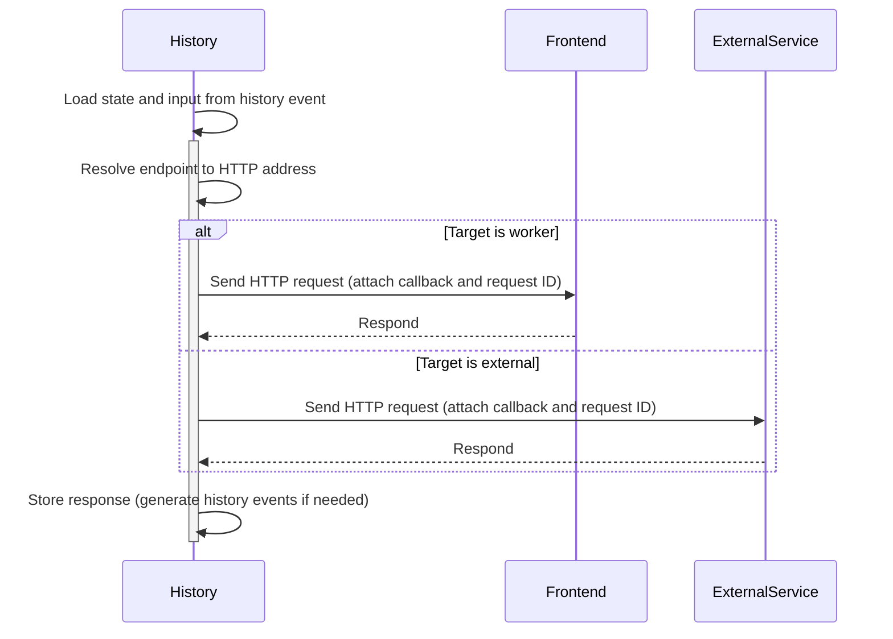
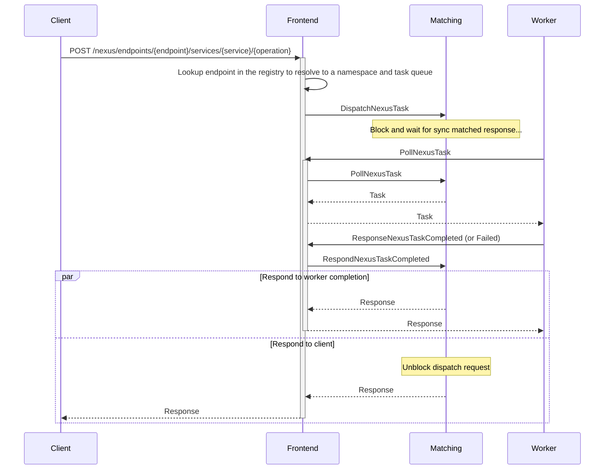
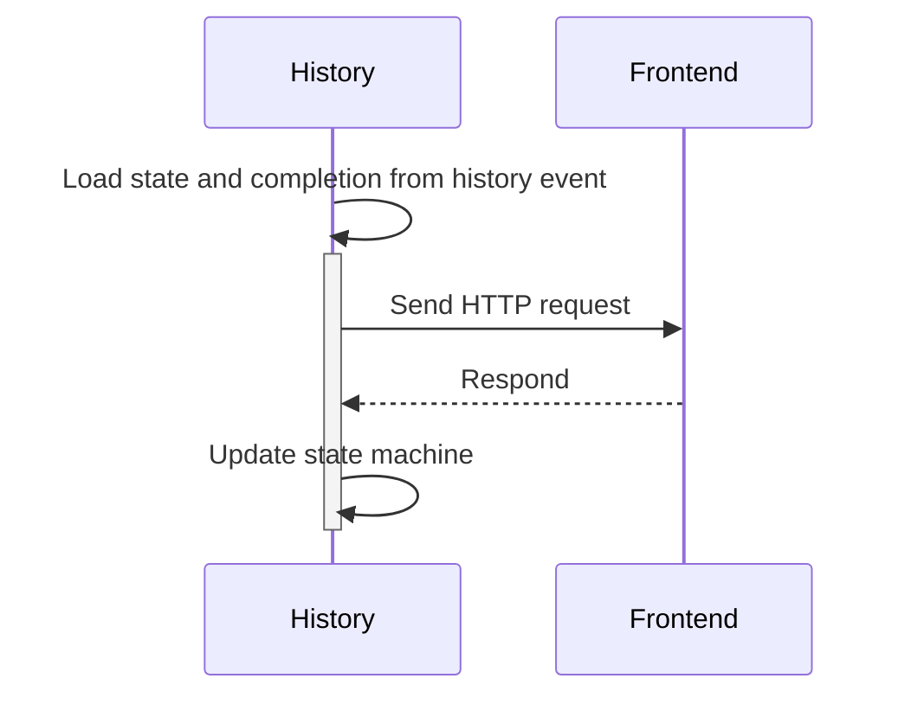
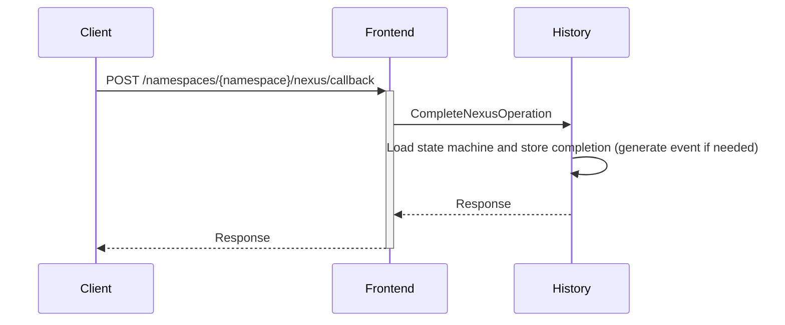

# Background

Nexus RPC is an open-source service framework for arbitrary-length operations whose lifetime may extend beyond a
traditional RPC. It is an underpinning connecting durable executions
within and across namespaces, clusters and regions – with an API contract designed with multi-team collaboration in mind.
A service can be exposed as a set of sync or async Nexus operations – the latter provides an operation identifier and a
uniform interface to get the status of an operation or its result, receive a completion callback, or cancel the
operation.

Temporal uses the Nexus RPC protocol to allow calling across namespace and cluster boundaries.
The [Go SDK Nexus proposal](https://github.com/temporalio/proposals/blob/master/nexus/sdk-go.md) explains the user
experience and shows sequence diagrams from an external perspective.

# Nexus RPC in the Temporal Codebase

Temporal server uses the [Nexus Go SDK](https://github.com/nexus-rpc/sdk-go) client and server abstractions which
implement the [Nexus over HTTP Spec](https://github.com/nexus-rpc/api/blob/main/SPEC.md) for internal and cross cluster
communication.

The frontend exposes the following Nexus HTTP routes over the existing HTTP API (default port is `7243`):

> ⚠️ All of the following routes are considered experimental and may change without notice until the feature stabilizes ⚠️

### `/namespaces/{namespace}/task-queues/{task_queue}/nexus-services`

Dispatch a nexus task directly to a task queue.

`/nexus/endpoints/{endpoint}/services`

Dispatch a nexus task directly to a registered endpoint by ID. (more on this later).

### `/namespaces/{namespace}/nexus/callback`

Complete a Nexus operation via callback.

# Trying Nexus Out

Since Nexus is a new feature with experimental APIs and has not been exercised in production, it is disabled by default
until it is considered stable.

Nexus is only supported in single cluster setups for the time being due to endpoint registry replication not being implemented
yet.

## Enabling Nexus

To enable Nexus in your deployment:

> NOTE: Replace `$PUBLIC_URL` with a URL value that is accessible to external callers or internally within the cluster.
> At the time of writing external Nexus calls are considered experimental so it should be safe to use the address of an
> internal load balancer for the frontend service.

1. Ensure that the server's static configuration file enables the HTTP API.

    ```yaml
    services:
      frontend:
        rpc:
          # NOTE: keep other fields as they were
          httpPort: 7243

    clusterMetadata:
      # NOTE: keep other fields as they were
      clusterInformation:
        active:
          # NOTE: keep other fields as they were
          httpAddress: $PUBLIC_URL:7243
    ```

2. Enable Nexus via dynamic config, set the public callback URL, and set the allowed callback addresses.

    ```yaml
    system.enableNexus:
      - value: true
    component.nexusoperations.callback.endpoint.template:
      # The URL must be publicly accessible if the callback is meant to be called by external services.
      # When using Nexus for cross namespace calls, the URL's host is irrelevant as the address is resolved using
      # membership. The URL is a Go template that interpolates the `NamepaceName` and `NamespaceID` variables.
      - value: https://$PUBLIC_URL:7243/namespaces/{{.NamespaceName}}/nexus/callback
    component.callbacks.allowedAddresses:
      # This list is a security mechanism for limiting which callback URLs are accepted by the server.
      # Attackers may leverage the callback mechanism to force the server to call arbitrary URLs.
      # The config below is only recommended for development, tune this to your requirements.
      - value:
          - Pattern: "*"
            AllowInsecure: true
    ```

## Disabling Nexus

To disable Nexus completely a server restart is required as the outbound queue processor (detailed below) is started
if `system.enableNexus` is on, but does not shut itself down when this config is disabled. See [Disabling
the Outbound Queue Processor](#disabling-the-outbound-queue-processor) for shutting off processing on a running server.

## Downgrading to a Pre-Nexus Server Release

In order to safely downgrade the server version to `1.24.x`, first disable nexus via dynamic config
(`system.enableNexus`). This ensures that no experimental functionality while Nexus was still being developed is
triggered.

After disabling Nexus, outbound tasks currently scheduled will not be run and timer tasks will immediately go to the
[DLQ](../admin/dlq.md) without any retries. Workflows with pending Nexus operations will be stuck.

# Components

## Nexus Endpoint Registry

The Nexus Endpoint Registry is a cluster-global registry that maintains Endpoint configuration and routing rules.

> NOTE: Temporal Cloud has an alternative registry implementation that is scoped to an account.

An Endpoint is defined in the public API:

https://github.com/temporalio/api/blob/39b0f69d19b67731e1f35fd2d231f2c871091359/temporal/api/nexus/v1/message.proto#L132-L195

Endpoint CRUD APIs are defined in the gRPC operator service:

https://github.com/temporalio/api/blob/39b0f69d19b67731e1f35fd2d231f2c871091359/temporal/api/operatorservice/v1/service.proto#L85-L145

Endpoints are identified internally by a server-allocated UUID. The server enforces that endpoint names are unique
within the registry. When a workflow schedules a Nexus operation it uses the endpoint name, while the Nexus HTTP API
resolves endpoints by their UUID. Renaming an endpoint must be done with care as workflows referring to an endpoint by
name will be stuck in a workflow task retry loop.

The registry is persisted in a dedicated table. All writes are serialized and routed through a single owning matching
node. Frontend and history nodes load registry entries from the owning matching node, falling back to a direct
persistence read for redundancy. Once the initial entries are loaded, nodes subscribe to changes by long-polling the
owning matching node for updates.
The endpoints table is versioned where every write to the table increments its version. The version has a couple of
purposes: to ensure writes are serialized, and to determine whether a node has an up-to-date view of the table when long
polling.

> ⚠️  At the time of writing, replication for the registry is not implemented and Nexus shouldn't be used in multi cluster
setups. Replication will be implemented at a later time.⚠️

## Outbound Task Queue

The outbound task queue is a task queue that is internal to the history service. Similarly to the the [transfer task
queue](./history-service.md#transfer-task-queue), the outbound queue is a sharded "immediate" queue. The difference
between the transfer queue and the outbound queue is that outbound tasks target external destinations, meaning that
tasks are allowed to make long running (typically up to 10 seconds) external requests. The outbound queue groups tasks
by their type, source namespace, and destination in a best effort attempt to provide isolation when a destination is
down or is taking long to respond. This isolation is provided via two mechanisms: multi-cursor and a custom
scheduler.

### Multi-Cursor

Multi-Cursor is a mechanism that allows multiple readers, with separate cursors, to consume the same queue. This
mechanism has existed in the server for a while but lacks documentation ATM. The outbound queue leverages multi-cursor,
moving tasks for slow and unavailable destinations to slower readers. The outbound queue by default starts 4 readers per
shard, this is dynamically configurable via: `history.outboundQueueMaxReaderCount`.

#### Disabling the Outbound Queue Processor

The outbound queue reader can be disabled dynamically by setting `history.outboundTaskBatchSize` to `0` (default is
`100`).

### Scheduler

The outound queue processor uses the [`GroupByScheduler`](https://github.com/temporalio/temporal/blob/a8799ae43286f7dddf3147439bc2129f25065456/common/tasks/group_by_scheduler.go#L49) to group tasks into a per source namespace and destination [`DynamicWorkerPoolScheduler`](https://github.com/temporalio/temporal/blob/a8799ae43286f7dddf3147439bc2129f25065456/common/tasks/dynamic_worker_pool_scheduler.go#L47).

Each task within its group goes through an in-memory buffer, a concurrency limiter, a rate limiter, and a circuit breaker.

The entire group's processing stack emits metrics with the group's key (the source namespace name and destination).



#### In-Memory Buffer

If the scheduler cannot immediately spawn a new goroutine, tasks go directly to this buffer.

The buffer size is dynamically configurable per source namespace and destination via:
`history.outboundQueue.groupLimiter.bufferSize`.

**Relevant metrics**:

- `dynamic_worker_pool_scheduler_enqueued_tasks` - a counter that is incremented when a task is enqueued to the buffer
- `dynamic_worker_pool_scheduler_dequeued_tasks` - a counter that is incremented when a task is dequeued from the buffer
- `dynamic_worker_pool_scheduler_rejected_tasks` - a counter that is incremented when the buffer is full and adding the
  task is rejected
- `dynamic_worker_pool_scheduler_buffer_size` - a gauge that periodically samples the size of the buffer

#### Concurrency Limiter

The DynamicWorkerPoolScheduler spawns goroutines on demand and shuts them down when there's no more work to do.
The number of goroutines per group is dynamically configurable per source namespace and destination via:
`history.outboundQueue.groupLimiter.concurrency`.

**Relevant metrics**:

- `dynamic_worker_pool_scheduler_active_workers` - a gauge that periodically samples the number of running goroutines
  processing tasks

#### Rate Limiter

The per-group rate limiter kicks in as soon as a task starts executing. The rate can be dynamically configured via:
`history.outboundQueue.hostScheduler.maxTaskRPS`.


**Relevant metrics**:

- `rate_limited_task_runnable_wait_time` - a histogram representing the time a task spends waiting for the rate limiter

#### Circuit Breaker

The final step in the outbound queue processing pipeline is a circuit breaker. The circuit breaker is implemented using
the [gobreaker](https://pkg.go.dev/github.com/sony/gobreaker) package and integrated into the task processing stack via
a custom [Executable
implementation](https://github.com/temporalio/temporal/blob/7c8025aff96af7d72a91af615f1d625817842894/service/history/queues/executable.go#L801).

The circuit breaker tracks `DestinationDownError`s returned by executors (for Nexus and Callbacks this happens on
retryable HTTP errors and timeouts) and trips when the number of consecutive failures is more than 5.
When the circuit breaker is tripped it transitions to the "open" state, from which it transitions to half-open, starting
to let some requests through to probe if the destination is up again. After a while the circuit breaker transitions back
into open or closed states, depending on the success of requests during the time spent in the half-open state.

Tasks that get rejected by the circuit breaker never make it into the executor and prevent any work including loading
mutable states from the cache or database.

The circuit breaker is dynamically configurable via:
[`history.outboundQueue.circuitBreakerSettings`](https://github.com/temporalio/temporal/blob/7c8025aff96af7d72a91af615f1d625817842894/common/dynamicconfig/constants.go#L1672).

**Relevant metrics**:

- `circuit_breaker_executable_blocked` - a counter that is incremented every time a task execution is blocked by the
  circuit breaker

## Nexus Operations

The [`nexusoperations` component](../../components/nexusoperations) holds all of the logic for scheduling Nexus
Operations from a workflow and maintaining the Operations's lifecycle.

There are some other pieces of Nexus logic spread around other parts of the server (`common`, `frontend`, and
`matching`) but the history service logic is almost completely contained in the component.

A Nexus Operation is modelled as a collection of state machines, tasks, and executors using the Hierarchical State
Machine framework (docs TBD).

### `Operation` State Machine

The
[Operation](https://github.com/temporalio/temporal/blob/a0fdea5319be5f1631d7e2b0f6f06c38dae3d413/components/nexusoperations/statemachine.go#L65)
state machine manages the lifetime of an Operation the StartOperation request.

The state machine transitions between these states (as defined in code):



When the state machine is spawned, it generates a timeout task to enforce the schedule-to-close timeout.
The state machine generates a timer task when entering the `BackingOff` state and an invocation task on the outbound
queue when entering the `Scheduled` state.

> NOTE: The `Scheduled` and `BackingOff` states may likely be merged into a single state when we add an outbound timer
> queue.

An operation in the `Scheduled` state is put on the outbound queue for scheduling a `StartOperation` request. The
outbound queue is protected by a circuit breaker per source namespace and destination endpoint, which may entirely
prevent loading the operation's associated state from the DB.

Operations are continuously retried using a [configurable retry policy][nexus-retry-policy] until they succeed,
permanently fail, or the operation times out.

The maximum allowed schedule-to-close timeout can be enforced with
`component.nexusoperations.limit.scheduleToCloseTimeout`.

### `Cancelation` State Machine

The Cancelation state machine maintains the lifecycle of a `CancelOperation` call, its transitions are as shown below:



Cancelations are continously retried using a [configurable retry policy][nexus-retry-policy] until they succeed,
permanently fail, or the operation times out.

### Task Executors

There are a couple of different types of executors making up the Nexus machinery. Timer executors (for purely
transitioning out of `BackingOff` states and enforcing the schedule-to-close timeout), and the more complex outbound
executors that are responsible for invoking `StartOperation` and `CancelOperation` requests.

Task execution only fails due to transient and unexpected internal errors. Invocation errors do not fail tasks and
instead transition state machines into a `BackingOff` state until the next attempt.

The `InvocationTask` executor loads state from the operation state machine and history event to construct a response,
releases the mutable state lock while making the HTTP request, and reacquires the lock to save the result of the call.

Since Nexus Operations can provide their results asynchronously, when constructing the `StartOperation` call, the
executor adds a callback URL along with a set of headers to later correlate the operation completion with the calling
workflow and operation state machine. The
[component.nexusoperations.callback.endpoint.template](https://github.com/temporalio/temporal/blob/7c8025aff96af7d72a91af615f1d625817842894/components/nexusoperations/config.go#L69)
global dynamic config must be set to construct callback URLs or the executor will fail to process invocation tasks. When
routing callbacks to external clusters and non-Temporal destinations, the URL is used and should be a value that is
publically accessible to those external destinations. Callbacks that are routed internally within the cluster resolve
the frontend URL via membership or, as a last resort, via static configuration overrides.

The timeout for making a single Nexus HTTP call is configurable via: `component.nexusoperations.request.timeout`
(default is 10 seconds).

## Callbacks

Callbacks were introduced on the server to power Nexus and provide a reliable delivery mechanism for any workflow
outcome. There is currently only one supported "nexus" callback variant and a single callback trigger - workflow closed.
The workflow closed trigger will trigger a callback when a workflow completes successfully, with a failure,
cancellation, or termination, as well as carry over the callbacks to the next execution in a chain when a workflow is
retried or continues-as-new.

Similarly to Nexus Operations, callbacks are implemented via a hierarchical state machine and a set of executors, which
are located in [the components directory](../../components/callbacks).

Callbacks are continously retried using a [configurable retry policy][callback-retry-policy] until they succeed,
permanently fail, or the workflow's retention period expires.

The timeout for making a single callback HTTP call is configurable via: `component.callbacks.request.timeout`
(default is 10 seconds).

### `Callback` State Machine

The callback state machine is fairly simple. It starts in standby and waits to be triggered. Once triggered, it tracks
the state of sending the callback request, backing off with durable timers when attempts fail with retryable errors.



## Dispatching a Nexus Request

There are two sides to Nexus request dispatching - the caller side and the handler side.
The call is initiated by the history service. Request handling starts at the frontend.

### Caller



### Handler



## Dispatching a Callback Request

There are two sides to callback request dispatching - the caller side and the handler side.
The call is initiated by the history service. Request handling starts at the frontend.

### Caller



### Handler



[nexus-retry-policy]: https://github.com/temporalio/temporal/blob/f0f5539c8de71f7f9dec22e4e30a5cb9ded7b945/components/nexusoperations/config.go#L77-L87
[callback-retry-policy]: https://github.com/temporalio/temporal/blob/f0f5539c8de71f7f9dec22e4e30a5cb9ded7b945/components/callbacks/config.go#L40-L50
