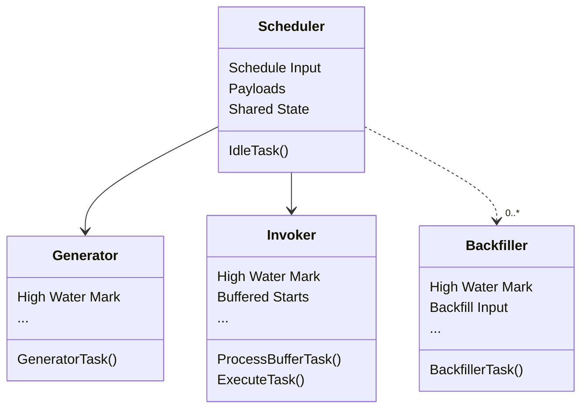
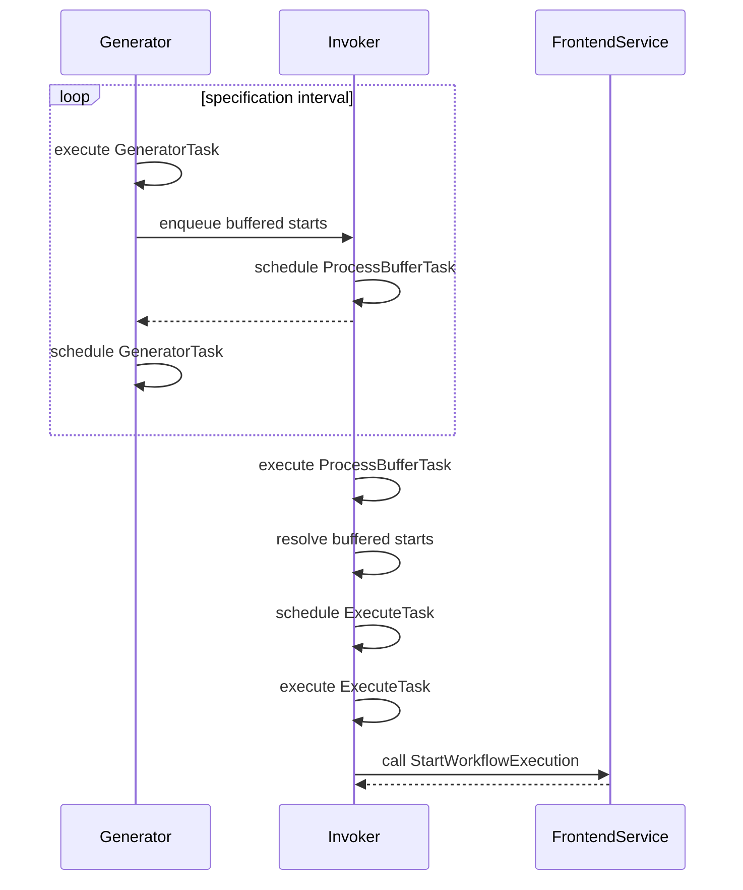
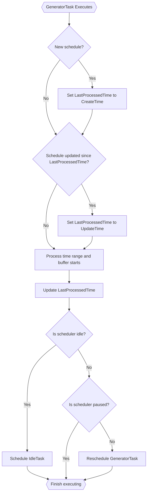
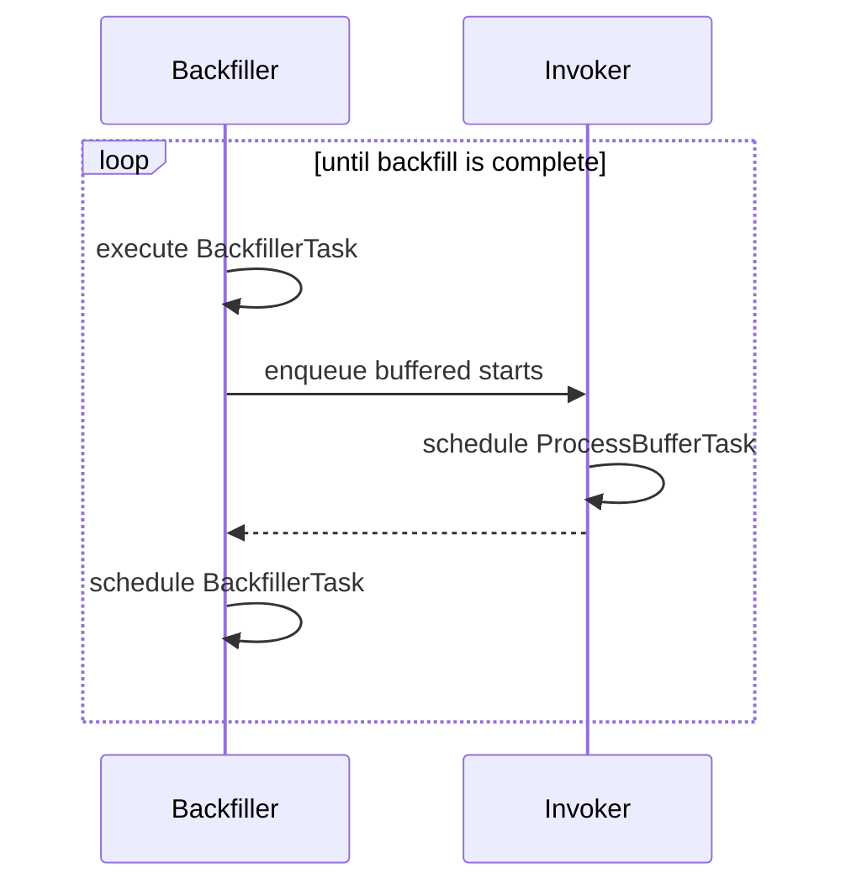
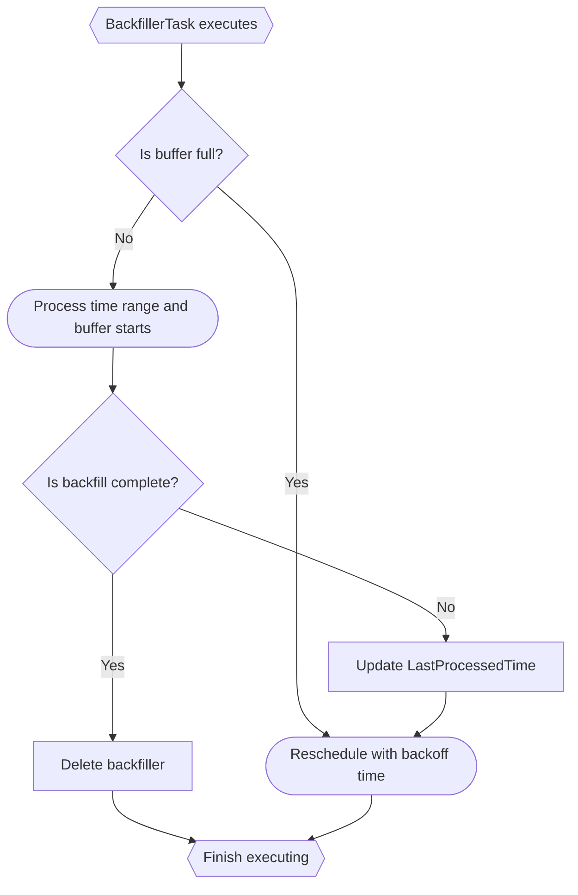
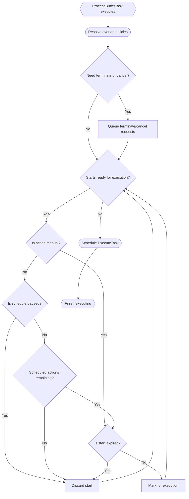
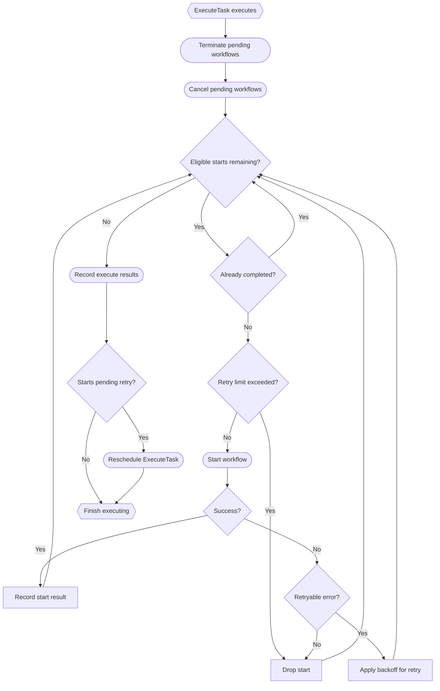
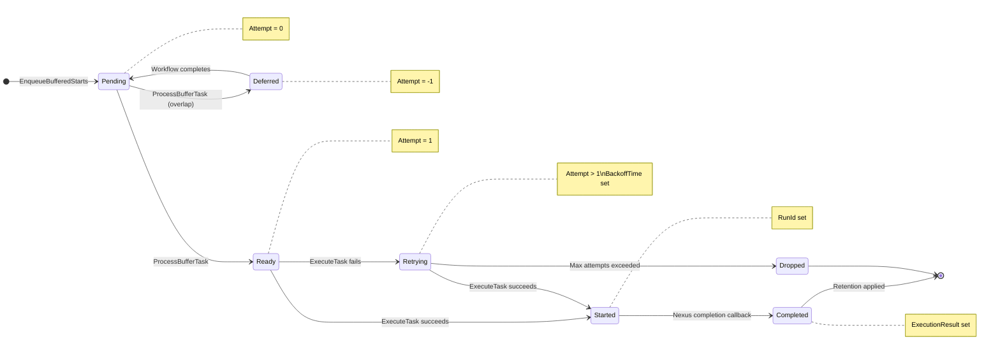
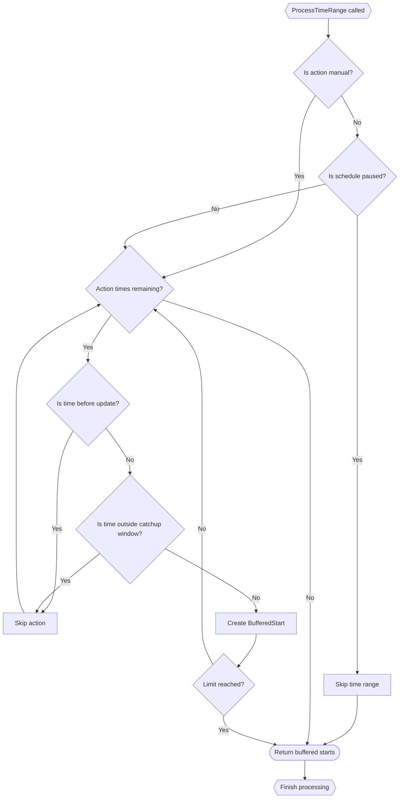

> [!WARNING]  
> All documentation pertains to the [CHASM-based](https://github.com/temporalio/temporal/blob/main/docs/architecture/chasm.md) Scheduler implementation, which is not yet generally available.

This page documents the internal architecture behind Temporal's [Schedules feature](https://docs.temporal.io/schedule). The target audience are server developers who are maintaining or operating the Scheduler implementation. Readers should already have an understanding of the feature's functional capabilities and usage.  

### Introduction

Scheduler is implemented as a [CHASM](https://github.com/temporalio/temporal/blob/main/docs/architecture/chasm.md) library, with all related implementation code located in [`chasm/lib/scheduler`](https://github.com/temporalio/temporal/tree/main/chasm/lib/scheduler). Every schedule is backed by an execution whose root component is a [`Scheduler`](https://github.com/temporalio/temporal/blob/main/chasm/lib/scheduler/scheduler.go#L35), which parents several other key components:

* [**Generator**](https://github.com/temporalio/temporal/blob/main/chasm/lib/scheduler/generator.go#L11): buffers actions in accordance with the schedule's specification (one per `Scheduler`).
* [**Invoker**](https://github.com/temporalio/temporal/blob/main/chasm/lib/scheduler/invoker.go#L16): executes buffered actions and handles retry logic (one per `Scheduler`).
* [**Backfiller**](https://github.com/temporalio/temporal/blob/main/chasm/lib/scheduler/backfiller.go): buffers actions from manually requested backfills and trigger requests (one `Backfiller` per pending request).

Only the `Invoker` makes service calls with side effect tasks; the rest of the scheduler is driven through pure timer tasks. The `Scheduler` component itself implements required CHASM interfaces for lifecycle management and visibility, request-reply handler functions, and helper functions for mutating state common to the entire scheduler tree.

*Figure: A scheduler tree showing important state and tasks of the components. Not all state is shown here.*

### Generator (Automated Actions)

The Generator component buffers automated actions according to the schedule's specification. This is driven through `GeneratorTask`, a timer task that fires, and re-schedules itself, on the schedule's interval until the schedule is complete. Generator is solely responsible for buffering automated actions, not driving those actions to execution; that work is handed off to the `Invoker`. The following high-level sequence diagram indicates the Generator's contribution towards firing an action:

*Figure: A high-level sequence diagram of how scheduler kicks off actions on interval.* 

#### State
- `LastProcessedTime`: Generator advances this high water mark whenever it has finished buffering all actions up to that point in time. This also includes when periods of time are skipped over, such as when the schedule is updated (all actions prior to update time are discarded), or when an action's schedule latency would exceed the schedule's catchup window.

#### Tasks
`GeneratorTask`: Drives the automated actions loop. When a schedule is first created (or updated), a `GeneratorTask` is scheduled for immediate execution. `GeneratorTask` will reschedule itself for subsequent execution at the point in time where the next automated action is scheduled to fire. If the schedule has completed (by exceeding its lifetime, or action count), `GeneratorTask` won't reschedule itself, and will instead schedule the Scheduler's `IdleTask`. The idle task keeps the schedule open for a retention period before closing it, ensuring the schedule doesn't immediately disappear after completion.

`GeneratorTask`'s primary responsibility is to call `EnqueueBufferedStarts` on the `Invoker`, handing off actions for execution (see also *Specification Processor* in this document):

*Figure: `GeneratorTask`'s decision tree for buffering starts (trivial branches omitted).*

Note that when the schedule is paused, `GeneratorTask` finishes without rescheduling itself. Whenever the schedule is updated (including being resumed from a paused state), a new `GeneratorTask` is scheduled for immediate execution, restarting the loop.

#### Notes
- At time of writing, `FutureActionTimes` is also maintained in Generator's state. This field is a cached view of speculated action times, and is returned as part of describe responses, but is not involved in actual start time calculations, action buffering, or even as assured guarantees of execution (e.g., a listed time may be dropped for having missed catchup window).

### Backfiller (Manual Actions)

A Backfiller component is created for every backfill requested through the API (including "trigger immediately" requests). Similar to the `GeneratorTask`, the `BackfillerTask` is responsible for driving a backfill to completion by enqueueing buffered actions into the Invoker. Each backfiller acts as a distinct buffer per backfill request, and will avoid [monopolizing the Invoker's shared `BufferedStarts` field](https://github.com/temporalio/temporal/blob/658b80da2ed66355fe78650788ac33814ffd1561/chasm/lib/scheduler/backfiller_tasks.go#L233-L234), instead backing off and retrying while waiting for the buffer to drain. 

The Backfiller component fits into the scheduler sequence diagram similarly to the Generator:

*Figure: A high-level sequence diagram of how scheduler uses the Backfiller to enqueue manual starts. Invoker details omitted.*

#### State
- `LastProcessedTime`: Similar to Generator, Backfiller maintains a high water mark that is advanced whenever the backfill makes progress. The high water mark is set to the point in time within the backfill request's specified time range that has been processed, and is therefore moved whenever buffered starts are enqueued.
- `Request`: Backfillers are 1:1 with backfill requests, and embed the original request within their state.
- `BackfillId`: Every backfiller is assigned a random UUID upon creation.

#### Tasks
`BackfillerTask`: Drives the backfill to completion. Whenever a Backfiller is created, a `BackfillerTask` is scheduled for immediate execution. If the backfill cannot be completed in a single execution (too many actions to comfortably buffer at a time), the `BackfillerTask` will be rescheduled with an exponential backoff for later retry (unlimited retries). Once the backfill is completely filled, the Backfiller deletes its own component without rescheduling a task.

`BackfillerTask` works similarly to `GeneratorTask`, but acts as a buffer for enqueueing starts into the shared queue:

*Figure: `BackfillerTask`'s decision tree (trivial branches omitted).*

#### Notes
* `TriggerImmediately` requests, those which execute only a single action, are *always* immediately buffered into the Invoker's queue (regardless of queue utilization).
* At the time of writing, the `Backfiller` doesn't make use of completion callbacks as a signal; for example, if after rescheduling `BackfillerTask`, Invoker managed to drain its queue ahead of the exponential backoff window, Backfiller would sit idle until the timer expires, despite being theoretically able to proceed immediately.

### Invoker (Execution)

The Invoker component is responsible for driving buffered starts to execution, managing backoffs, failures, and retries. Invoker centralizes where service calls are made within the Scheduler, and handles starting, cancelling, and terminating actions/workflows. Much of the Invoker's execution state is set on, and scoped to, individual `BufferedStart` structs; each buffered start has its own attempt count and backoff time. 

#### State
- `BufferedStarts`: Invoker manages the scheduler's buffered starts/actions through their entire lifecycle (see *BufferedStart Lifecycle* below). The Invoker function `EnqueueBufferedStarts` is used to schedule an action for execution by adding it to this list, setting `Attempt` to `0`. Once added to the list, the `ProcessBufferTask` will evaluate the schedule's overlap policy, as well as other scheduler state, before bumping `Attempt` to `1`, which makes it eligible for `ExecuteTask` to drive to completion. Entries remain in `BufferedStarts` after starting (with `RunId` set) and after completion (with `Completed` set), providing computed views for running workflows and recent actions.
	- Each `BufferedStart` entry is itself stateful, maintaining its own `Attempt` and `BackoffTime`. Only once `Attempt` is past `0` will it be eligible for execution (see [`getEligibleBufferedStarts`](https://github.com/temporalio/temporal/blob/85635674d7c55a8679b715b118aaf14c973266eb/chasm/lib/scheduler/invoker.go#L276)).
- `CancelWorkflows`: Workflows that will be cancelled due to overlap policy. The `ProcessBufferTask` adds to this list, and the `ExecuteTask` consumes the list.
- `TerminateWorkflows`: Similar to `CancelWorkflows`.
- `LastProcessedTime`: A high water mark used to evaluate when to fire tasks that are pending a retry after execution failure.

#### Tasks
`ProcessBufferTask`: Evaluates overlap policies and determines which buffered starts will become eligible for execution via the `ExecuteTask`. This is the step where actions may be discarded (e.g., `BUFFER_ONE` policy with a running workflow) or deferred (waiting for a running workflow to complete). `ProcessBufferTask` itself does not make *any* service calls to determine the state of running workflows, and instead relies on the computed view of running workflows derived from `BufferedStarts` (entries with `RunId` set but not yet completed), which is updated through `ExecuteTask` and completion callbacks, discussed below.

*Figure: `ProcessBufferTask`'s decision tree (trivial branches omitted).*

`ExecuteTask`: Drives all [eligible buffered starts](https://github.com/temporalio/temporal/blob/85635674d7c55a8679b715b118aaf14c973266eb/chasm/lib/scheduler/invoker.go#L276) and pending cancel/terminate requests to execution by making service calls. `ExecuteTask` reschedules itself whenever a service call fails and must be retried, as well as when it wants to "checkpoint" a batch of completed executions by flushing to mutable state.

*Figure: `ExecuteTask`'s decision tree (trivial branches omitted).*

### BufferedStart Lifecycle

The `BufferedStart` struct is the central data structure for tracking scheduled actions through their entire lifecycle. Each action progresses through distinct states, from initial buffering, through execution, to completion. The Invoker maintains a queue of `BufferedStart` entries, where each entry tracks its own state independently.

The `Attempt` field encodes the current state: `0` for newly enqueued (pending processing), `-1` for deferred (processed but waiting on overlap policy, e.g., `BUFFER_ONE` with a running workflow), and `≥1` for ready/retrying execution. When a workflow completes, deferred entries are reset to `0` so the overlap policy can be re-evaluated.

*Figure: State transitions of a `BufferedStart` entry.*

#### State
As a `BufferedStart` progresses through its lifecycle, different fields become populated:

| Field | Pending | Deferred | Ready/Retrying | Started | Completed |
|-------|:-------:|:--------:|:--------------:|:-------:|:---------:|
| `NominalTime` | ✓ | ✓ | ✓ | ✓ | ✓ |
| `ActualTime` | ✓ | ✓ | ✓ | ✓ | ✓ |
| `RequestId` | ✓ | ✓ | ✓ | ✓ | ✓ |
| `WorkflowId` | ✓ | ✓ | ✓ | ✓ | ✓ |
| `Attempt` | 0 | -1 | ≥1 | ≥1 | ≥1 |
| `BackoffTime` | - | - | (on retry) | - | - |
| `RunId` | - | - | - | ✓ | ✓ |
| `StartTime` | - | - | - | ✓ | ✓ |
| `Completed` | - | - | - | - | ✓ |

#### Computed Views
The `BufferedStarts` queue allows scheduler to compute the following `Info` block fields on demand (during a `Describe` call):

- `RunningWorkflows`: Entries where `RunId` is set but `Completed` is nil.
- `RecentActions`: Entries where `RunId` is set (includes both running and completed).

### Completion Callbacks

In order to determine when an action started by a schedule has completed, Scheduler makes use of Nexus completion callbacks. When the Invoker starts an action, a Nexus callback token [is generated](https://github.com/temporalio/temporal/blob/main/chasm/nexus_completion.go#L26), and set as part of the [`StartWorkflowExecution` request](https://github.com/temporalio/temporal/blob/main/chasm/lib/scheduler/invoker_tasks.go#L551). Once the action has completed, the callback mechanism will eventually trigger the [scheduler's completion handler](https://github.com/temporalio/temporal/blob/main/chasm/lib/scheduler/scheduler.go#L419).

The completion handler has several responsibilities:
- Records the completed action's payloads (success/failure) to the scheduler's `LastCompletionResult`.
- Enacts the schedule's pause-on-failure policy.
- Marks the corresponding `BufferedStart` entry as completed by setting its `Completed` field with the execution result.
- Records the action's close time, to measure the latency between "last action completed" and "next action started" when multiple starts are buffered sequentially and pending execution.
- Applies retention to keep only the most recent completed actions in `BufferedStarts`.
- Schedules another `ProcessBufferTask`, as a completion may make a buffered start eligible for execution.

Nexus completion callbacks are the only way that Scheduler can find out about an action's completion (there is no additional synchronous path). When the Invoker's `ProcessBufferTask` evaluates running workflow status, the computed view of running workflows (derived from `BufferedStarts` entries with `RunId` set but not completed) is used instead of making additional describe calls. 

### Specification Processor

The Specification Processor (`SpecProcessor` in code) is responsible for looping through the action times derived from the schedule's specification for a given range of time. It is used by both the `Generator` and the `Backfiller` to generate their `BufferedStart` structs. 

*Figure: `SpecProcessor.ProcessTimeRange`'s decision tree (trivial branches omitted).*