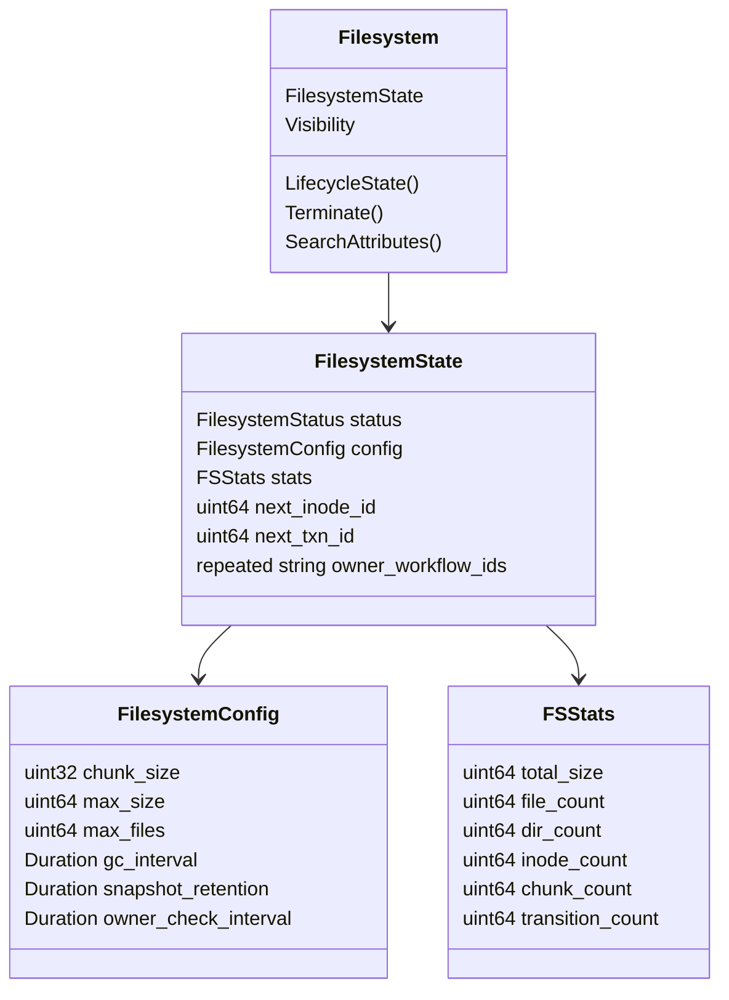
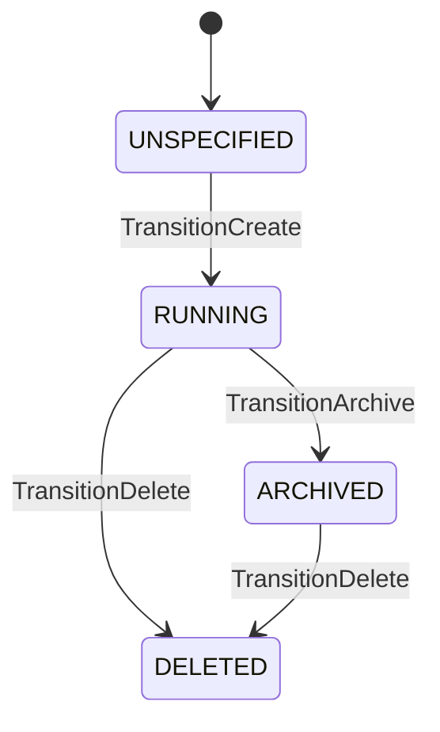

> [!WARNING]
> All documentation pertains to the [CHASM-based](https://github.com/temporalio/temporal/blob/main/docs/architecture/chasm.md) TemporalFS implementation, which is not yet generally available.

This page documents the internal architecture of TemporalFS, a durable versioned filesystem for AI agent workflows. The target audience is server developers maintaining or operating the TemporalFS implementation. Readers should already have an understanding of [CHASM terminology](https://github.com/temporalio/temporal/blob/main/docs/architecture/chasm.md).

### Introduction

TemporalFS is implemented as a [CHASM](https://github.com/temporalio/temporal/blob/main/docs/architecture/chasm.md) library, with all related implementation code located in [`chasm/lib/temporalzfs`](https://github.com/temporalio/temporal/tree/main/chasm/lib/temporalzfs). Each filesystem is backed by an execution whose root component is a [`Filesystem`](https://github.com/temporalio/temporal/blob/main/chasm/lib/temporalzfs/filesystem.go).

FS layer data (inodes, chunks, directory entries) is stored in a dedicated store managed by an [`FSStoreProvider`](https://github.com/temporalio/temporal/blob/main/chasm/lib/temporalzfs/store_provider.go), not as CHASM Fields. Only FS metadata (config, stats, lifecycle status) lives in CHASM state. This separation keeps the CHASM execution lightweight while allowing the FS data layer to scale independently.

The FS operations are powered by the [`temporal-fs`](https://github.com/temporalio/temporal-fs) library, which provides a transactional copy-on-write filesystem backed by PebbleDB.


*Figure: The Filesystem component and its state. The Visibility field (not shown) provides search attribute indexing.*

### State Machine

The `Filesystem` component implements `chasm.StateMachine[FilesystemStatus]` with three transitions defined in [`statemachine.go`](https://github.com/temporalio/temporal/blob/main/chasm/lib/temporalzfs/statemachine.go):



- **TransitionCreate** (`UNSPECIFIED → RUNNING`): Initializes the filesystem with configuration (or defaults), sets `next_inode_id = 2` (root inode = 1), creates empty stats, records owner workflow IDs (deduplicated), schedules the first ChunkGC task (if gc_interval > 0), and schedules an OwnerCheckTask if owners are present.
- **TransitionArchive** (`RUNNING → ARCHIVED`): Marks the filesystem as archived. The underlying FS data remains accessible for reads but no further writes are expected.
- **TransitionDelete** (`RUNNING/ARCHIVED → DELETED`): Marks the filesystem for deletion and schedules a DataCleanupTask immediately. `Terminate()` also sets this status and schedules DataCleanupTask.

Lifecycle mapping: `RUNNING` and `UNSPECIFIED` → `LifecycleStateRunning`; `ARCHIVED` and `DELETED` → `LifecycleStateCompleted`.

### Tasks

Five task types are registered in the [`library`](https://github.com/temporalio/temporal/blob/main/chasm/lib/temporalzfs/library.go), with executors in [`tasks.go`](https://github.com/temporalio/temporal/blob/main/chasm/lib/temporalzfs/tasks.go):

| Task | Type | Description |
|------|------|-------------|
| **ChunkGC** | Periodic timer | Runs `temporal-fs` garbage collection (`f.RunGC()`) to process tombstones and delete orphaned chunks. Reschedules itself at the configured `gc_interval`. Updates `TransitionCount` and `ChunkCount` in stats. |
| **ManifestCompact** | Placeholder | Reserved for future per-filesystem PebbleDB compaction triggers. Currently a no-op since compaction operates at the shard level. |
| **QuotaCheck** | On-demand | Reads `temporal-fs` metrics to update `FSStats` (total size, file count, dir count). Logs a warning if the filesystem exceeds its configured `max_size` quota. |
| **OwnerCheckTask** | Periodic timer | Checks if owner workflows still exist via `WorkflowExistenceChecker`. Uses a not-found counter with threshold of 2 (must miss twice before removal) to avoid transient false positives. Removes owners that are confirmed gone. Transitions filesystem to DELETED when all owners are removed. Reschedules at `owner_check_interval`. |
| **DataCleanupTask** | Side-effect | Runs after filesystem transitions to DELETED. Calls `FSStoreProvider.DeleteStore()` to remove all filesystem data. On failure, reschedules with exponential backoff (capped at 30 minutes). |

ChunkGC, ManifestCompact, QuotaCheck, and OwnerCheckTask validators check that the filesystem is in `RUNNING` status. DataCleanupTask validates `DELETED` status.

### Storage Architecture

TemporalFS uses a pluggable storage interface so that OSS and SaaS deployments can use different backends without changing the FS layer or CHASM archetype.

```
┌─────────────────────────────────────┐
│           FSStoreProvider           │  ← Interface (store_provider.go)
│  GetStore(shard, ns, fsID)          │
│  DeleteStore(shard, ns, fsID)       │
│  Close()                            │
├──────────────────┬──────────────────┤
│  PebbleStore     │  CDSStore        │
│  Provider (OSS)  │  Provider (SaaS) │
└──────────────────┴──────────────────┘
```

**[`FSStoreProvider`](https://github.com/temporalio/temporal/blob/main/chasm/lib/temporalzfs/store_provider.go)** is the sole extension point for SaaS. All other FS components (CHASM archetype, gRPC service, FUSE mount) are identical between OSS and SaaS.

**[`PebbleStoreProvider`](https://github.com/temporalio/temporal/blob/main/chasm/lib/temporalzfs/pebble_store_provider.go)** (OSS):
- Creates a single PebbleDB instance (lazy-initialized at `{dataDir}/temporalzfs/`).
- Returns a `PrefixedStore` per filesystem execution for key isolation — each `(namespaceID, filesystemID)` pair maps to a deterministic partition ID derived from FNV-1a hash, ensuring stability across restarts.
- The underlying PebbleDB is shared across all filesystem executions.

**`CDSStoreProvider`** (SaaS, in `saas-temporal`):
- Implements `FSStoreProvider` via `fx.Decorate`, replacing `PebbleStoreProvider`.
- Backed by Walker: uses `rpcEngine` (wrapping Walker `ShardClient` RPCs) adapted to `store.Store`.
- Data isolated via `ShardspaceTemporalFS`, a `tfs\x00` key prefix, and per-filesystem `PrefixedStore` partitions.
- See [`cds/doc/temporalzfs.md`](https://github.com/temporalio/saas-temporal/blob/main/cds/doc/temporalzfs.md) in `saas-temporal` for the full CDS integration architecture.

### gRPC Service

The [`TemporalFSService`](https://github.com/temporalio/temporal/blob/main/chasm/lib/temporalzfs/proto/v1/service.proto) defines 22 RPCs for filesystem operations. The [`handler`](https://github.com/temporalio/temporal/blob/main/chasm/lib/temporalzfs/handler.go) implements these using CHASM APIs for lifecycle and `temporal-fs` APIs for FS operations.

**Lifecycle RPCs:**

| RPC | CHASM API | temporal-fs API |
|-----|-----------|-----------------|
| `CreateFilesystem` | `chasm.StartExecution` | `tfs.Create()` |
| `GetFilesystemInfo` | `chasm.ReadComponent` | — |
| `ArchiveFilesystem` | `chasm.UpdateComponent` | — |
| `AttachWorkflow` | `chasm.UpdateComponent` | — |
| `DetachWorkflow` | `chasm.UpdateComponent` | — |

`AttachWorkflow` adds an owner workflow ID to the filesystem (deduplicated). `DetachWorkflow` removes one; if no owners remain, the filesystem transitions to DELETED.

**FS operation RPCs** (all use inode-based `ByID` methods from `temporal-fs`):

| RPC | temporal-fs API |
|-----|-----------------|
| `Getattr` | `f.StatByID()` |
| `Setattr` | `f.ChmodByID()`, `f.ChownByID()`, `f.UtimensByID()` |
| `Lookup` | `f.LookupByID()` |
| `ReadChunks` | `f.ReadAtByID()` |
| `WriteChunks` | `f.WriteAtByID()` |
| `Truncate` | `f.TruncateByID()` |
| `Mkdir` | `f.MkdirByID()` |
| `Unlink` | `f.UnlinkByID()` |
| `Rmdir` | `f.RmdirByID()` |
| `Rename` | `f.RenameByID()` |
| `ReadDir` | `f.ReadDirByID()` / `f.ReadDirPlusByID()` |
| `Link` | `f.LinkByID()` |
| `Symlink` | `f.SymlinkByID()` |
| `Readlink` | `f.ReadlinkByID()` |
| `CreateFile` | `f.CreateFileByID()` |
| `Mknod` | `f.MknodByID()` |
| `Statfs` | `f.GetQuota()`, `f.ChunkSize()` |
| `CreateSnapshot` | `f.CreateSnapshot()` |

The handler pattern for FS operations is: get store via `FSStoreProvider` → open `tfs.FS` → execute operation → close FS (which also closes the store). On error, `openFS`/`createFS` close the store internally before returning. The CHASM execution is only accessed for lifecycle operations (create, archive, get info).

### WAL Integration (SaaS)

In the SaaS deployment, writes go through a WAL pipeline for durability:

```
temporal-fs write → walEngine → LP WAL → ack → stateTracker buffer
                                                      ↓
                                              tfsFlusher (500ms tick)
                                                      ↓
                                              rpcEngine → Walker RPCs
                                                      ↓
                                              watermark advance
```

- **`walEngine`**: Implements `Engine` by routing reads to `rpcEngine` (Walker) and writes through the LP WAL. Each write is serialized as a `WALLogTFSData` record and awaits acknowledgement before buffering in the state tracker.
- **`tfsStateTracker`**: Buffers acknowledged WAL ops in memory, ordered by log ID. The flusher drains this buffer.
- **`tfsFlusher`**: Runs a dedicated goroutine that drains buffered ops every 500ms and writes them to Walker via `rpcEngine`, then advances the `TEMPORALFS_RECOVERY_WATERMARK`. On shutdown, performs a final flush with a 5s timeout.
- **`tfsWALRecoverer`**: On shard acquisition, replays WAL records between the recovery watermark and the WAL head to rebuild the state tracker buffer.

### FX Wiring

The [`HistoryModule`](https://github.com/temporalio/temporal/blob/main/chasm/lib/temporalzfs/fx.go) wires everything together via `go.uber.org/fx`:

1. **Provides**: `Config` (dynamic config), `FSStoreProvider` (PebbleStoreProvider), `WorkflowExistenceChecker` (noop in OSS), `PostDeleteHook` (noop in OSS), `handler` (gRPC service), task executors (chunkGC, manifestCompact, quotaCheck, ownerCheck, dataCleanup), `library`.
2. **Invokes**: `registry.Register(library)` to register the archetype with the CHASM engine.

The module is included in [`service/history/fx.go`](https://github.com/temporalio/temporal/blob/main/service/history/fx.go) alongside other archetype modules (Activity, Scheduler, etc.).

### Owner Lifecycle & GC

TemporalFS uses a belt-and-suspenders approach for garbage collection when owner workflows are deleted:

- **Pull path (OwnerCheckTask)**: Periodic safety net. Checks if each owner workflow still exists and removes confirmed-gone owners. Transitions to DELETED when all owners are removed, which triggers DataCleanupTask.
- **Push path (PostDeleteHook)**: Fast path. A `PostDeleteHook` on the workflow delete manager calls `DetachWorkflow` when a workflow is deleted. OSS implementation is a noop (relies on pull path). SaaS overrides via `fx.Decorate` to query visibility for owned filesystems.
- **WorkflowExistenceChecker**: Interface for checking workflow existence. OSS provides a noop (always returns true). SaaS overrides to query the history service.

### Configuration

[`config.go`](https://github.com/temporalio/temporal/blob/main/chasm/lib/temporalzfs/config.go) defines:

| Setting | Default | Description |
|---------|---------|-------------|
| `temporalzfs.enabled` | `false` | Namespace-level toggle for TemporalFS |
| Default chunk size | 256 KB | Size of file data chunks |
| Default max size | 1 GB | Per-filesystem storage quota |
| Default max files | 100,000 | Per-filesystem inode quota |
| Default GC interval | 5 min | How often ChunkGC runs |
| Default snapshot retention | 24 h | How long snapshots are kept |
| Default owner check interval | 10 min | How often OwnerCheckTask runs |
| Owner check not-found threshold | 2 | Consecutive misses before owner removal |
| Data cleanup max backoff | 30 min | Max retry interval for DataCleanupTask |

Per-filesystem configuration can override these defaults via `FilesystemConfig` at creation time.
