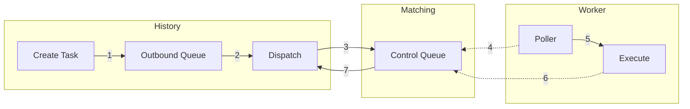

# Worker Commands

Worker commands are server-initiated instructions sent to workers via Nexus. Each worker process has a dedicated control task queue that it polls via Nexus RPC. A single control queue serves one or more workers running within the same process. This enables the server to push actions to workers without relying on heartbeats or long-poll cycles.

To route a command, the server needs to know the target worker's control queue. For commands that target activities, this information is stored directly in the mutable state (`ActivityInfo`) when the activity was dispatched to the worker.

### History

1. **Create Task** -- The server decides whether to initiate a worker command based on a state change (e.g., a user requesting activity cancellation). The trigger logic creates one or more `WorkerCommand` protos and calls `GenerateWorkerCommandsTasks`, which persists them as an outbound task. Serialization is command-agnostic ([`task_serializers.go`](https://github.com/temporalio/temporal/blob/f5246b3fddf565d9cbe96ff25d36731bd4374cd2/common/persistence/serialization/task_serializers.go#L1453-L1467)).
2. **Outbound Queue** -- The outbound queue executor picks up the task and invokes the dispatcher configured in [`Execute`](https://github.com/temporalio/temporal/blob/856e276e58055867f3d852dd23a1ed9d48197c01/service/history/outbound_queue_active_task_executor.go#L100-L108).
3. **Dispatch** -- The [`dispatcher`](https://github.com/temporalio/temporal/blob/856e276e58055867f3d852dd23a1ed9d48197c01/service/history/worker_commands_task_dispatcher.go#L112-L166) sends a `DispatchNexusTask` RPC to matching. This is synchronous — matching holds the request until a worker responds or the request times out.

### Matching

4. **Control Queue** -- Matching holds the command on the control queue until a worker polls it. If no worker is polling, the request times out. There is currently no way to distinguish a permanently gone worker from a temporarily slow one, so the dispatcher simply retries up to a maximum number of attempts before dropping the task. This is acceptable because worker commands are best-effort.

### Worker

5. **Poller** -- The worker's poller picks up the command from the control queue.
6. **Execute** -- The worker executes the command and sends the response back to matching.

### Matching

7. **Response** -- Matching forwards the response back to the dispatcher in history.

## Adding a new command

1. **Define the proto** -- Add a new variant to `WorkerCommand` in [`message.proto`](https://github.com/temporalio/api/blob/43b4618e84611e594929ac60c970ec163e85c17a/temporal/api/worker/v1/message.proto#L198-L207) (api repo).
2. **Add a trigger** -- Add server-side logic to detect the condition, create the command, and call `GenerateWorkerCommandsTasks` (see [`task_generator.go`](https://github.com/temporalio/temporal/blob/c229fcb98ac88f62aec741212aa3797071057dff/service/history/workflow/task_generator.go#L582-L597)).
3. **Handle in the SDK** -- Add a handler for the new command variant in the SDK's worker command executor.
