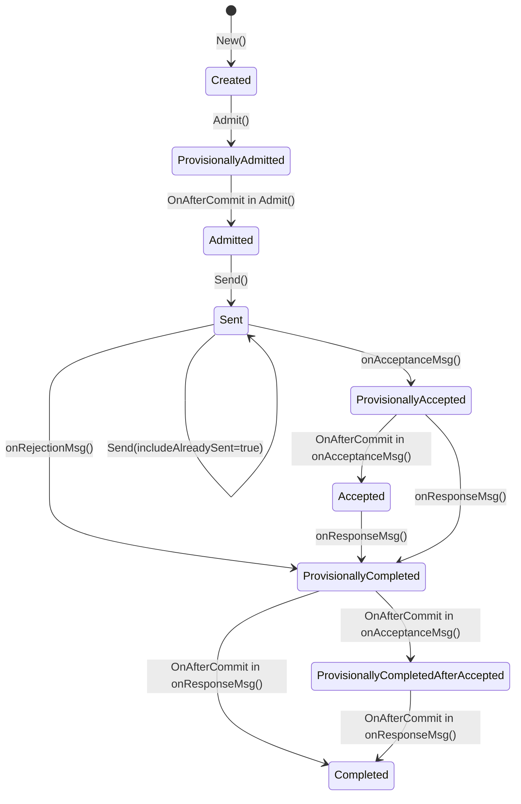
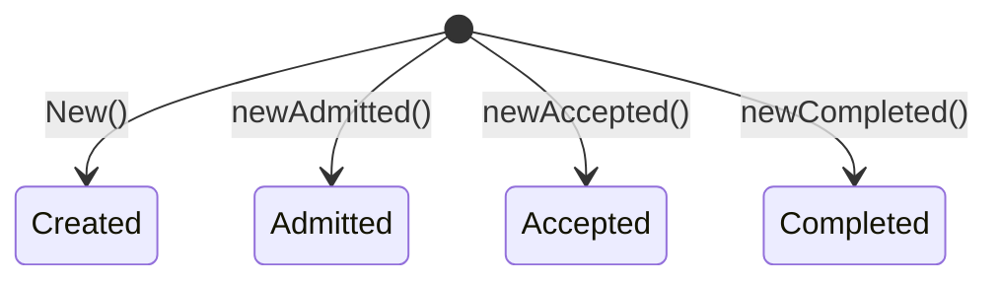
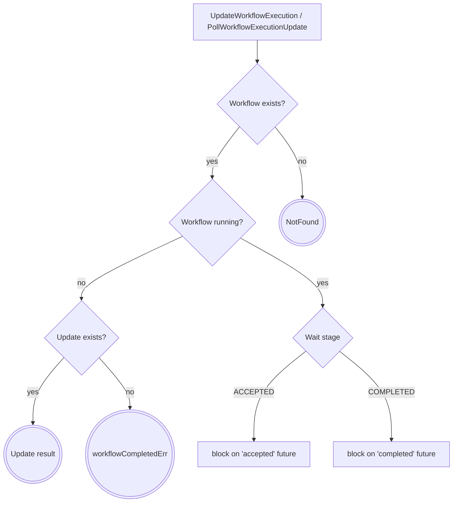
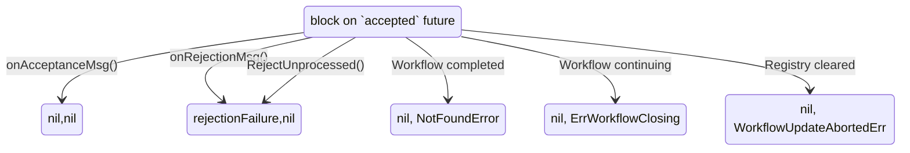
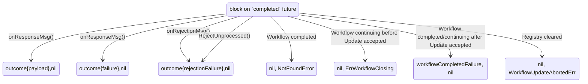
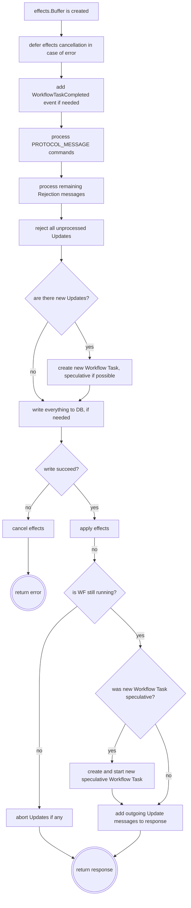

# Workflow Update

## What is this doc?
This doc is focused on internal server implementation details of Workflow Update. The target audience
are server developers who work on server bugs or Workflow Update improvements.
User facing docs, usage scenarios, SDK APIs can be found at https://docs.temporal.io instead.

## What is Workflow Update?
Historically, Temporal had two basic primitives, which allows users to interact with a Workflow:
1. Signal, which can be sent to a Workflow to trigger some behavior there.
2. Query, which can be used to return some information from a Workflow.

Both have limitations. A Signal cannot be rejected and always records at least one event in
the Workflow history. Also, there is no way for an API caller to know if a Signal was successfully
processed by the Workflow - it is a fire-and-forget mechanism. Conversely, a Query cannot modify
the Workflow state, i.e., it can only perform read-only operations.

Workflow Update is a complex feature that can be thought of as "Signal + Query" in a single API call.
An Update can be rejected by the Workflow, and then it does not write any events to the Workflow history.
But when it is accepted and processed, the API caller can immediately get a result back. Essentially, 
the Temporal Server acts as a proxy between the caller and the Workflow, exposing APIs of
the Workflow code.

To achieve this, a few new internal primitives were introduced. They are not coupled directly with
Workflow Update, but it highly depends on them:
  - [Speculative Workflow Task](./speculative-workflow-task.md)
  - [In-memory timer queue](./in-memory-queue.md)
  - [Message protocol](./message-protocol.md)
  - [`effect` package](./effect-package.md)

## Key Requirement: no persistence writes on reject
There is a requirement, which is not common among Temporal APIs: Update rejections must leave
no traces in the Workflow history and must be as "cheap" as possible. The consequences of this
requirement are:
1. No "Update Admitted" or "Update Received" event is written to the history when the server receives 
an Update request - since if the Workflow rejects the Update, the event shouldn't be in the
Workflow history.
   - NOTE: An Update request cannot be shipped to the Workflow as an event, 
     instead it is shipped as a Message (see [Message protocol](./message-protocol.md)).  
2. There is no "Update Rejected" event: when an Update is rejected, it just disappears.
   - NOTE: The Update outcome cannot be shipped to server as a Command, 
     because every Command *must* produce an event.
3. The original Update request (with its payload) is stored in the "Update Accepted" event 
since this is the first event the server is able to record. Until then, it remains in-memory.
4. The Update outcome is stored in the "Update completed" event. It indicates success or failure.
Note that Failure in an Update outcome is different from Update rejection.
5. The Workflow Task to ship the Update request form the server to the worker must not be
persisted in mutable state.

## Update Registry
Updates are managed through the `update.Registy` interface. A workflow's Update Registry is stored in
its `workflow.ContextImpl` struct. Each Registry has an internal map which stores *admitted and
accepted* Updates, i.e., in-flight Updates only. Completed Updates are not stored there - but can
still be accessed through the Registry since it has a reference to the mutable state
(via the `UpdateStore` interface). When an Update is accepted or completed, a corresponding event
is written to the Workflow history.

Mutable state itself only stores an `UpdateInfo` map, linking `UpdateId` to `UpdateInfo`
(one of `UpdateAcceptanceInfo`, `UpdateCompletionInfo`, or `UpdateAdmissionInfo`). They contain
minimal data (to limit the mutable state size) and are just pointers to corresponding events
in the Workflow history.

When a new Update Registry is created, it is initialized from the mutable state's `UpdateInfo` data.
However, the "Update Completed" event is only loaded when calling mutable state's `GetUpdateOutcome()`
directly.

Because maps enumeration in Go is non-deterministic, before being sent out, Updates are sorted by the
time they were admitted.

> #### TODO
> Because the Update Registry only exists in-memory, and is built from events, and Updates in the
> admitted state don't have any events, they are *lost* when the Registry is cleared. In the future,
> an "Update Admitted" event can be used to persist the Update before delivering it to the worker.

Since rejected Updates are not stored anywhere and, therefore, cannot be deduplicated, they can be
shipped to the worker twice. For the same reason, if the `PollWorkflowExecutionUpdate` API is called
for a rejected Update, the caller will not get a rejection failure but a `NotFound` error.

> #### TODO
> This is because there is no good place to store rejection failure. There is no history event
> for "Rejected Update" and it cannot be stored in mutable store due to size limitations.
> In the future, when there is another store available, it can be used to store rejection failures.

### Update State Machine
Update states are defined in `state.go` and are prefixed with `state` (i.e. `Created` is `stateCreated`).

Transitions are made in three places:
1. `UpdateWorkflowExecution` API (called by external caller): `Created`, `Admitted` states.
2. `RecordWorkflowTaskStarted` API (called by matching service): `Sent` state.
3. `RecordWorkflowTaskCompleted` API (called by SDK worker): `Accepted`, `Rejected`, `Completed` states.

Usually the Update flow would be:

_NOTE: States which are set by `commit` also have a `rollback` path to revert to the
previous state (not shown in the diagram for simplicity)_

### Update Constructors
There are various constructors that create an Update with a specific state:

When the server receives an Update request, it creates a new Update with state `Created`
via `New()`. However, when the Update Registry loads all Updates from the `UpdateStore`, it can create
them directly with state `Admitted` (see "Reapply Update" below) via `newAdmitted()` or `Accepted` 
via `newAccepted()`. Similarly, when an Update is resurrected (see "Update Resurrection" below) it 
also has state `Admitted`. But when an Update cannot be found in the Registry, yet it exists in
`EventStore` because it is already completed, it is created with state `Completed`.

### Update Registry Lifecycle
Every time the Workflow context is cleared, its Update Registry is cleared as well. Because the
Workflow context is cleared on every error, a significant effort was - originally - made to keep the
Update Registry intact. But it proved to be too error-prone.

> For example, if there is an Update in the Registry that is waiting to be delivered to a worker,
> but the Workflow Task to do so is lost because the mutable state (but not the Registry) was cleared,
> the workflow is stuck. Retries won’t help here because the Update will be deduplicated by UpdateId.
> The `SCHEDULE_TO_START` timeout timer for the speculative Workflow Task also won't help
> because the processor would not be able to find the Workflow Task in the Mutable state.
>
> There are many more issues that were discovered (and probably more that were not).

Instead, the Workflow Update feature relies on internal retries by the history gRPC handler,
history gRPC client (on the frontend side), and frontend gRPC handler. So if an Update is removed from
the Registry due to non-related error, a retryable `WorkflowUpdateAbortedErr` error is returned to
the `UpdateWorkflowExecution` API caller and subsequent internal retries recreate the Update
in the Registry (see "Aborting an Update" below).

Also, it is important to note that the Workflow context itself is stored in the Workflow cache
and might be evicted any time. Therefore, the Workflow Update feature relies on a properly
configured cache size. If the cache is too small, it will evict Workflow contexts too soon and their
Update Registry will be cleared. Note that in that case, all in-flight Updates are aborted with a
retryable error; and the frontend will retry the `UpdateWorkflowExecution` call.

### Aborting an Update
An Update is aborted when:
1. The Update Registry is cleared. Then, a retryable `WorkflowUpdateAbortedErr` error is returned
   (see "Update Registry Lifecycle" above).
2. The Workflow completes itself (e.g., with `COMPLETE_WORKFLOW_EXECUTION` command) or completed externally
   (e.g., terminated or timed out). Then, a non-retryable `AbortedByWorkflowClosingErr` error or failure is returned
   to the API caller depending on an Update state.
3. The Workflow is continuing (e.g., with `CONTINUE_AS_NEW_WORKFLOW_EXECUTION` command) or is retried after
   failure or timeout. Then, a retryable `ErrWorkflowClosing` error or failure is returned to the API caller
   depending on Update state.
4. The Workflow Task fails unexpectedly, e.g., during completion (call to `RespondWorkflowTaskCompleted` API).
   Then Updates, which have *not* been seen by the Workflow, are aborted with a retryable error. Updates which
   *have* been seen by the Workflow are aborted with non-retryable error. Otherwise, internal retries will
   quickly exhaust and `Unavailable` error will be returned to the client.

Full "Update state" and "Abort reason" matrix is the following:

| Update State ↓ / Abort Reason →         | (1) RegistryCleared                             | (2) WorkflowCompleted                    | (3) WorkflowContinuing                   | (4) WorkflowTaskFailed                          |
|-----------------------------------------|-------------------------------------------------|------------------------------------------|------------------------------------------|-------------------------------------------------|
| **Created**                             | `registryClearedErr`→`WorkflowUpdateAbortedErr` | `AbortedByWorkflowClosingErr`            | `ErrWorkflowClosing`                     | `registryClearedErr`→`WorkflowUpdateAbortedErr` |
| **ProvisionallyAdmitted**               | `registryClearedErr`→`WorkflowUpdateAbortedErr` | `AbortedByWorkflowClosingErr`            | `ErrWorkflowClosing`                     | `registryClearedErr`→`WorkflowUpdateAbortedErr` |
| **Admitted**                            | `registryClearedErr`→`WorkflowUpdateAbortedErr` | `AbortedByWorkflowClosingErr`            | `ErrWorkflowClosing`                     | `registryClearedErr`→`WorkflowUpdateAbortedErr` |
| **Sent**                                | `registryClearedErr`→`WorkflowUpdateAbortedErr` | `AbortedByWorkflowClosingErr`            | `ErrWorkflowClosing`                     | `workflowTaskFailErr`                           |
| **ProvisionallyAccepted**               | `registryClearedErr`→`WorkflowUpdateAbortedErr` | `acceptedUpdateCompletedWorkflowFailure` | `acceptedUpdateCompletedWorkflowFailure` | `nil`                                           |
| **Accepted**                            | `registryClearedErr`→`nil`                      | `acceptedUpdateCompletedWorkflowFailure` | `acceptedUpdateCompletedWorkflowFailure` | `nil`                                           |
| **ProvisionallyCompleted**              | `registryClearedErr`→`nil`                      | `acceptedUpdateCompletedWorkflowFailure` | `acceptedUpdateCompletedWorkflowFailure` | `nil`                                           |
| **ProvisionallyCompletedAfterAccepted** | `registryClearedErr`→`nil`                      | `acceptedUpdateCompletedWorkflowFailure` | `acceptedUpdateCompletedWorkflowFailure` | `nil`                                           |
| **Completed**                           | `nil`                                           | `nil`                                    | `nil`                                    | `nil`                                           |
| **ProvisionallyAborted**                | `nil`                                           | `nil`                                    | `nil`                                    | `nil`                                           |
| **Aborted**                             | `nil`                                           | `nil`                                    | `nil`                                    | `nil`                                           |

When the Workflow performs a final completion, all in-flight Updates are aborted: admitted Updates get
`AbortedByWorkflowClosingErr` error on both `accepted` and `completed` futures. Accepted Updates
are failed with special server `acceptedUpdateCompletedWorkflowFailure` failure because if a client
knows that Update has been accepted, it expects any following requests to return an Update result
(or failure) but not an error. This failure is set on the `completed` future only. 

When a Workflow completion command creates a new run, accepted Updates are failed in the same way:
with the `acceptedUpdateCompletedWorkflowFailure` failure on the `completed` future. Admitted Updates,
though, are aborted with the retryable `ErrWorkflowClosing` error. The server internally retries this error
and the next attempt should land on the new run. Because Updates received while the Workflow Task
was running haven't been seen by the Workflow yet, they can be safely retried on the new run.
It also provides a better experience for API callers since they will not notice that the Workflow
started a new run.

`WorkflowUpdateAbortedErr` error is also retried internally by the server providing a better experience
to the API caller: they will not notice that the Update was lost. Internally this case is communicated
via `registryClearedErr` error which is set on Update futures every time the Registry is cleared.
But if Update was already accepted, it is converted to `ACCEPTED` stage (with `nil` error) which is 
returned to the API caller instead of `WorkflowUpdateAbortedErr` error.
See `WaitLifecycleStage` methods for details.

`Aborted` is a terminal state. Updates remain in the `Aborted` state in the Registry even after
the Update Registry is reconstructed from the history.

## `UpdateWorkflowExecutions` and `PollWorkflowExecutionUpdate` APIs
The Workflow Update feature exposes two APIs: `UpdateWorkflowExecution` to send Update requests
to a Workflow and wait for results, and `PollWorkflowExecutionUpdate` to just wait for results.
These can be thought of as "get-or-create" and "get", respectively.

### Schedule new Workflow Task
After an Update is added to the Registry, the server schedules a new Workflow Task to deliver the 
Update to the worker. This Workflow Task is always speculative, unless there is an
already-scheduled-but-not-yet-started Workflow Task present.

Later, when handling a worker response in the `RespondWorkflowTaskCompleted` API handler, the server
might write or discard events for this Workflow Task. Read
[Speculative Workflow Tasks](./speculative-workflow-task.md) for more details.

### Lifecycle Stage
The caller can specify an Update stage which defines how long they are willing to wait before the
API call is returned. Currently, it can only be `ACCEPTED` or `COMPLETED`.

> #### TODO
> `ADMITTED` stage will be added later and will require new feature called "Durable Admitted":
> to support this stage, the Update request must be persisted somewhere on the server. This will
> also allow using an Update as a "fire-and-forget" (just like Signal).

### Waiters
The server performs a few checks before blocking on corresponding future:

When the wait stage is `ACCEPTED`, the API caller waits for the `accepted` future to complete
(type `*failurepb.Failure`). The future can be resolved with the following results:


If the wait stage is `COMPLETED`, the API caller waits for the `outcome` future to complete
(type `*updatepb.Outcome`). The future can be resolved with the following results:


`ErrWorkflowClosing` and `WorkflowUpdateAbortedErr` are retryable errors. Even they are set on futures,
they will not be returned to the API caller but will be retried internally.

### Timeouts
The API caller can specify the time it is willing to wait before the specified stage is reached.
If the timeout expires and the Update has not reached the desired stage yet, a 
`context deadline exceeded` error will be returned to the caller.

If the API caller does not specify a timeout, or it is too high, the server will enforce a
`LongPollExpirationInterval` (default is 20 seconds). When this timeout expires, the server won't 
return a `context deadline exceeded` error, but instead will return an empty response with the
reached stage.

The client needs to handle the result as follows:
- If the reached stage is `ADMITTED`, it means that the Update was not persisted yet and might be lost -
the client should retry the `UpdateWorkflowExecution` API call.
- If the reached stage is `ACCEPTED`, it means there is no reason to retry the call - the client should
start polling for the Update result using the `PollWorkflowExecutionUpdate` API.

> #### NOTE
> When the Registry is cleared, though, the behavior is slightly different: Instead of returning
> an empty response, the server returns a retryable `Unavailable` error. This error *should* not
> reach the client, actually, as it is retried internally on the server. But if it does, the client 
> should behave the same way as for the empty response with `ADMITTED` stage: 
> retry the `UpdateWorkflowExecution` API call.

### Thread-safe Methods
All `update.Update` and `update.Registry` methods and fields *must* be accessed while holding
the Workflow lock. The only exception is `WaitLifecycleStage()` since it only accesses fields of
the thread-safe `Future` type. It would be impossible for `WaitLifecycleStage()` to hold the Workflow
lock while waiting for Update to be processed because `RespondWorkflowTaskCompleted` needs the lock
to process the Update response from the worker at the same time.

### Limits
There are these limits: 
- `history.maxTotalUpdates`: maximum total Updates per Workflow run (excludes rejections)
- `history.maxInFlightUpdates`: maximum in-flight Updates (i.e., not completed Updates)
- `history.maxInFlightUpdatePayloads`: maximum total payload size of in-flight Updates (in bytes)

There are two exceptions when the `maxInFlightUpdates` limit is ignored and can be exceeded:
1. Update is resurrected (see "Update Resurrection" below).
2. Update is reapplied (see "Reapply Updates" below). All reapplied Updates become in-flight.

Furthermore, to prevent a workflow from reaching the `maxTotalUpdates` limit, the server will
annotate the next `WorkflowTaskStarted` event with `SuggestContinueAsNew: true` when 90% of the
limit is reached. This will instruct the SDK to consider Continue-As-New. This threshold can be
configured with `history.maxTotalUpdates.suggestContinueAsNewThreshold`.

## Processing Updates in `RespondWorkflowTaskCompleted`
The Server receives the Update `updatepb.Acceptance` and `updatepb.Response`
as [messages](./message-protocol.md) in the `Messages` field of 
`RespondWorkflowTaskCompletedRequest`. Workflow Update handling can be extracted as:



### Update Resurrection
When processing Update Acceptance or Rejection, the Update can be resurrected in the Registry.
This can happen when the Update is not found in the Registry and the Acceptance
or Rejection message contains the original Update request. In this case, the Update is created
in `Admitted` state, added to the Registry, and processing continues.

> #### NOTE
> SDKs only started to send the original Update request back around May 2024.
> Therefore, previous versions do not allow for Resurrection.

> #### NOTE
> Resurrection is only possible when a *normal* Workflow Task was used to ship the Update request
> to the worker. But Updates are mostly delivered using a speculative Workflow Task, which is also
> lost when Registry is lost (because the Workflow context was cleared).
> `RespondWorkflowTaskCompleted` handler returns a `NotFound` error to the worker in this case.

### Race with Workflow Completion
Updates don't block a Workflow from completing. If they did, the Workflow Task would fail, which would
clear the Workflow context and Update Registry, and fail all Updates. Then, there would be a race
between the worker, trying to complete the Workflow Task again, and the internal retries,
trying to recreate the Update.

> #### TODO
> This might be possible in the future when "Durable Admitted" Update is implemented.

Update results are available after the Workflow is completed. They can be accessed using the
`PollWorkflowExecutionUpdate` API. Note that the `UpdateWorkflowExecution` API will return the
result, too. This provides a consistent experience for API caller: no matter at what stage the 
Workflow is, the API caller will always get an error or failure, when the Update wasn't
processed by the Workflow, or the Update outcome when it was.

> #### NOTE
> If a Workflow receives an Update Response message *and* completion command which creates
> a new run (e.g. `CONTINUE_AS_NEW_WORKFLOW_EXECUTION`) on the same Workflow Task, then there
> is a chance that the Update will be delivered to *both* runs - the old and the new.
> 
> In one scenario the history node dies *after* the mutable state is persisted, but *before* the 
> Update callers gets the Update result, then the frontend will retry the `UpdateWorkflowExecution`
> API call, and that call will land on the new run (which won't have a completed UpdateId in the
> Registry), and will treat this Update request as a new Update and send it to the worker (again).
> 
> The same can happen when the Registry was cleared (due to an error) after the Update was sent to
> the worker, and while waiting for the internal retry, the Workflow Task arrives with an
> Update Response message as well as a `ContinueAsNew` command. Then, the Update will be resurrected
> and successfully completed on the old run - and the internal retries will send it to the 2nd run (again).

### Workflow Task Failure
If the Workflow Task that shipped an Update request to the worker fails, the 
`UpdateWorkflowExecution` API caller does not get an error because a Workflow Task failure indicates
that there is something wrong with the Workflow or with the server, but not with the Update request.
The API caller will get a timeout without any details. The root cause can be found in the corresponding
event from the Workflow history.

### Rejecting Unprocessed Updates
After the server sends a Workflow Task with an Update request to the worker, the Update is in the
`Sent` state, and must be processed (accepted or completed) by the worker on the *same* Workflow Task.
If a worker ignores the Update request, then it means that the worker is using an old SDK,
which is not aware of Updates and messages. In this case, the server rejects Update request on
behalf of the worker. This is to prevent continuously sending the same Update request to the worker,
which cannot process it.

### Provisional States
The Workflow Update state machine uses provisional states (e.g. `stateProvisionallyAccepted`
or `stateProvisionallyCompleted`) to indicate that an Update hasn't yet fully transitioned to a new
state (e.g. `stateAccepted` or `stateCompleted`). A callback mechanism is used to complete - or 
rollback - the transition after successful persistence write. Check the
[`effect` package doc](./effect-package.md) for more details.

If a Workflow Update is accepted and completed in the same Workflow Task, it goes through the
following chain of state transitions:
```
Sent -> ProvisionallyAccepted -> ProvisionallyCompleted -> ProvisionallyCompletedAfterAccepted -> Completed
```
The `ProvisionallyCompletedAfterAccepted` in-between state is necessary to unblock `completed` future before
`accepted`. This allows returning Update results to the API caller even it was waiting for `ACCEPTED`
stage.

If a Workflow Update is accepted and the **Workflow** is completed in the same Workflow Task, it goes through a
similar chain of state transitions:
```
Sent -> ProvisionallyAccepted -> ProvisionallyAborted -> ProvisionallyCompletedAfterAccepted -> Aborted
```
The `ProvisionallyCompletedAfterAccepted` state is reused here as `ProvisionallyAbortedAfterAccepted` because
behavior is exactly the same.

> #### NOTE
> Because the `Cancel()` method is called in a `defer` block in case of error, the `Apply()` method
> *must* be called immediately after the persistence write is successfully completed. Otherwise,
> any error will cancel the effects and leave the Update state machine in an incorrect state.

### `UpdateWorkflowExecution` Persistence Method
The word "update" is widely used in the Temporal codebase. Before the Workflow Update feature was 
introduced, it mainly meant update to persistence. Unfortunately, the `ExecutionStore` interface
exposes methods with exact the same name: `UpdateWorkflowExecution` (which writes a Workflow execution
to the database). The method name is also used in the `operation` tag in various metrics.

> #### TODO
> Because it is unreasonable and impossible to rename the `UpdateWorkflowExecution` API,
> the persistence operation should be renamed to `SaveWorkflowExecution`, `WriteWorkflowExecution`, 
> `PersistWorkflowExecution`, or something similar.

# Reapply Updates
Updates, similar to Signals, are reapplied to the new Workflow run after a Workflow Reset. That 
means if the original Workflow run receives Updates *after* the event to which it gets reset to,
those Updates are sent to the new run *again*. Also, Updates are getting reapplied during history
branch reconciliation.

These Updates need to be persisted in state `Admitted` because at the time for reset/branch reconciliation,
the worker might not be available. Also, if the Workflow is reset one more time, Updates must be
reapplied again, even if the second attempt rejected them.

To support this, an "Update Admitted" event was introduced. The Workflow Update does not normally use
this event, but in case of reset, all accepted and completed Updates after the reset event are
converted to "Update Admitted" events and written to the history. Because this event already contains
the original Update request payload, the original request is not written to the "Update Accepted" event.
This adds complexity to both server and SDKs. The server needs to support both cases when the 
Update request is in "Update Admitted" or the "Update Accepted" event. SDKs should be able to read
Update request from both messages and events.

> #### NOTE
> This was a tradeoff. One of the main arguments for the "Update Admitted" event approach
> is that this event will be used in the future for the "Durable Admitted" feature and all the logic
> is applicable there.
