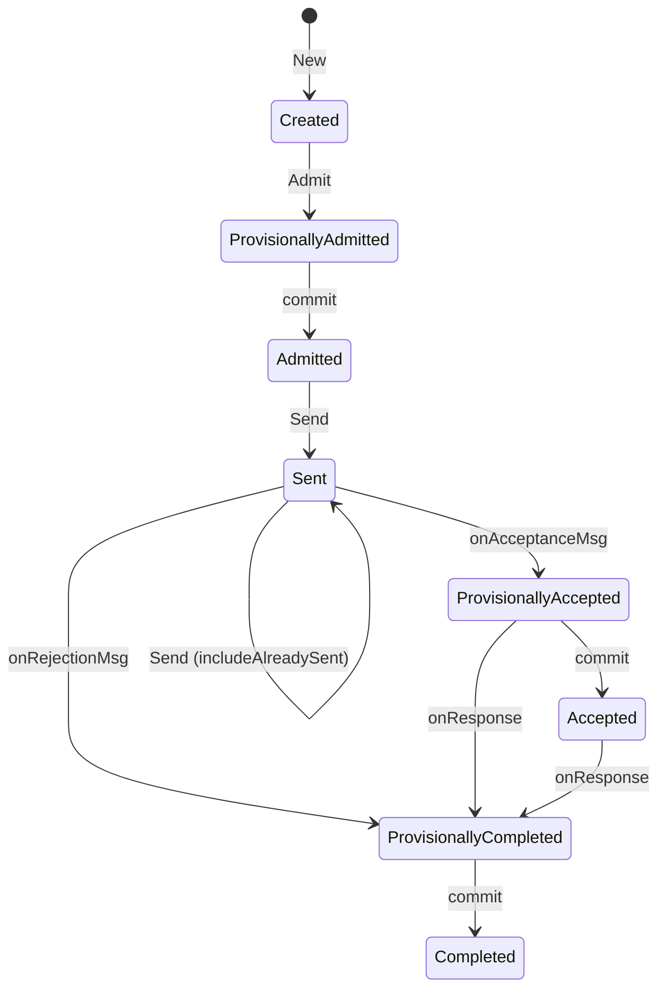
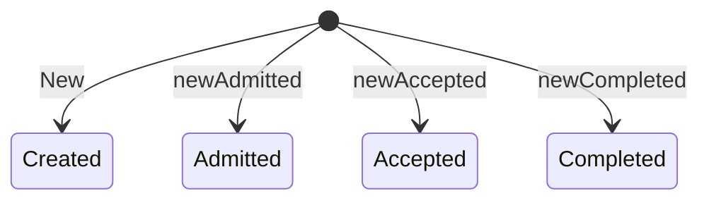
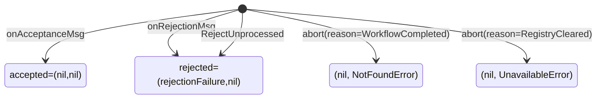
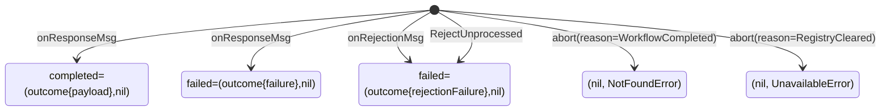
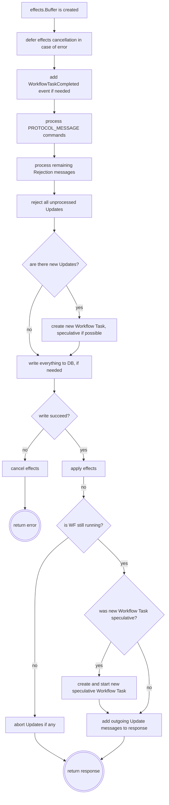

# Workflow Update

## What is this doc?
This doc is focused on internal server implementation details of Workflow Update. Target audience are
server developers who work on server bugs or improving Workflow Update.
User facing docs, usage scenarios, SDK APIs can be found at https://docs.temporal.io.

## What is Workflow Update?

Historically Temporal had two basic primitives, which allows users to interact with Workflow:
Signal and Query:
- Signal can be sent to Workflow to trigger some extra logic there.
- Query can return some information from the Workflow.

Both of them have limitations:
- Signal can't be rejected and always got at least one event in Workflow history.
Also, there is no way for API caller to figure out if a Signal was successfully processed by Workflow:
it is a fire-and-forget mechanism.
- Query can't modify Workflow state and can perform only readonly operation.

Workflow Update is a complex feature that can be thought of as "signal+query" in one API call.
Update can be rejected by Workflow and don't write any events. But if it was accepted and processed,
caller can immediately get a result. Essentially, Temporal Server acts as a proxy between API caller
and Workflow: it exposes API which is handled by Workflow code.

To achieve this, few new internal primitives were introduced. They are not coupled directly with
Workflow Update, but it highly depends on them:
  - [Speculative Workflow Task](./speculative-workflow-task.md)
  - [In-memory timer queue](./in-memory-queue.md)
  - [Message protocol](./message-protocol.md)
  - [`effect` package](./effect-package.md)

## Key Requirement: Zero Persistence Writes
There is a requirement, which is not common among Temporal APIs: Update rejections must leave
no traces in history and also be as "cheap" as possible. The consequences of this requirement are:
1. There is no "Update Admitted" or "Update Received" event at the moment when the server received 
Update request, because if Workflow rejects Update, this event shouldn't be in a history.
   - Update request can't be shipped to Workflow as an event, they are shipped as messages.  
2. There is no "Update Rejected" event: if Update is rejected, it just disappears.
   - Update outcome can't be shipped to server as a command, because each command must produce an event. 
3. The Original Update request is stored in "Update Accepted" event, because this is a first event when
server can write Update.
4. Update outcome is stored in "Update completed" event. It might indicate success or failure. Failure
in an Update outcome is different from Update rejection. 
5. Workflow task to ship Update request form server to worker must not be persisted with mutable state. 

## Update Registry
Updates are accessed through `update.Registy` interface. Instance of this interface is stored in
`workflow.ContextImpl` struct. Registry has an internal map which stores **admimitted and
accepted** Updates only. Completed Updates are not stored in this map but still can be accessed through
Registry, because Registry has a reference to the store which is the instance of mutable state.
When Update is accepted or completed corresponding event is written to the Workflow history.

Mutable state itself doesn't store all information about Updates but, instead, stores `UpdateInfo`
map, which links UpdateId with UpdateInfo, which can be one of `UpdateAcceptanceInfo`,
`UpdateCompletionInfo`, or `UpdateAdmissionInfo`. These structs contain minimum data (to limit
mutable state size) and are just pointers to corresponding history events in the
Workflow history. 

When Update Registry is created, it iterates over `UpdateInfo` struct in mutable state
which has all required data just to build a Registry. "Update Completed" event is loaded
only in `GetUpdateOutcome()` method of mutable state, which is used to retrieve results of completed
Updates. 

Because order in an internal map is non-deterministic, before sending out, Updates are sorted on admitted time.

> #### TODO
> Because Registry is in-memory struct, which is built from events, and Updates in admitted state
> don't have events, they are lost when Registry is cleared. In the future, "Update Admitted" event can be
> used to persist Update before delivering it to the worker. 

Rejected Updates are not stored anywhere and, therefore, can't be deduplicated, and can be shipped
twice to the worker. Also, if `PollWorkflowExecutionUpdate` API is called for rejected Update,
it will not get rejection failure but `NotFound` error.

> #### TODO
> This is because there is no good place to store rejection failure. There is no history event
> for "Rejected Update" and it can't be stored in mutable store due to size limitations.
> In the future, if there is another key-value store, it can be used to store rejection failures. 

### Update State Machine
Update states are defined in `state.go` and are prefixed with `state` (i.e. `Created` is `stateCreated`).

Transitions are made in three places:
1. `UpdateWorkflowExecution` API (called by external caller): `Created`, `Admitted` states.
2. `RecordWorkflowTaskStarted` API (called by matching service): `Sent` state.
3. `RecordWorkflowTaskCompleted` API (called by SDK worker): `Accepted`, `Rejected`, `Completed` states.

States which are set by `commit` method also have `rollback` method to revert the state
to the previous state (not shown on the diagram for simplicity). Usually Update flow would be:


### Update Constructors
Different constructors can create Update at specified state:

Normally, when server gets Update request, it creates Update with `New` at state `Created`.
When Update Registry loads Updates from `UpdateStore` it can create them directly in `Admitted`
(see Reapply Update bellow) or in `Accepted` states using corresponding constructors. 
Also, Update can be created at state `Admitted` when it is resurrected (see Update Resurrection bellow).
When Update can't be found in Registry but exist in `EventStore` because it is already completed,
it is created at state `Completed` and returned to the caller.

### Aborting Update
Update is aborted when:
1. The Workflow is completed or completes itself: non retryable `ErrWorkflowCompleted` error is returned
to the API caller.
2. Update Registry is cleared: retryable error `WorkflowUpdateAbortedErr` error is returned (see
Update Registry Lifecycle bellow).

Update can be aborted at any state. State `Aborted` can't be changed (terminal state).

### Update Registry Lifecycle
Update Registry is cleared together with mutable state, every time when Workflow context is cleared.
Because Workflow context is cleared on every error, a significant effort was made not to do it,
but instead keep the Update Registry intact even if mutable state is cleared.
This approach was proven to be error-prone and had few bugs which can't be addressed.

> For example, if there is an Update in the Registry that waits for to be delivered to the worker,
> but Workflow Task, which is supposed to do this, is lost because mutable state (but not Registry) was cleared.
> Retries won’t help, because Update will be deduplicated by UpdateId.
> `SCHEDULE_TO_START` timeout timer for speculative Workflow Task also won't help
> because processor of this task, reads Workflow Task from mutable state and if it is not there, does nothing.
>
> There are few other discovered and probably not-discovered cases when this approach doesn't work.

Instead, the Workflow Update feature relies on internal retries: history handler, history client on frontend side, and frontend
handler. If Update is removed from Registry due to non-related error, a retryable error is returned to
`UpdateWorkflowExecution` API caller and internal retries recreate Update in Registry.

Also, it is important to notice that Workflow context is stored in the Workflow cache
and might be evicted any time. Therefore, the Workflow Update feature relies on properly configured cache size.
If cache is too small, it will evict Workflow context and Update Registry will be lost.
`UpdateWorkflowExecutions` API caller will time out.

## `UpdateWorkflowExecutions` and `PollWorkflowExecutionUpdate` APIs
The Workflow Update feature exposes two APIs: `UpdateWorkflowExecution` to send Update request to Workflow,
and wait for results, and `PollWorkflowExecutionUpdate` to just wait for results. These can be
thought as "PUT&GET" and "GET".

### Schedule New Workflow Task
After Update is added to the Registry, the server schedules a new Workflow Task to deliver Update to the worker.
This Workflow Task is always speculative, unless there is already scheduled but not started Workflow Task.
Later, when handling worker response in `RespondWorkflowTaskCompleted` handler,
server might write or drop events for this Workflow Task.
Check [here](./speculative-workflow-task.md) for more details.

### Lifecycle Stage
Besides common sense parameters (like Update name and input) caller can also specify Update stage
it's willing to wait before API call is returned. Currently, it can be only `ACCEPTED` or `COMPLETED` also
known as async and sync modes.

> #### TODO
> `ADMITTED` stage will be added later and will require new feature called "Durable Admitted":
> to support this stage Update request must be persisted somewhere on server. This will also allow
> to use Update with Signal "fire-and-forget" semantic.

### Waiters diagram
When wait stage is specified as `ACCEPTED`, API caller waits on `accepted` future
(value of type `*failurepb.Failure`). The following results can be returned:

If wait stage is `COMPLETED`, API caller waits for `outcome` future (value of type `*updatepb.Outcome`)
and can get one of the following:


### Internal Timeout
Also, caller can specify a timeout it's willing to wait before specified stage is reached. If timeout
is expired and Update didn't reach the stage, `context deadline exceeded` error will be returned to the caller.

But if caller doesn't specify timeout, server will enforce it to `LongPollExpirationInterval`
(default is 20 seconds). When this timeout is expired, server won't return `context deadline exceeded` error,
but, instead, will return an empty response with actual reached stage. SDK has special logic to handle
this response:
- If reached stage is `ADMITTED`, means that Update wasn't persisted yet, and might be lost, SDK
retries `UpdateWorkflowExecution` API call,
- If reached stage is `ACCEPTED`, then there is no reason to retry original call and SDK starts to poll
Update results using `PollWorkflowExecutionUpdate` API.

> The same empty response with actual reached stage is returned when the Update Registry is cleared,
> but Update reached `ACCEPTED` stage. Instead of retrying `UpdateWorkflowExecution` API, SDK starts to poll.
> If reached stage is `ADMITTED` only, server returns retryable `Unavailable` error, which shouldn't
> reach SDK and retried internally on server, but if it does, SDK behavior is the same as empty
> response with `ADMITTED` stage: retry `UpdateWorkflowExecution` API call. 

### Thread Safe Methods
All `update.Update` and `update.Registry` methods and fields must be accessed while holding a Workflow lock.
The only exception is `WaitLifecycleStage()` method because it accesses only fields of thread safe `Feature` type.
Otherwise, `WaitLifecycleStage()` call would hold Workflow lock while waiting for Update to be processed,
which also requires a lock in `RespondWorkflowTaskCompleted`.

### Workflow Updates Limits
There are currently two limits: maximum in-flight Updates (means not-completed Updates), and
total maximum Updates count per Workflow run. Default values are 10 and 2000 respectively.

There are two exceptions when `maxInFlightLimit` limit is ignored and can be exceeded:
1. Update is resurrected (see Update Resurrection bellow).
2. Update is reapplied (see Reapply Updates below). All reapplied Updates become in-flight.

## Processing Updates in `RespondWorkflowTaskCompleted`
Server receives Update `updatepb.Acceptance` and `updatepb.Response` as [messages](./message-protocol.md) in `Messages` field
of `RespondWorkflowTaskCompletedRequest`. Handler of `RespondWorkflowTaskCompleted` is one of the most
complicated functions in Temporal. Workflow Update handling can be extracted as:

### Update Resurrection
During processing of Update Acceptance or Rejection message, Update can be resurrected
in the Registry. This can happen when Update is not found in the Registry and Acceptance
or Rejection message contains the original Update request. In this case, Update is created
in `Admitted` state, added to Registry, and processing continues.

> #### NOTE
> SDKs started to send the original request back starting around May 2024. 
> Previous version didn't do it and resurrection was not possible.
> 
> Resurrection is possible only when a normal Workflow Task was used to ship Update request to the worker.
> But Updates are mostly delivered using speculative Workflow Task, which is also lost when Registry
> is lost (because WF context was cleared). `RespondWorkflowTaskCompleted` handler returns
> `NotFound` error to the worker in this case.

### Race with Workflow Completion
Updates don't block Workflow from completing. Admitted Updates can't block Workflow from completing
because blocking means fail Workflow Task, which means clearing Workflow context, Update Registry,
and loosing Updates. Then there is a race: worker, which doesn't get any new Updates 
will try to complete Workflow Task again, or internal retries will recreate Update in the Registry.

> #### TODO
> This might be changed in future when "Durable Admitted" Update is implemented.
 
Accepted (but not Completed) Updates remain in this state after the Workflow is completed.
It is Workflow responsibility to complete them. This behavior is similar to Activities
which also can be completed after the Workflow is completed (the result will be obviously ignored).

Therefore, if Workflow completes itself, all incomplete Updates are aborted: admitted Updates
get `ErrWorkflowCompleted` error on both `accepted` and `completed` futures, and accepted Updates get
same error only on `completed` future.

Update results are available after the Workflow is completed. They can be accessed using
`PollWorkflowExecutionUpdate` API. But even `UpdateWorkflowExecution` API won't return `ErrWorkflowCompleted`
if UpdateId is the one of already completed. This provides consistent experience for API caller:
no matter at what stage Workflow is and how many retries were made, API caller
will get `ErrWorkflowCompleted` error, if Update wasn't processed by Workflow,
or Update outcome if it was. 

> #### NOTE
> There is one special case of Workflow completion: `ContinueAsNew`. If Workflow completes
> Update and does `ContinueAsNew`on the same Workflow Task, then there is a chance that Update
> will be delivered to both 1st and 2nd run: if after mutable state
> is persisted, but before Update callers get Update result, history node dies, then frontend
> will retry `UpdateWorkflowExecution` API call, and this call will land on 2nd run,
> which won't have completed UpdateId in the Registry, and will treat this Update request
> as new, and send Update to the worker again.
> 
> The same can happen when Registry was cleared (due to error) after Update was sent to worker,
> and, while waiting for internal retry, Workflow Task completes with an Update Response message and 
> `ContinueAsNew` command. Update will be resurrected and successfully completed on the 1st run,
> and then internal retries will send it again to the 2nd run.

### Workflow Task Failure
If Workflow Task that shipped Update request to the worker fails, `UpdateWorkflowExecution` API caller
doesn't get an error because Workflow Task failure indicates that there is something wrong with Workflow
or with server, but not with Update request. API caller will get time out without any details.
Root cause can be found in the corresponding event in Workflow history.

### Rejecting Unprocessed Updates
After server sends Workflow Task with Update request to the worker, Update gets `Sent` state,
and it must be processed (accepted or completed) by worker on the same Workflow Task.
If a worker ignores Update request, then it means that worker is using old SDK, which is not aware
of Updates and messages. In this case, the server rejects Update request on behalf of the worker.
This is to prevent continuously sending the same Update request to the worker, which can't process it.

### Provisional States
Workflow Update state machine uses provisional states (e.g. `stateProvisionallyAccepted`
or `stateProvisionallyCompleted`) to indicate that state machine has a call back to switch to the
corresponding state (e.g. `stateAccepted` or `stateCompleted`). Update state switched to provisional
immediately, and the callback function changes it to normal state. Because Workflow Update
can be accepted and completed in the same Workflow Task following state transition is normal:
```
Sent -> ProvisionalyAccepted -> ProvisionalyCompleted -> Accepted -> Completed
```
Check [`effect` package doc](./effect-package.md) for more details.

### When to Apply Effects
Because `Cancel()` method is called in `deffer` block in case of error, `Apply()` method
should be called immediately after persistence write is successfully completed. Otherwise, any error
will cancel effects and leave Update state machine in inconsistent state.

### `UpdateWorkflowExecution` Persistence Method
The Word "update" is widely used in Temporal codebase, and before Workflow Update feature was introduced,
mainly meant update to persistence. Unfortunately `ExecutionStore` interface exposes method
with exact the same name: `UpdateWorkflowExecution` (which writes Workflow execution to a database).
This method name is used as value of `operation` tag in different metrics. API name is also used
to tag metrics with `operation` tag. 

> #### TODO
> Because it is impossible to rename `UpdateWorkflowExecution` API (and there is no better name anyway),
> persistence operation should be renamed to `SaveWorkflowExecution`, `WriteWorkflowExecution`, 
> `PersistWorkflowExecution`, or something similar.

# Reapply Updates
Updates, similar to Signals, are reapplied to the new Workflow run after reset. It means if
the original Workflow run got Updates after the event to which it gets reset, those Updates
are sent to the new run again. Also, Updates are getting reapplied during history branch reconciliation.
These Updates need to be persisted in state `Admitted` because at the time for reset/branch reconciliation,
worker might not be available. Also, if the Workflow is reset one more time, Updates must be
reapplied again, even if the second attempt rejected them.

To support this "Update Admitted" event is used. Workflow Update does not normally use this event,
but in case of reset, all accepted and completed Updates after reset event are converted to 
"Update Admitted" event and written in to the history. Because this event already contains 
the original Update request payload, the original request is not written to the "Update Accepted" event.
This adds complexity to both server and SDKs. The server needs to support both cases when Update request
is in "Update Admitted" and "Update Accepted" event. SDKs should be able to read Update request
from both messages and events.

> #### NOTE
> This is not a great solution. Few other options were considered, but were rejected
> for various reasons. One of the main arguments for "Update Admitted" event approach
> is that this event will be used in the future for "Durable Admitted" feature and all the logic
> is applicable there.
