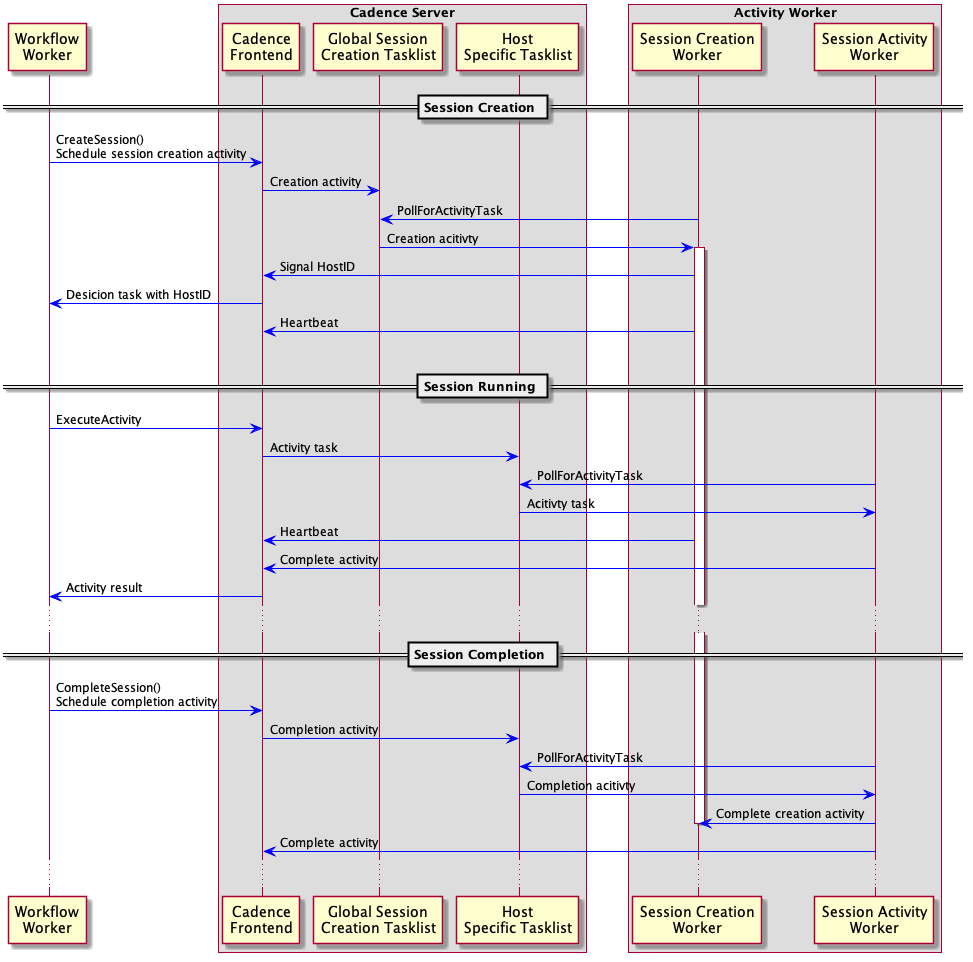
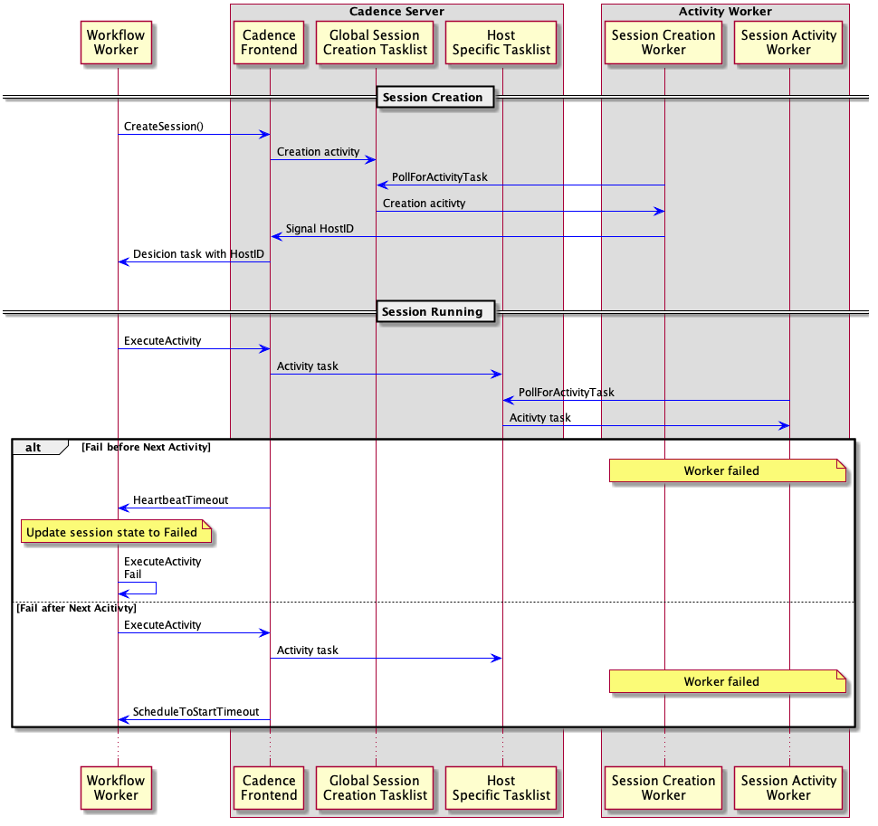
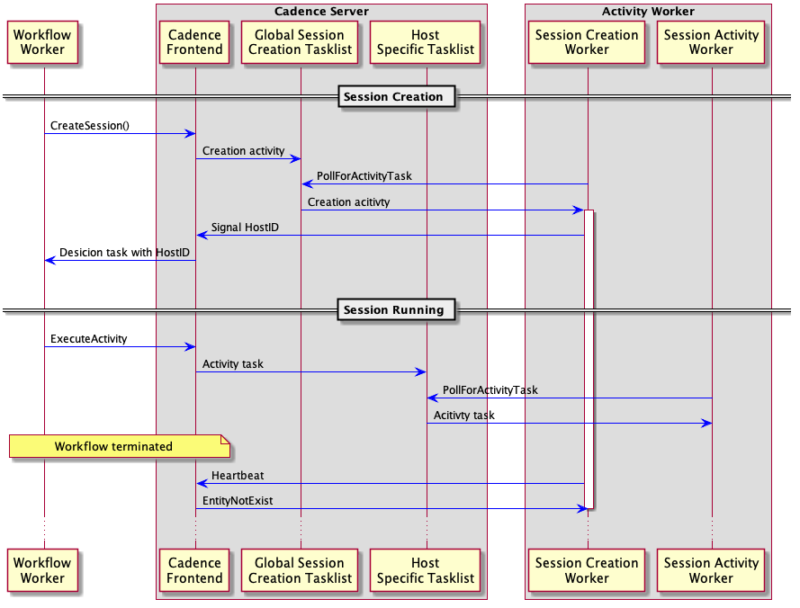
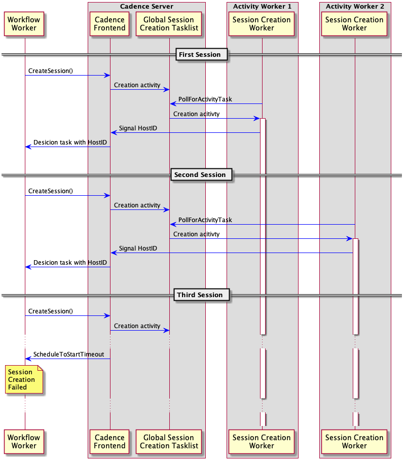
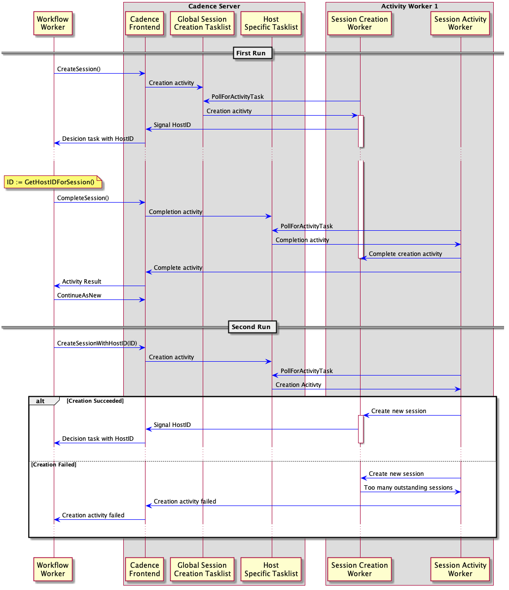

# Proposal: Resource-Specific Tasklist

Author: Yichao Yang (@yycptt)

Last updated: July 2019

Discussion at <https://github.com/uber-go/cadence-client/issues/697>

## Abstract

Currently, there’s no straightforward way for a Cadence user to run multiple activities (a session) on a single activity worker. Although there is the option to explicitly specify a host-specific tasklist name or manually execute special activities to get information about the activity worker, these approaches have limitations and are error prone. Besides running multiple activities on a single worker, a user may also want to limit the total number of sessions running concurrently on a single worker if those sessions consume worker resources. This document proposes several new APIs and their implementations so that a user can create sessions, execute activities, and limit the number of concurrent sessions through a simple API call.

## Use Cases

### Machine Learning Model Training

A user can model the entire training process with multiple activities, for example, downloading datasets, data cleaning, model training, and parameter uploading. In this case, all activities should be executed by one activity worker. Otherwise, the dataset might be downloaded multiple times. In addition, as a dataset typically consumes a lot of disk space and model training requires GPU support, the number of total models training on a single worker should be limited.

### Service Deployment

In this case, a session represents the deployment of a service to one worker and the number of concurrent deployments is critical. A user controls that number by limiting the number of concurrently running sessions on an activity worker.

## Proposal

The scope of this proposal is limited to the Cadence client. Cadence server doesn’t need to be changed at all. The basic idea here is that we should write special workflow code for users to perform activity scheduling and worker monitoring, and expose simple APIs to users. Once users don’t need to care about those implementation details, they can focus on their own business logic.

The proposal includes both API changes and implementations. It aims at solving three problems:

1. How to ensure multiple activities are executed on one activity worker.

2. How to limit the number of concurrent sessions on an activity worker.

3. How to carry over session information between different workflow runs.

The following sections will first go through the APIs exposed to users, explain how to use them, and provide sample code. Any developer with previous Cadence experience should be able to understand the APIs and start using them immediately. After that I will explain the model behind those APIs and how they are implemented.

### API Changes

#### New Go Client API

There will be four new APIs available when writing a workflow:

```go
sessionCtx, err := workflow.**CreateSession**(ctx Context, so *SessionOptions)
```

A user calls this API to create a session on the worker that polls the task list specified in the ActivityOptions (or in the StartWorkflowOptions if the task list name is not specified in the ActivityOptions). All activities executed within the returned sessionCtx (a new context which contains metadata information of the created session) are considered to be part of the session and will be executed on the same worker. The sessionCtx will be cancelled if the worker executing this session dies or CompleteSession() is called.

The SessionOptions struct contains two fields: `ExecutionTimeout`, which specifies the maximum amount of time the session can run and `CreationTimeout`, which specifies how long session creation can take before returning an error.

CreateSession() will return an error if the context passed in already contains an open session. If all the workers are currently busy and unable to handle new sessions, the framework will keep retrying until the CreationTimeout you specified in the SessionOptions has passed before returning an error.

When executing an activity within a session, a user might get three types of errors:
1. Those returned from user activities. The session will not be marked as failed in this case, so the user can return whatever error they want and apply their business logic as necessary. If a user wants to end a session due to the error returned from the activity, use the CompleteSession() API below. 
2. A special `ErrSessionFailed` error: this error means the session has failed due to worker failure and the session is marked as failed in the background. In this case, no activities can be executed using this context. The user can choose how to handle the failure. They can create a new session to retry or end the workflow with an error.
3. Cancelled error: If a session activity has been scheduled before worker failure is detected, it will be cancelled afterwards and a cancelled error will be returned.

```go
workflow.**CompleteSession**(sessionCtx Context)
```

This API is used to complete a session. It releases the resources reserved on the worker and cancels the session context (therefore all the activities using that session context). It does nothing when the session is already closed or failed.

```go
sessionInfoPtr := workflow.**GetSessionInfo**(sessionCtx Context)
```

This API returns session metadata stored in the context. If the context passed in doesn’t contain any session metadata, this API will return a nil pointer. For now, the only exported fields in sessionInfo are: sessionID, which is a unique identifier for a session, and hostname. 

```go
sessionCtx, err := workflow.**RecreateSession**(ctx Context, recreateToken []byte, so *SessionOptions)
```

For long running sessions, user might want to split it into multiple runs while still wanting all the activities executed by the same worker. This API is designed for such a use case.

Its usage is the same as CreateSession() except that it also takes in a recreateToken. The token encodes the resource specific tasklist name on which the new session should be created. A user can get the token by calling the GetRecreateToken() method of the SessionInfo object.


#### Example

The basic usage looks like the following (it belongs to a larger workflow):

```go
sessionCtx, err := CreateSession(ctx)

if err != nil {

    // Creation failed. Wrong ctx or too many outstanding sessions.

}

defer CompleteSession(sessionCtx)

err = ExecuteActivity(sessionCtx, DownloadFileActivity, filename).Get(sessionCtx, nil)

if err != nil {

    // Session(worker) has failed or activity itself returns an error.

    // User can perform normal error handling here and decide whether creating a new session is needed.

    // If they decide to create a new session, they need to call CompleteSession() so that worker resources can be released. We recommend that users create a function for a session and call defer CompleteSession(sessionCtx) after a session is created. If session retry is needed, this function can be called multiple times if the error returned is retriable.

}

err = ExecuteActivity(sessionCtx, ProcessFileActivity, filename).Get(sessionCtx, nil)

if err != nil {

    // Session(worker) has failed or activity itself returns an error.

}

err = ExecuteActivity(sessionCtx, UploadFileActivity, filename).Get(sessionCtx, nil)

if err != nil {

    // Session(worker) has failed or activity itself returns an error.

}
```

#### New Worker Options

There will be three new options available when creating a worker:

* **EnableSessionWorker**

  This flag controls whether the worker will accept activities that belong to a session.

* **SessionResourceID**

  An identifier of the resource that will be consumed if a session is executed on the worker. For example, if a worker has a GPU, and a session for training a machine learning model is executed on the worker, then some memory on the GPU will be consumed. In this case, the resourceID can be the identifier of the GPU.

**NOTE:** Users must ensure that only one worker uses a certain resourceID on a host.

* **MaxCurrentSessionExecutionSize**

  Because a session may consume some kind of resource, a user can use this option to control the maximum number of sessions running in the worker process at the same time.

## Implementation

### Session Model

All sessions are **resource specific**. This means that a session is always tied to some kind of resource (not the worker). The resource can be CPU, GPU, memory, file descriptors, etc., and we want all the activities within a session to be executed by the same worker that owns the resource. If a worker dies and restarts, as long as it owns the same resource, we can try to reestablish the session (this is future work). Also, the user needs to ensure that the resource is owned by only one worker on a single host.

Note that when creating a session, a user doesn’t need to specify the resource that is consumed by the session. This is because right now one worker owns only one resource, so there’s only one resource type on the worker. As a result, as long as the user specifies the correct tasklist in the context passed into the createSession API, the correct type of resource will be consumed (since there’s only one). Later, when a worker can support multiple types of resources, users will need to specify the resource type when creating a session.

### Workflow Context

When a user calls the CreateSession() or RecreateSession() API, a structure that contains information about the created session will be stored in the returned context. The structure contains seven pieces of information:

1. **SessionID**: a unique ID for the created session. (Exported)

2. **Hostname**: the hostname of the worker that is responsible for executing the session. (Exported)

3. **ResourceID**: the resource consumed by the session. (Will Be Exported)
 
4. **tasklist**: the resource specific tasklist used by this session. (Not Exported)

5. **sessionState**: the state of the session (Not Exported).  It can take one of the three values below:

   1. **Open**: when the session is created and running
   2. **Failed**: when the worker is down and the session can’t continue
   3. **Closed**: when the user closes the session through the API call and the session is successfully closed

6. **sessionCancelFunc**: the function used to cancel the sessionCtx. It will cancel both the creation activity (see below) and all user activities. (Not Exported)

7. **completionCtx**: the context for executing the completion activity. It’s different from the sessionCtx as we want to cancel the session context when CompleteSession() is called, but the completion activity (see below) still needs to be executed. (Not Exported)

When a user calls the CompleteSession() API, the state of the session will be changed to "Closed" in place, which is why this API doesn’t return a new context variable.

There is no way to set the state of a session to “Failed”. The state of a session is “Failed” only when the worker executing the session is down and the change from “Open” to “Failed” is done in the background. Also notice that it’s possible that the worker is down, but the session state is still “Open” (since it takes some time to detect the worker failure). In this case, when a user executes an activity, the activity will still be scheduled on the resource specific tasklist. However, it will be cancelled after worker failure is detected and the user will get a cancelled error.

### Workflow Worker

When scheduling an activity, the workflow worker needs to check the context to see if this activity belongs to a session. If so and the state of that session is "Open", get the resource specific tasklist from the context and use it to override the tasklist value specified in the activity option. If on the other hand, the state is "Failed", the ExecuteActivity call will immediately fail without scheduling the activity and return an ErrSessionFailed error through Future.Get().

CreateSession() and CompleteSession() really do are **schedule special activities** and get some information from the worker which executes these activities.

* For CreateSession(), a special **session creation activity** will be scheduled on a global tasklist which is only used for this type of activity. During the execution of that activity, a signal containing the resource specific tasklist name will be sent back to the workflow (with other information like hostname). Once the signal is received by the worker, the creation is considered successful and the tasklist name will be stored in the session context. The creation activity also performs periodic heartbeat throughout the whole lifetime of the session. As a result, if the activity worker is down, the workflow can be notified and set the session state to “Failed”. 

* For RecreateSession(), the same thing happens. The only difference is that the session creation activity will be **scheduled on the resource specific task list instead of a global one**.

* For CompleteSession(), a special **completion activity** will be scheduled on the resource specific tasklist. The purpose of this activity is to stop the corresponding creation activity created by the CreateSession()/CreateSessionWithHostID() API call, so that the resource used by the session can be released. Note that, **the completion activity must be scheduled on the resource specific tasklist (not a global one)** since we need to make sure the completion activity and the creation activity it needs to stop are running by the same worker.

### Activity Worker

When `EnableSessionWorker` is set to true, two more activity workers will be started.

* This worker polls from a global tasklist whose name is derived from the tasklist name specified in the workerOption and executes only the special session creation activity. This special activity serves several purposes:

   1. **Send the resource specific tasklist name** back to the workflow through signal.

   2. Keep **heart beating** to Cadence server until the end of the session.

      If the heart beating returns the `EntityNotExist` Error, this means the workflow/session has gone and this special activity should stop to release its resources.

      If on the other hand, the worker is down, Cadence server will send a heartbeat timeout error to the workflow, so the workflow can be notified and update the session state. Later, an ExecuteActivity() call to the failed session context will also fail.

   3. Check the number of currently running sessions on the worker. If the maximum number of concurrent sessions has been reached, return an error to fail the creation.

   One detail we need to ensure is that when the maximum number of concurrent sessions has been reached, this worker should stop polling from the global task list.

* Session Activity Worker: this worker only polls from the resource specific tasklist. There are three kinds of activities that can be run by this worker:

   1. User activities in a session that belongs to this host.

   2. Special activity to complete a session.

      The sole purpose of this activity is to stop the long running session creation activity so that new sessions can be executed.

   3. Special session creation activity scheduled by RecreateSession().

When domain failover happens, since no worker will poll from the resource specific task, all activities within a session will timeout and the user will get an error. Also, Cadence server will detect the heartbeat timeout from the session creation activity.

### Sequence Diagrams

This section illustrates the sequence diagrams for situations that may occur during the session execution.

* Here is the sequence diagram for a normal session execution.



* When activity worker fails during the execution.



* When the workflow failed or terminated during the execution.



* When there are too many outstanding sessions and the user is trying to create a new one. The assumption here is that each activity worker is configured to have **MaxCurrentSessionExecutionSize = 1**. Resource specific tasklist and session activity worker are omitted in the diagram.



* An example of RecreateSession().



## Open Issues

* Support automatic session reestablishing when worker goes down.

* Allow session activities to access session information such as sessionID, resourceID, etc. This information is useful for logging and debugging.

* Support multiple resources per worker and allow user to specify which type of resource a session will consume when creating the session.
