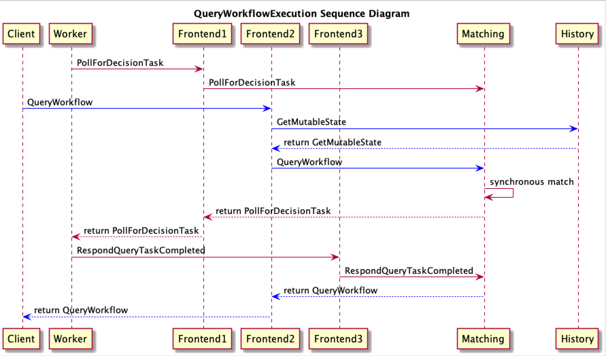
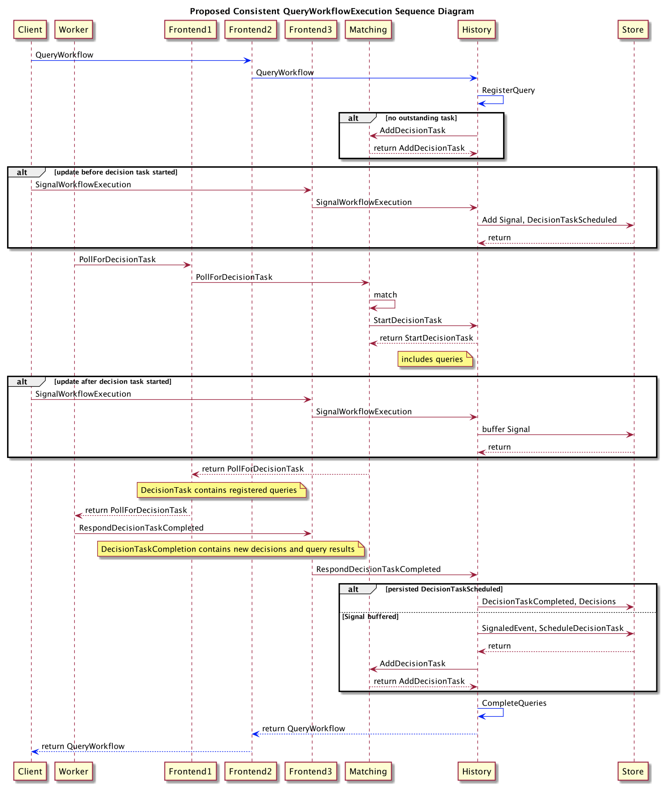
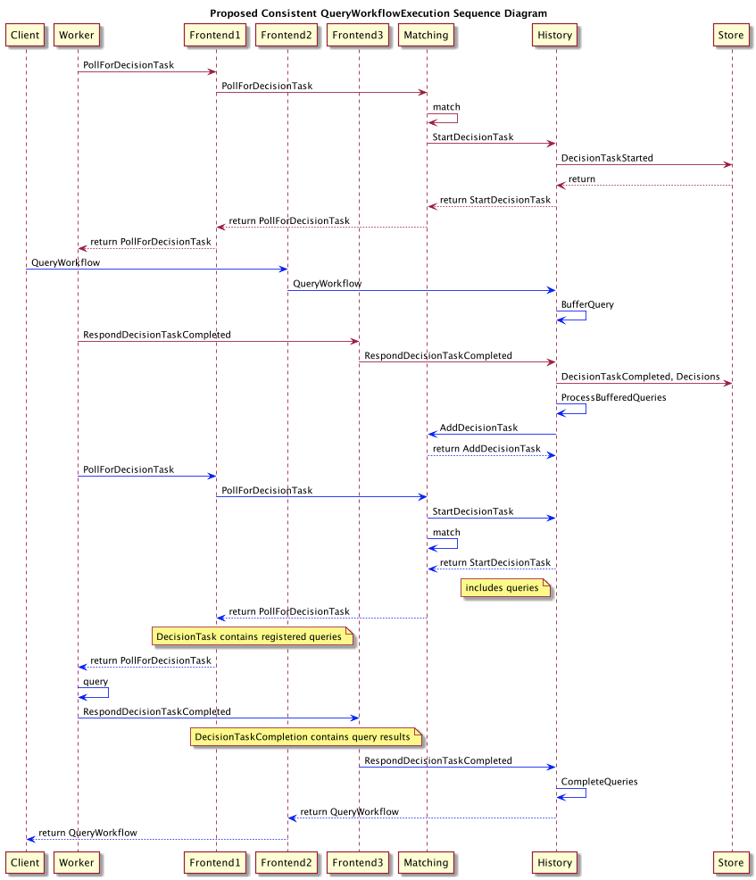
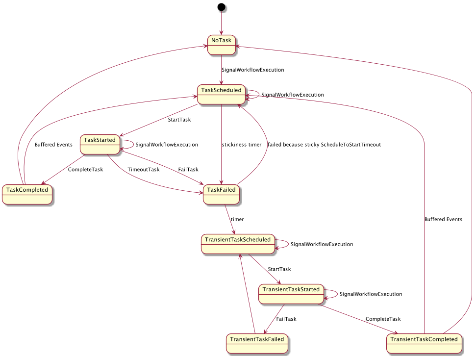
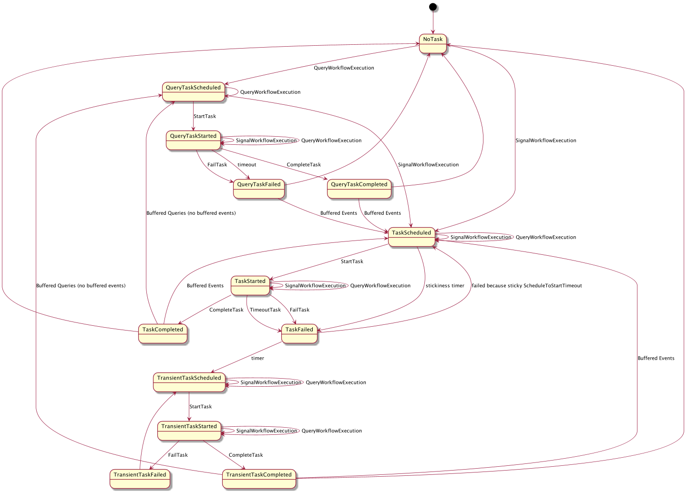

# Proposal: Synchronous Request Reply

Authors: Maxim Fateev (@mfateev), Andrew Dawson (@andrewjdawson2016)

Last updated: July 16, 2019

Discussion at [https://github.com/uber/cadence/issues/2215](https://github.com/uber/cadence/issues/2215)

## Abstract

Currently Cadence workflows only process events (in form of signals) asynchronously. The only synchronous operations supported by workflows are query and waiting for workflow completion. Query is a read only operation that cannot mutate a workflow state. And waiting for a workflow completion is applicable to a pretty narrow set of use cases. There is a clear need for workflows processing mutating requests synchronously. This document goes over various workflow related request/reply use cases, identifies requirements and proposes solutions.

## Use Cases

### Synchronous Update

For example customer service needs to notify a workflow that the task was matched to a specific customer service representative. The notification should fail if the task is not available for dispatch anymore. This can happen if the call is duplicated by the matching system or the task state has changed for other reasons.

### Page Flow

For example placing an order through a web UI or mobile app involves going through multiple screens. The data submitted from a screen is sent to a workflow which might execute activities and return information about the next page to present. In most cases the latency of this interaction is expected to be low.

### Conditional Update

Various scenarios would benefit from transactional guarantees. In its simplest form an update should not go through if a state of a workflow has changed since the last query. For example the page flow should reject an update from a cached browser page if a current state of the workflow expects a different one. While it is possible to implement this check in an application code a framework support for such guarantee would simplify the programming model.

### Queue Consumer

Queue Consumer receives a task from Kafka, constructs a workflow id from it and forwards it to the appropriate instance. If workflow cannot process message because it is corrupted it can reject it with an error which is eventually going to put it into the DLQ. Ideally if message is rejected it is not recorded in the history to not increase the history size due to retries. It also would allow workflow efficiently filter out unnecessary messages.

### Waiting for a State Change

For example continuous deployment show the current workflow state in the UI and update it once the workflow state changes. Currently they keep executing query periodically to learn about the state changes. The ideal solution would allow waiting for state changes using a long poll that is much more efficient. It also should scale to the large number of pollers watching a single workflow execution which is common in continuous deployment scenarios.

## Proposal

The proposal consists of three parts.

1. Guarantee read after write consistency between signal and query

2. Long poll on query result changes

3. Update operation that should complete within a single decision

All three together cover all the listed use cases.

### Guarantee read after write consistency between signal and query

Currently, there is a race condition when a query emitted after a signal sees a stale workflow state without the update from the signal. Accounting for this inconsistency complicates the workflow logic. Fixing this race condition allows the signal-then-query pattern to be used for request-reply scenarios. The drawback of this approach is suboptimal performance since it requires at least two decisions and multiple database updates. But, together with the long polling on query result changes feature, it is a reasonable way to implement update-and-wait for long-running update operations.

The reverse consistency of failing a signal if the workflow state has changed since the last query is also possible when requested. The basic idea is to return a current workflow (or query result) version with a query in the form of an opaque token. Then include the token into the SignalWorkflowExecution call arguments. The call is rejected if the version doesn’t match the one in the token.

#### Implementation Details

Here is the sequence diagram of the current QueryWorkflow API implementation:

The race condition happens because a query always creates its own special decision task even if there is an outstanding decision task caused by an external event. To not return state that workflow hasn’t reached yet the query ignores all the new events after the already processed decision task. This approach has another issue of failing queries for newly created workflows that haven’t yet seen a decision task.

The solution is to not create a separate decision task for a query, but include the query into an already outstanding one. It would be done by modifying the history service startDecisionTask method to return all the outstanding queries. And the client side should be modified to execute a decision as usual and then execute all the queries and insert both decisions and the query results into RespondDecisionTaskCompleted.

The main drawback of this approach is that a query cannot be processed while there is a started decision task. Usually decision task processing is pretty fast, but if it executes local activities the latency of a query can increase dramatically. The current implementation already has this problem when a sticky workflow execution (which is on by default) is used. But currently the delay happens on the client worker which serializes processing of decision tasks by the same workflow instance.

The naive implementation would add DecisionTaskScheduled/Started/Completed events to the history on every query. This is not acceptable as queries are read only operations and incurring the cost of all these updates and correspondent history growth would defeat its purpose. So the proposal is to skip any database updates if there is no outstanding decision task and rely on the in-memory cache of mutable state for such decision task handling. In case of a shard movement the state is going to be lost and the query request is going to fail. The reply to a decision task for such forgotten query can be safely ignored. If an external event like activity completion or signal is received when there is an outstanding decision task caused by a query then the event and the correspondent events including  DecisionTaskScheduled and later DecisionTaskStarted and DecisionTaskCompleted are added to the history without adding the duplicated task to the task list. The probability of a query failure in case of shard movement can be reduced by a frontend retrying it to a host that assumed the shard ownership.

Here is the sequence diagram for the proposed consistent QueryWorkflowExecution API:

The next diagram covers situation when query is received when another decision task is already started:

The current decision state diagram 

Diagram with query task added

### Long poll on query result changes

The usage scenario is to include a token with a current workflow version (as nextEventId value) into QueryWorkflowExecution result. Then if the token is included into the next QueryWorkflowExecution call do not return the call until the workflow version changes. If it doesn’t change after the specified timeout (let’s say a minute) return the call with empty no changes result. An alternative is to use hash of the query result as the version. In this case workflow changes that don’t affect the query result are not going to notify the query callers.

#### Implementation Details

If nextEventId is used as a version, a QueryWorkflowExecution call to the History Service checks the version value against the current workflow nextEventId value. If they do not match the usual query path is executed. If the versions match the long poll request is registered with in-memory mutable state cache.  At some point the workflow execution receives an event that causes a decision task creation. When the decision task is started the queries registered with the workflow are included into it. The decision task completion includes the query results and all the registered long poll queries are notified about them. If no decision task is scheduled for the long poll timeout then the query is returned with no changes empty result.

If hash of the query result is used as a version then mutable state has to persist the map of hash(queryName + queryArgs) to hash(queryResult). And any new query request is checked against the correspondent value in this map. If it matches then it is registered with the mutable state. When a decision task due to an external event completes it includes query results. The query result hash is checked against the already stored result hashes. If the hash value has changed then the poll requests are notified.

### Update operation that should complete within a single decision

This section is not fully designed yet.

## Open issues

1. Design update operation. There is an outstanding design issue for how update works in a multiple DC model.

2. Agree on the client model for synchronous request reply primitives.

