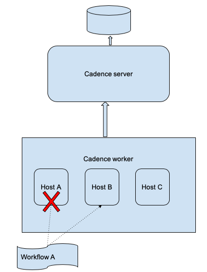

# Abstract

This article is for Cadence developers to understand and address issues with non-deterministic errors. It gives an introduction to the nature and categories of the non-deterministic error, and provide different ways for the fix. It uses Golang as example.

# What is non-deterministic error

## Some Internals of Cadence workflow

A Cadence workflow can be viewed as a long running process on a distributed operating system(OS). The process’s state and dispatching is owned by Cadence server, and customers’ workers provide CPU/memory resources to execute the process’s code. For most of the time, this process(workflow) is owned by a worker and running like in other normal OS. But because this is a distributed OS, the workflow ownership can be transferred to other workers and continue to run from the previous state. Unlike other OS, this is not restarting from the beginning. This is how workflow is fault tolerant to certain host failures. 



Non-deterministic issues arise during this workflow ownership transfer. Cadence is designed with event sourcing, meaning that it persists each workflow state mutation as "**history event**", instead of the whole workflow state machine. After switching to another worker, the workflow state machine has to be rebuilt. The process of rebuilding the state machine is called “**history replay**”. Any failure during this history replay is a “**non-deterministic error**”.


Even if a workflow ownership doesn’t change, history replay is also required under some circumstances: 

* A workflow stack(of an execution) lives in worker’s memory, a worker can own many workflow executions. So a worker can run out of memory, it has to kick off some workflow executions (with LRU) and rebuild them when necessary.    

* Sometimes the stack can be stale because of some errors.

In Cadence, Workflow ownership is called "stickiness". 

Worker memory cache for workflow stacks is called "sticky cache". 

## Cadence History Protocol 

History replay process is under some basic rules/concepts. 

In Cadence, we use "close" to describe the opposite status of “open”. For activity/decision, close includes complete,timeout,fail. For workflow, close means complete/timeout/fail/terminate/cancel/continueAsNew.

### Decision

* Decision is the key of history replay. It drives the progress of a workflow. 

* The decision state machine must be **Scheduled->Started->Closed** 

* The first decision task is triggered by server. Starting from that, the rest decision task is triggered by some events of workflow itself -- when those events mean something the workflow could be waiting for. For example, Signaled, ActivityClosed, ChildWorkflowClosed, TimerFired events. Events like ActivityStarted won’t trigger decisions.  

* When a decision is started(internally called in flight), there cannot be any other events written into history before a decision is closed. Those events will be put into a buffer until the decision is closed -- flush buffer will write the events into history.

* **In executing mode**, a decision task will try to complete with some entities: Activities/Timers/Childworkflows/etc Scheduled. 

* **In history replay mode**, decisions use all of those above to rebuild a stack. **Activities/ChildWorkflows/Timers/etc will not be re-executed during history replay.** 

### Activity 

* State machine is **Scheduled->Started->Closed**

* Activity is scheduled by DecisionCompleted

* Activity started by worker. Normally ActivityStartedEvent can be put at any place in history except for the between of DecisionStarted and DecisionClose. 

* But Activity with RetryPolicy is a special case. Cadence will only write down Started event when Activity is finally closed. 

* Activity completed/failed by worker, or timeouted by server -- they all consider activity closed, and it will trigger a decision task if no decision task on going. 

* Like in the above, only ActivityClose events could trigger a decision.

### Local activity 

* Local activity is executed within decision is processing in flight. 

* Local activity is only recorded with DecisionCompleted -- no state machine needed.

* Local activity completed with trigger another decision

### Timer

* State machine is **Scheduled->Fired/Canceled**

* Timer is the implementation of "workflow.Sleep()" and “workflow.NewTimer().

* Timer is scheduled by DecisionCompleted

* Timer fired by server. It would trigger a decision.

* Timer canceled by worker(when workflow is canceled)

### ChildWorkflow

* State machine is **Initiated->Started->Closed**

* ChildWorkflow is initiated by DecisionCompleted

* ChildWorkflow is started by server(returning runID). It could trigger a decision. 

* ChildWorkflow close events can be"canceled/failed/completed". It could trigger a decision.  

### SignalExternal/RequestCancel 

* State machine is **Initiated->Closed**

* They both initiated by DecisionCompleted, 

* Closed(completed/failed) by server, it could trigger a decision.

### More explanation of BufferedEvents 

When a decision is in flight, if something like a signal comes in, Cadence has to put it into buffer. That’s because for the next decision, SDK always processes unhandled events starting from last decision completed.  There cannot be any other events to record between decision started and close event. [This may cause some issues](https://github.com/uber/cadence/issues/2934) if you are sending a signal to self within a local activities. 

## An Example of history protocol 

To understand the protocol, consider an example of the following workflow code:
```go
func Workflow(ctx workflow.Context) error {
	ao := workflow.ActivityOptions{
		...
	}
	ctx = workflow.WithActivityOptions(ctx, ao)
	var a int
	err := workflow.ExecuteActivity(ctx, activityA).Get(ctx, &a)
	if err != nil {
		return err
	}
	workflow.Sleep(time.Minute)
	err = workflow.ExecuteActivity(ctx, activityB, a).Get(ctx, nil)
	if err != nil {
		return err
	}
      workflow.Sleep(time.Hour)
	return nil
}
```

The workflow will execute activityA, then wait for 1 minute, then execute activityB, finally waits for 1 hour to complete. 

The history will be the follow if everything runs smoothly (no errors, timeouts, retries, etc):

		

```
ID:1		Workflow Started
ID:2		DecisionTaskScheduled : first decision triggered by server
ID:3		DecisionTaskStarted
ID:4		DecisionTaskCompleted
ID:5		ActivityTaskScheduled : activityA is scheduled by decision
ID:6		ActivityTaskStarted   : started by worker 
ID:7		ActivityTaskCompleted : completed with result of var a
ID:8		DecisionTaskScheduled : triggered by ActivityCompleted
ID:9		DecisionTaskStarted
ID:10		DecisionTaskCompleted
ID:11		TimerStarted : decision scheduled a timer for 1 minute
ID:12		TimerFired : fired after 1 minute
ID:13		DecisionTaskScheduled : triggered by TimerFired
ID:14		DecisionTaskStarted
ID:15		DecisionTaskCompleted
ID:16		ActivityTaskScheduled: activityB scheduled by decision with param a 
ID:17		ActivityTaskStarted : started by worker
ID:18		ActivityTaskCompleted : completed with nil as error
ID:19		DecisionTaskScheduled : triggered by ActivityCompleted
ID:20		DecisionTaskStarted
ID:21		DecisionTaskCompleted
ID:22		TimerStarted : decision scheduled a timer for 1 hour
ID:23		TimerFired : fired after 1 hour
ID:24		DecisionTaskScheduled : triggered by TimerFired
ID:25		DecisionTaskStarted
ID:26		DecisionTaskCompleted 
ID:27		WorkflowCompleted     : completed by decision
```

## Categories of non-deterministic errors

### Missing decision

[Error message](https://github.com/uber-go/cadence-client/blob/e5081b085b0333bac23f198e57959681e0aee987/internal/internal_task_handlers.go#L1206):

```go
fmt.Errorf("nondeterministic workflow: missing replay decision for %s", util.HistoryEventToString(e))
```

This means after replay code, the decision is scheduled less than history events. Using the previous history as an example, when the workflow is waiting at the one hour timer(event ID 22), if we delete the line of :
```go
 workflow.Sleep(time.Hour)
```
and restart worker, then it will run into this error. Because in the history, the workflow has a timer event that is supposed to fire in one hour. However, during replay, there is no logic to schedule that timer. 

### Extra decision 

[Error message](https://github.com/uber-go/cadence-client/blob/e5081b085b0333bac23f198e57959681e0aee987/internal/internal_task_handlers.go#L1210):

```go
fmt.Errorf("nondeterministic workflow: extra replay decision for %s", util.DecisionToString(d))
```

This is basically the opposite of the previous case, which means that during replay, Cadence generates more decisions than those in history events. Using the previous history as an example, when the workflow is waiting at the one hour timer(event ID 22), if we change the line of :
```go
err = workflow.ExecuteActivity(ctx, activityB, a).Get(ctx, nil)
```
to 

```go
fb := workflow.ExecuteActivity(ctx, activityB, a)
fc := workflow.ExecuteActivity(ctx, activityC, a)
err = fb.Get(ctx,nil)
if err != nil {
	return err
}
err = fc.Get(ctx,nil)
if err != nil {
	return err
}
```

And restart worker, then it will run into this error. Because in the history, the workflow has scheduled only activityB after the one minute timer, however, during replay, there are two activities scheduled in a decision( in parallel). 

### Decision mismatch

[Error message](https://github.com/uber-go/cadence-client/blob/e5081b085b0333bac23f198e57959681e0aee987/internal/internal_task_handlers.go#L1214):

```go
fmt.Errorf("nondeterministic workflow: history event is %s, replay decision is %s",util.HistoryEventToString(e), util.DecisionToString(d))
```

This means after replay code, the decision scheduled is different than the one in history. Using the previous history as an example, when the workflow is waiting at the one hour timer(event ID 22), 

if we change the line of :
```go
err = workflow.ExecuteActivity(ctx, activityB, a).Get(ctx, nil)
```
to 
```go
err = workflow.ExecuteActivity(ctx, activityC, a).Get(ctx, nil)
```
And restart worker, then it will run into this error. Because in the history, the workflow has scheduled activityB with input a, but during replay, it schedules activityC.

### Decision State Machine Panic

[Error message](https://github.com/uber-go/cadence-client/blob/e5081b085b0333bac23f198e57959681e0aee987/internal/internal_decision_state_machine.go#L693):

```go
fmt.Sprintf("unknown decision %v, possible causes are nondeterministic workflow definition code"+" or incompatible change in the workflow definition", id)
```

This usually means workflow history is corrupted due to some bug. For example, the same activity can be scheduled and differentiated by activityID. So ActivityIDs for different activities are supposed to be unique in workflow history. If however we have an ActivityID collision, replay will run into this error. 

## What can cause non-deterministic errors

* Changing the order of executing activities/timer/childWorkflows/signalExternal/CancelRequest

* Changing signature of activities

* Changing duration of timer 

* Using time.Now() instead of workflow.Now()

* Use golang builtin "go" to start goroutine in workflow, instead of “workflow.Go”

* Use golang builtin channel instead of "workflow.Channel" for inter goroutines communication

* time.Sleep() will not work, even though it doesn’t cause non-deterministic errors, but changing to workflow.Sleep() will. 

For those needs, see "How to address non-deterministic issues" in the next section.

## What will NOT cause non-deterministic errors

* Activity input/output is a struct, changing the details of the struct

* Adding/changing some code that will not affect history, for example, code about logs/metrics

* Change retry policy of activity/local activity

* <TODO: more to come...>

## Find the Non-Deterministic Code

Workflow logic can be complicated and changes to workflow code can be non-trivial and non-isolated. In case you are not able to pinpoint the exact code change that introduces the workflow logic and non-deterministic error, you can download the workflow history with non-deterministic error and [replay it locally](https://github.com/uber-go/cadence-client/blob/master/worker/worker.go#L96). This is [an example](https://github.com/uber-common/cadence-samples/blob/03293b934579e0353e08e75c2f46a84a5a7b2df0/cmd/samples/recipes/helloworld/replay_test.go#L39) of using this utility. 

You can do this with different versions of your workflow code to see the difference in behavior. 

However, it could be hard if you have too many versions or your code is too complicated to debug. In this case, you can run replay in debug mode to help you to step into your workflow logic.

To do this you first change [this code](https://github.com/uber-go/cadence-client/blob/cc25a04f6f74c54ea9ae330741f63ae6df15f4df/internal/internal_event_handlers.go#L429) into 

```go
func (wc *workflowEnvironmentImpl) GenerateSequence() int32 {
    result := wc.counterID
    wc.counterID++
    if wc.counterID == THE_ID_WITH_ERROR {
        fmt.Println("PAUSE HERE IN DEBUG MODE")
    }
    return result
}
```

THE_ID_WITH_ERROR is the ActivityID/TimerID of activities/timers of decision runs into non-deterministic error during your replay with current code. When you pause the replay thread in the fmt.Println("PAUSE HERE IN DEBUG MODE") , trace back in the stack you will see the position of your workflow code that run into non-deterministic error.

Currently this debugging experience is not very ideal. [This proposal will help](https://github.com/uber/cadence/issues/2801). 

## Automatic history replay and non-deterministic error detection

We have ideas on how non-deterministic errors can be detected automatically and safe rollout can be achieved. See [this issue](https://github.com/uber/cadence/issues/2547).

# What to do with non-deterministic errors

## Related worker configs

### NonDeterministicWorkflowPolicy

This is a worker option to decide what to do with non-deterministic workflows. Default is **NonDeterministicWorkflowPolicyBlockWorkflow**

Another option is **NonDeterministicWorkflowPolicyFailWorkflow** which will fail the workflow immediately. You may want that if it is Okay to fail the trouble workflows for now(you can reopen later with reset) so that workers won’t keep on retrying the workflows.  

### DisableStickyExecution

It defaults to false which means all workflows will stay in stickyCache unless there is memory pressure which causes them to be evicted. This is the desired behavior in production as it saves replay efforts. However it could hide potential non-deterministic errors exactly because of this reason. 

When troubleshooting it might be helpful to let a small number of workers run with stickiness disabled, so that it always replays the whole history when execution decision tasks. 

## GetVersion() & SideEffect()

If you know some code change will cause non-deterministic errors, then use 

[workflow.GetVersion()](https://cadenceworkflow.io/docs/07_goclient/14_workflow_versioning) API to prevent it. This API will let the workflow that has finished the changing code to go with old code path, but let the workflows that hasn’t to go with new code path.

For example of "missing decision", instead of simply deleting the code, we could change it to:
```go
v := workflow.GetVersion(ctx, "delete_timer", workflow.DefaultVersion, 1)
if v == workflow.DefaultVersion{
   // run with old code
  workflow.Sleep(time.Hour)
}else{
  // run with new code
  // do nothing as we are deleting the timer 
}
```


Another similar API to prevent non-deterministic error is [workflow.SideEffect()](https://cadenceworkflow.io/docs/07_goclient/10_side_effect). 

## BinaryChecksum & workflow.Now()

What if Non-deterministic code change has been deployed without GetVersions()? 

Sometimes we may forget to use GetVersions(), or misuse it. This could be a serious problem because after deployment, we probably cannot rollback: because some workflows has run with new code but some workflows has stuck. Rollback will save the stuck workflows but also stuck other workflows. 

The best way is to use BinaryChecksum and Now() to let workflow diverge at the breaking changes. **workflow.GetInfo().****[BinaryChecksu**m](https://github.com/uber-go/cadence-client/issues/925) is the checksum of the binary that made that decision. **workflow.****[no**w](https://github.com/uber-go/cadence-client/issues/926)**()** is timestamp that the decision is made. For better experience, you should integrate with binaryChecksum is in a format of "**Your GIT_REF**" by **worker.SetBinaryChecksum()** API.

Use the "extra decision" as an example. After deploy the code change, then there are workflow W1 stuck because of extra decision, however workflow W2 has started the two in-parallel activities. If we rollback the code, W1 will be fixed but W2 will be stuck. We can fix it by changing the code to:

```go
if *(workflow.GetInfo(ctx).BinaryChecksum)== "BINARY_BEFORE_BAD_DEPLOYMENT" || workflow.Now(ctx) < DeploymentStartTime {
    // run with old code
    err = workflow.ExecuteActivity(ctx, activityB, a).Get(ctx, nil)
    if err != nil {
      return err
    }
}else{
    // run with new code
  fb := workflow.ExecuteActivity(ctx, activityB, a)
  fc := workflow.ExecuteActivity(ctx, activityC, a)
  err = fb.Get(ctx,nil)
  if err != nil {
    return err
  }
  err = fc.Get(ctx,nil)
  if err != nil {
    return err
  }
}
```


BINARY_BEFORE_BAD_DEPLOYMENT is the previous binary checksum, DeploymentStartTime that deployment start time. This will tell the workflows that has finished the decision with previous binary, or the decision is old enough that is not finished with new code, then it should go with the old code. We need DeploymentStartTime because W1 could be started by different binary checksums. 

## [Reset workflow](https://cadenceworkflow.io/docs/08_cli#restart-reset-workflow)

The last solution is to reset the workflows. A process in real OS can only move forward but never go back to previous state. However, a Cadence workflow can go back to previous state since we have stored the history as a list. 

Internally reset a workflow will use history as a tree. It takes a history as base, and fork a new branch from it. So that you will reset many times without losing the history(until history is deleted after retention). 

Reset will start a new run with new runID like continueAsNew. 

After forking from the base, reset will also collect all the signals along the chain of continueAsNew from the base history. This is an important feature as we can consider signals are external events that we don’t want to lose. 

However, reset will schedule and execute some activities that has done before. So after reset, you may see some activities are re-executed. Same applies for timer/ChildWorkflows. If you don’t want to re-execute, you can emit a signal to self to identify that this activity/timer/childWorkflow is done -- since reset will collect signals after resetting point.

Note  that reset with [child workflows](https://github.com/uber/cadence/issues/2951) is not fully supported yet. 

## Primitive Reset CLI Command

This reset command is for resetting one workflow. We may use this command to manually resetting particular workflow for experiment or mitigation. 

It takes workflowID/runID for base history. 

It takes either eventID or eventType for forking point. 

EventID has to be decisionCloseEventID as we designed reset must be done by decision boundary. 

ResetType support these: LastDecisionCompleted, LastContinuedAsNew, BadBinary ,FirstDecisionCompleted.

If the workflowID has an open run, you need to be aware of [this race condition](https://github.com/uber/cadence/issues/2930) when resetting it. 

## Batch Reset CLI Command

Reset-batch is for resetting a list of workflows. Usually reset-batch is more useful/powerful. Reset-batch command has many arguments, most of them are of two types: to decide what workflows to reset and where to reset to:

1. What workflows to reset

* Input file or query: only one of them is needed. Query will be same as List command(advanced functionality based on ElasticSearch).

* Exclude file- for filtering out some workflows that we don’t want to reset

* SkipIfCurrentOpen

* SkipIfBaseNotCurrent

* NonDeterministicOnly

2. Where to reset

* ResetType 

* ResetBadBinaryChecksum

Other arguments:

Parallism will decide how fast you want to reset.

To be safe, you may use DryRun option for only printing some logs before actually executing it. 

For example, in the case of "Decision State Machine Panic", we might have to reset the workflows by command:

*$nohup cadence --do samples-domain --env prod wf reset-batch --reason "fix outage" --query “WorkflowType=’SampleWorkflow’ AND CloseTime=missing”  --dry-run --reset-type <A-RESET-TYPE> --non_deterministic_only --skip_base_not_current &> reset.log &*

For reset type, you may try LastDecisionCompleted. Then try FirstDecisionCompleted. We should also provide [firstPanicDecision](https://github.com/uber/cadence/issues/2952) resetType .

## AutoReset Workflow

Cadence also provides a command to reset all progress made by any binary given a binaryChecksum. 

The way it works is to store the first decision completed ID as an **auto-reset point** for any binaryChecksum. Then when a customer mark a binary checksum is bad, the  badBinaryChecksum will be stored in domainConfig. Whenever an open workflow make any progress, it will reset the workflow to the auto-reset point. 

There are some limitations:

1. There are only a limited number(20 by default) of auto-reset points for each workflow. Beyond that the auto-reset points will be rotated. 

2. It only applies to open workflows. 

3. It only reset when the open workflow make a decision respond

4. [It could be much improved by this proposal, ](https://github.com/uber/cadence/issues/2810)

However, you can use reset batch command to achieve the same to both open/closed workflows and without waiting for making decision respond. 

