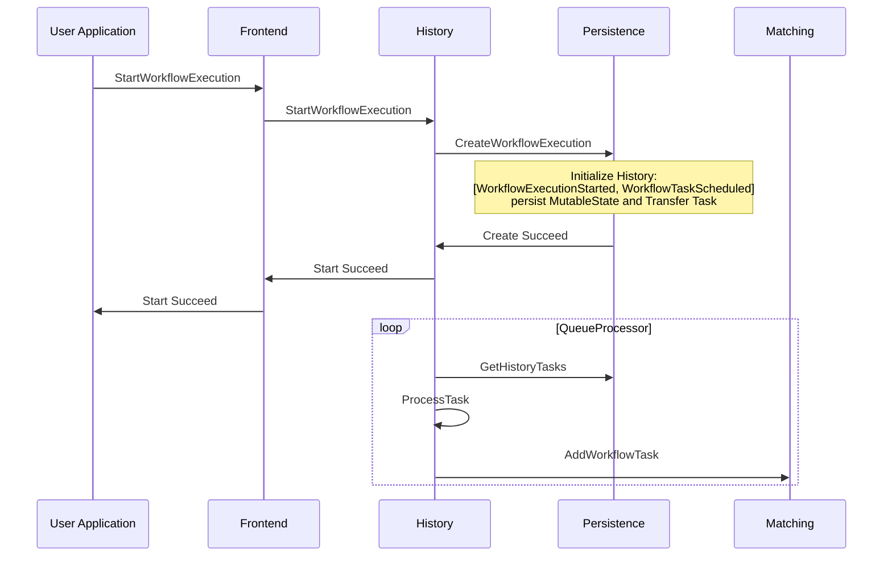
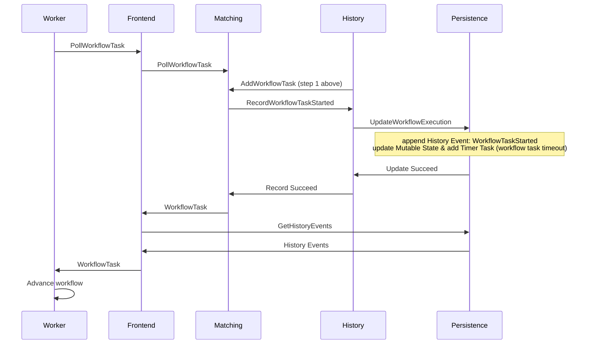
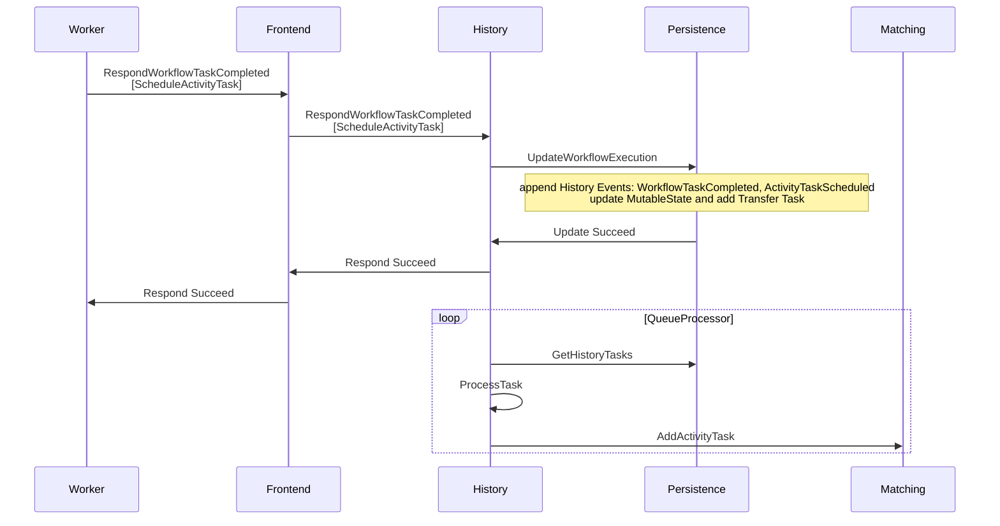
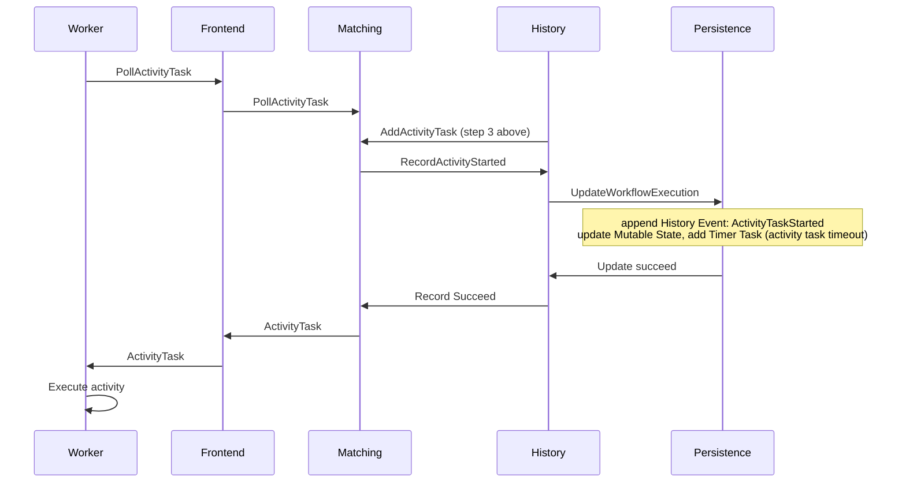
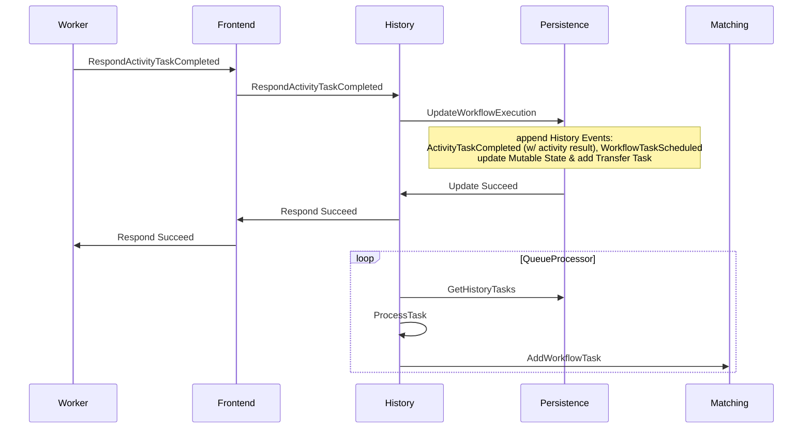
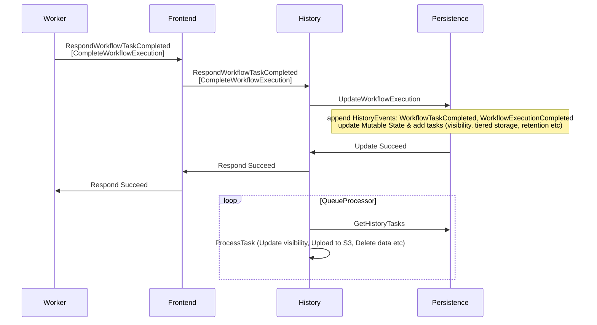
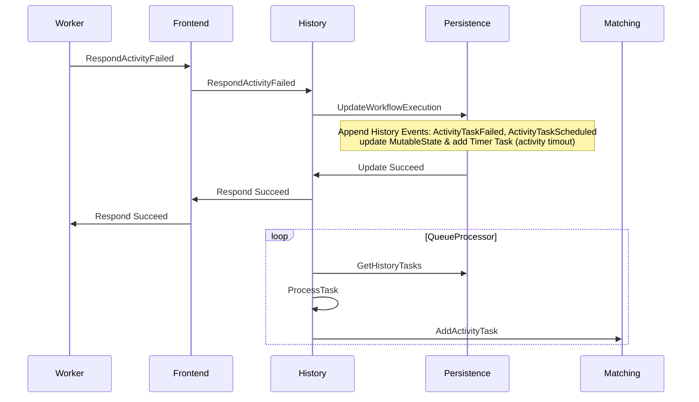

# Workflow lifecycle

Below we follow a typical sequence of events in the execution of the following very simple workflow pseudocode:

```javascript
function myWorkflow() {
  result = callActivity(myActivity);
  return result;
}
```

<br>

---

_Note that below, "Initialize history", "Append event to history", or "Persist Mutable State and history tasks", all refer to durable writes to the persistence layer._

<br>

1. **The User Application sends a `StartWorkflowExecution` request**
   - Workflow History is initialized with `[WorkflowExecutionStarted, WorkflowTaskScheduled]`
   - A Workflow Task is added in the Matching service



<details>
<summary><i>Code entrypoints</i></summary>

- History service [`StartWorkflow` handler](https://github.com/temporalio/temporal/blob/ef49189005b5323c532264287af6c08a447aab8a/service/history/api/startworkflow/api.go#L157).
- History service [queue processors](https://github.com/temporalio/temporal/blob/ef49189005b5323c532264287af6c08a447aab8a/service/history/history_engine.go#L303) and [transfer task queue processor](https://github.com/temporalio/temporal/blob/ef49189005b5323c532264287af6c08a447aab8a/service/history/queues/queue_immediate.go#L150).

</details>
<br>

---

<br>

2. **A Worker dequeues and processes the Workflow Task**
   - It advances the workflow execution, and becomes blocked on the Activity call.



<details>
<summary><i>Code entrypoints</i></summary>

- History service [`RecordWorkflowTaskStarted` handler](https://github.com/temporalio/temporal/blob/ef49189005b5323c532264287af6c08a447aab8a/service/history/handler.go#L319)

</details>
<br>

---

<br>

3. **The workflow launches an activity, causing the Worker to send a `ScheduleActivityTask` command back to the Frontend**
   - An Activity task is added in the Matching service.



<details>
<summary><i>Code entrypoints</i></summary>

- History service [`ScheduleActivityTask` command handler](https://github.com/temporalio/temporal/blob/ef49189005b5323c532264287af6c08a447aab8a/service/history/workflow_task_handler.go#L338)

</details>
<br>

---

<br>

**4. A Worker dequeues the Activity task and executes the activity**



<details>
<summary><i>Code entrypoints</i></summary>

- History service [`RecordActivityTaskStarted` handler](https://github.com/temporalio/temporal/blob/ef49189005b5323c532264287af6c08a447aab8a/service/history/handler.go#L287)

</details>
<br>

---

<br>

5. **Once the activity is completed, the Worker running the Activity sends `RespondActivityTaskCompleted`, containing the activity result**
   - A Workflow Task is added in the Matching service



<details>
<summary><i>Code entrypoints</i></summary>

- History service [`RespondActivityTaskCompleted` handler](https://github.com/temporalio/temporal/blob/ef49189005b5323c532264287af6c08a447aab8a/service/history/handler.go#L361)

</details>
<br>

---

<br>

6. **The Worker dequeues the Workflow Task**
   - It advances the workflow, and finds that it has reached its end.

\<Same sequence diagram as step 2 above\>

<br>

---

<br>

7. **The Worker sends `RespondWorkflowTaskCompleted`, containing a `CompleteWorkflowExecution` command**



<details>
<summary><i>Code entrypoints</i></summary>

- History service [`RespondWorkflowTaskCompleted` handler](https://github.com/temporalio/temporal/blob/ef49189005b5323c532264287af6c08a447aab8a/service/history/handler.go#L478)

</details>
<br>

---

<br>

**Alternatively, the Activity may fail and be retried:**



<details>
<summary><i>Code entrypoints</i></summary>

- History service [`RespondActivityTaskFailed` handler](https://github.com/temporalio/temporal/blob/ef49189005b5323c532264287af6c08a447aab8a/service/history/handler.go#L400)

</details>
