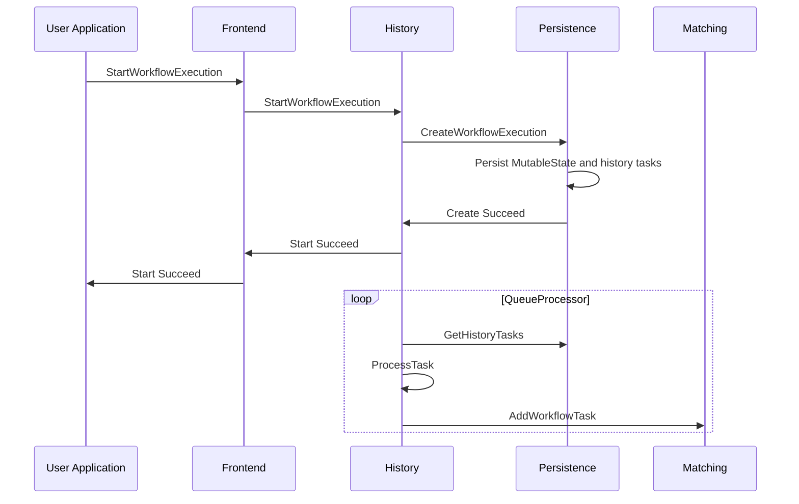
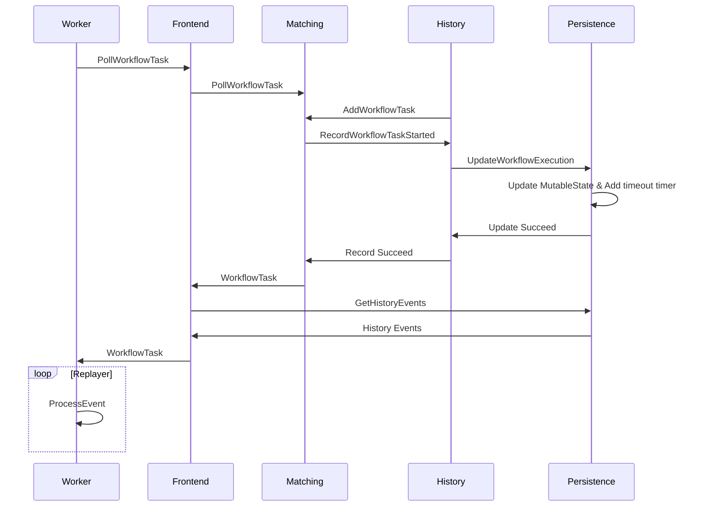
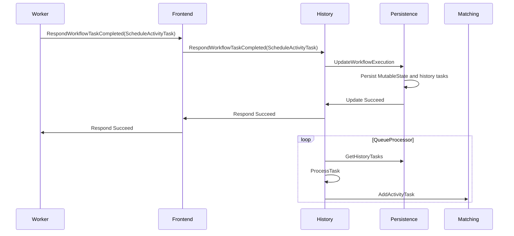
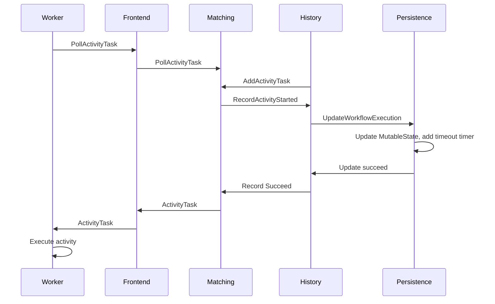
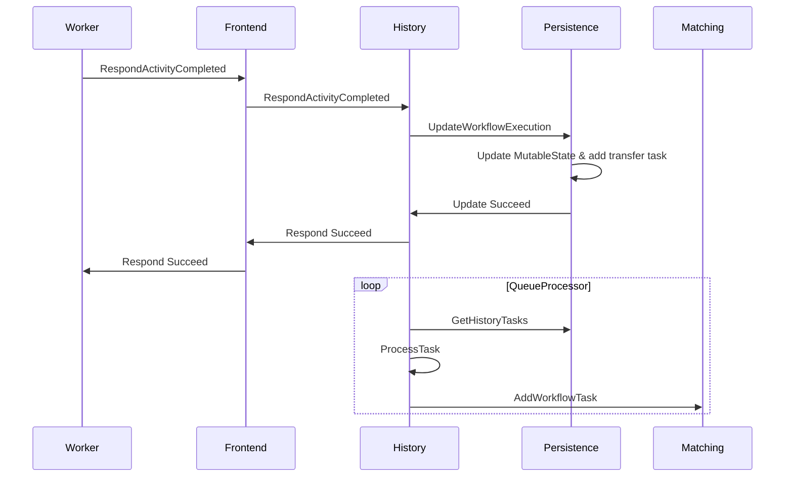
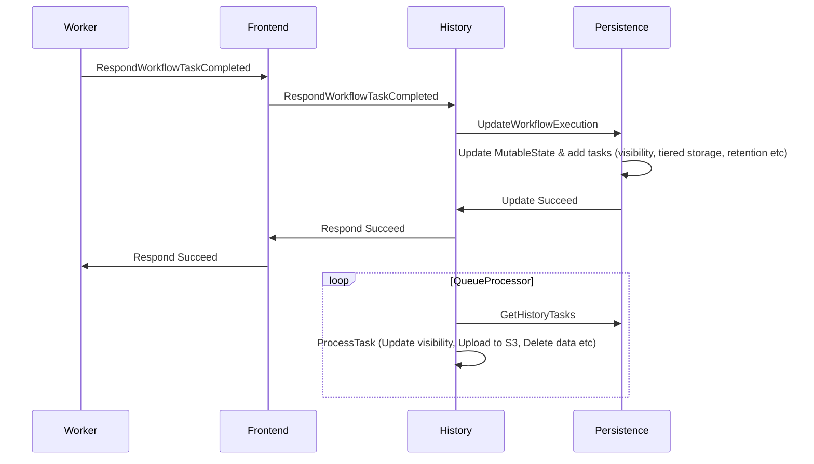
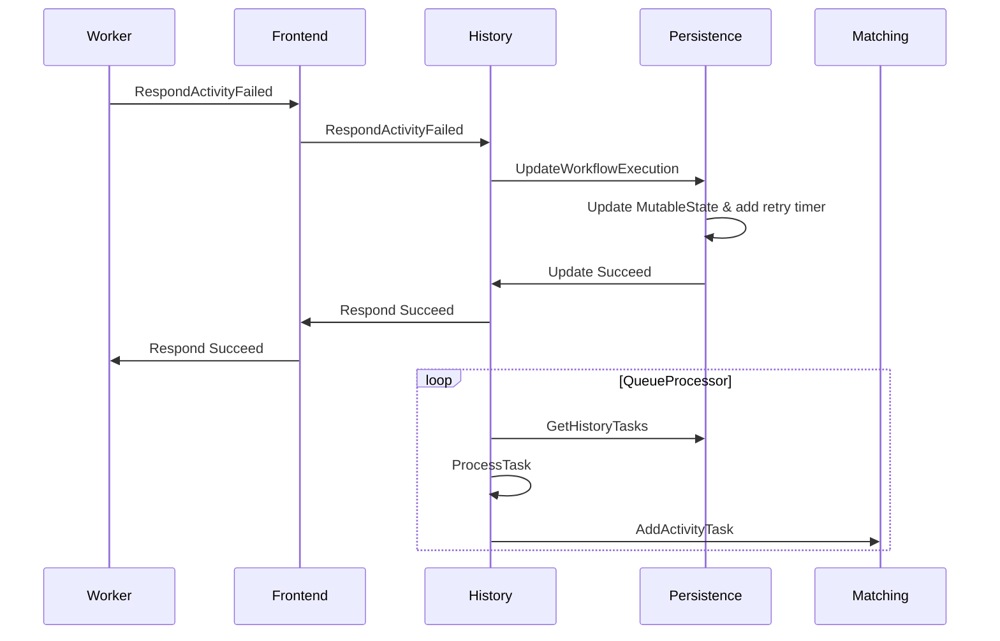

# Workflow lifecycle

Below we follow a typical sequence of events in the execution of the following very simple workflow:

```
myWorkflow() {
   result = callActivity(myActivity)
   return result
}
```

<br>

---

<br>

**1. The User Application uses a Temporal SDK to send a `StartWorkflowExecution` request; a Workflow Task is added in the Matching service**



**Code entrypoints:**

- History service [`StartWorkflow` handler](https://github.com/temporalio/temporal/blob/ef49189005b5323c532264287af6c08a447aab8a/service/history/api/startworkflow/api.go#L157).
- History service [queue processors](https://github.com/temporalio/temporal/blob/ef49189005b5323c532264287af6c08a447aab8a/service/history/history_engine.go#L303) and [transfer task queue processor](https://github.com/temporalio/temporal/blob/ef49189005b5323c532264287af6c08a447aab8a/service/history/queues/queue_immediate.go#L150).

<br>

---

<br>

**2. The Worker dequeues the Workflow Task, advances the workflow execution, and becomes blocked on the Activity call.**



**Code entrypoints:**

- History service [`RecordWorkflowTaskStarted` handler](https://github.com/temporalio/temporal/blob/ef49189005b5323c532264287af6c08a447aab8a/service/history/handler.go#L319)

<br>

---

<br>

**3. The Worker sends a `ScheduleActivityTask` command; an Activity task is added in the Matching service.**



**Code entrypoints:**

- History service [`ScheduleActivityTask` command handler](https://github.com/temporalio/temporal/blob/ef49189005b5323c532264287af6c08a447aab8a/service/history/workflow_task_handler.go#L338)

<br>

---

<br>

**4. The Worker dequeues the Activity task and executes the activity**



**Code entrypoints:**

- History service [`RecordActivityTaskStarted` handler](https://github.com/temporalio/temporal/blob/ef49189005b5323c532264287af6c08a447aab8a/service/history/handler.go#L287)

<br>

---

<br>

**4. The Worker sends `RespondActivityCompleted`; a Workflow Task is added in the Matching service**



**Code entrypoints:**

- History service [`RespondActivityTaskCompleted` handler](https://github.com/temporalio/temporal/blob/ef49189005b5323c532264287af6c08a447aab8a/service/history/handler.go#L361)

<br>

---

<br>

**5. The Worker dequeues the Workflow Task, advances the workflow, and finds that it has reached its end**

\<Same sequence diagram as step 2 above\>

<br>

---

<br>

**6. The Worker sends `RespondWorkflowTaskCompleted`**



**Code entrypoints:**

- History service [`RespondWorkflowTaskCompleted` handler](https://github.com/temporalio/temporal/blob/ef49189005b5323c532264287af6c08a447aab8a/service/history/handler.go#L478)

<br>

---

<br>

**Alternatively, the Activity may fail and be retried:**



**Code entrypoints:**

- History service [`RespondActivityTaskFailed` handler](https://github.com/temporalio/temporal/blob/ef49189005b5323c532264287af6c08a447aab8a/service/history/handler.go#L400)
