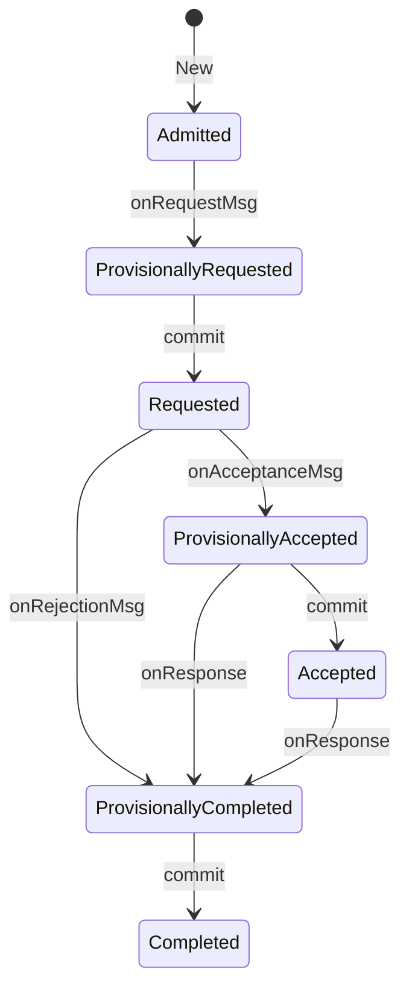

## Update State Machine

The diagram below depicts the state machine implemented in update.go.

```mermaid
stateDiagram-v2
    [*] --> Admitted: New

    Admitted --> ProvisionallyRequested: onRequestMsg
    ProvisionallyRequested --> Requested: commit

    Requested --> ProvisionallyAccepted: onAcceptanceMsg
    ProvisionallyAccepted --> Accepted: commit

    Requested --> ProvisionallyCompleted: onRejectionMsg
    ProvisionallyCompleted --> Completed: commit

    ProvisionallyAccepted --> ProvisionallyCompleted: onResponse
    Accepted --> ProvisionallyCompleted: onResponse
```
